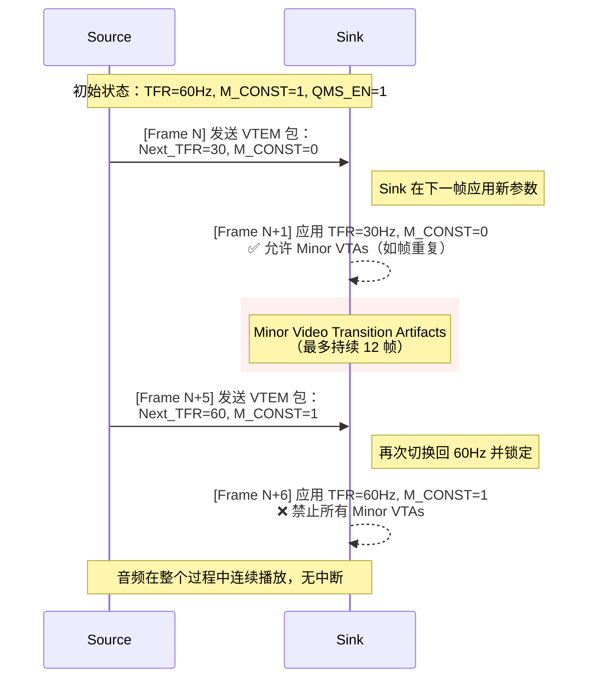
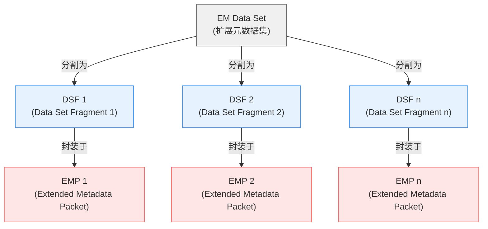

<!-- more -->
- [HDMI Spec22](#hdmi-spec22)
  - [7.Video Extensions](#7video-extensions)
    - [7.6 Variable Refresh Rate and Fast Vactive](#76-variable-refresh-rate-and-fast-vactive)
      - [7.6.6 Comparison between QMS-VRR and Gaming-VRR](#766-comparison-between-qms-vrr-and-gaming-vrr)
      - [7.6.7.1 QMS-VRR Specific Transition Artifact Requirements](#7671-qms-vrr-specific-transition-artifact-requirements)
      - [7.6.7.2 Gaming-VRR Specific Transition Artifact Requirements](#7672-gaming-vrr-specific-transition-artifact-requirements)
  - [8.Packet Definitions](#8packet-definitions)
    - [8.8 Extended Metadata Packet (EMP)](#88-extended-metadata-packet-emp)
      - [EMP Header 结构](#emp-header-结构)
      - [EMP Contents 结构](#emp-contents-结构)
  - [10.Control and Config](#10control-and-config)
    - [10.10 Extended Metadata Transport](#1010-extended-metadata-transport)


# HDMI Spec22

## 7.Video Extensions
### 7.6 Variable Refresh Rate and Fast Vactive
#### 7.6.6 Comparison between QMS-VRR and Gaming-VRR

1. Gaming-VRR：为极致低延迟而生
✅ 目标：
实现从 Source 到 Display 的最低可能延迟
支持“连续变化”的帧率（如 30 → 60 → 120 FPS）

2. QMS-VRR：为无缝切换而设计
✅ 目标：
在启用 VRR 的情况下，仍然能够快速切换视频格式（如分辨率/刷新率）
实现 无黑屏切换（<1帧延迟）


- 场景对比

|对比项|  Game-VRR   | QMS-VRR  |
|----|  ----  | ----  |
|Source| PS5  | 机顶盒 |
|Sink| 支持Gaming-VRR的显示器  | 支持QMS-VRR的电视 |
|动作| 开启游戏 → FPS 波动（30~120）  | 从 4K@60Hz（电影）→ 1080p@120Hz（体育） |
|结果| 显示器进入“最低延迟模式”图像处理被简化| 切换过程无黑屏, 显示器继续使用全部视频处理功能|

#### 7.6.7.1 QMS-VRR Specific Transition Artifact Requirements

主要讲述QMS模式下进行TFR切换时，Minor Video Transition Artifacts（轻微视频过渡伪影）允许的时间窗口。

- M_CONST = 0 时允许伪影
- M_CONST 从 0 → 1 后，根据内容帧率是否匹配 TFR，允许 1 帧 或 最多 12 帧 的轻微伪影
- 此后必须完全禁止伪影
- 红色条是Content Frame Rate和TFR匹配的情况，最多允许1帧轻微伪影
- 黄色是Content Frame Rate和TFR不匹配，使用了pulldown的情况，最多允许12帧轻微伪影



#### 7.6.7.2 Gaming-VRR Specific Transition Artifact Requirements


## 8.Packet Definitions
### 8.8 Extended Metadata Packet (EMP)

Extended Metadata Packet (EMP) 是用于传输 EM Data Set（扩展元数据集） 的基本单元。一个 EM Data Set 可能包含多个数据片段（DSF, Data Set Fragment），通过一系列 EMP 分片发送。

- EMP：单个传输单元，携带部分或全部 EM Data Set
- EM Data Set：完整的元数据块（如 HDR 参数、音频格式等）
- DSF：Data Set Fragment，EM Data Set 的分片
- MTW：Metadata Transmission Window，每帧允许发送 EMP 的时间窗口


#### EMP Header 结构


> EMP Header 定义了每个 EMP 的控制信息，位于包的前 3 字节（HB0~HB2）

```
Byte	Bit #	7	6	5	4	3	2	1	0
HB0		0	1	1	1	1	1	1	1
HB1		First	Last	Rsvd(0)	Rsvd(0)	Rsvd(0)	Rsvd(0)	Rsvd(0)	Rsvd(0)
HB2		Sequence_Index (MSB)	Sequence_Index (LSB)				
```

- First

=1：该 EMP 携带的是 第一个 DSF（即 EM Data Set 的起始包）
=0：不是第一个 DSF

接收端据此识别是否为新数据集的开始,若 First=1，则后续 EMP 必须有 Sequence_Index > 0

> 💡 示例：
> 
> 第一个 EMP：First=1, Sequence_I
> 第二个 EMP：First=0, Sequence_Index=1

- Last

=1：该 EMP 携带的是 最后一个 DSF
=0：不是最后一个 DSF

接收端知道何时完成重组,当 Last=1 时，表示整个 EM Data Set 已完整接收

> ⚠️ 注意：

> 如果一个 EM Data Set 很小（< 21 字节），可以放在一个 EMP 中，则同时设置 First=1 和 Last=1
> 否则，首尾分

- Sequence_Index

用于标识 EMP 在序列中的顺序,从 0 开始递增
规则：
1.第一个 EMP：Sequence_Index = 0
2.每次发送下一个 EMP，Sequence_Index += 1
3.最大值为 255（8位）
4.若超过 255，应清零并重新开始编号（但通常不会发生）

#### EMP Contents 结构


## 10.Control and Config
### 10.10 Extended Metadata Transport
---
感谢阅读！
