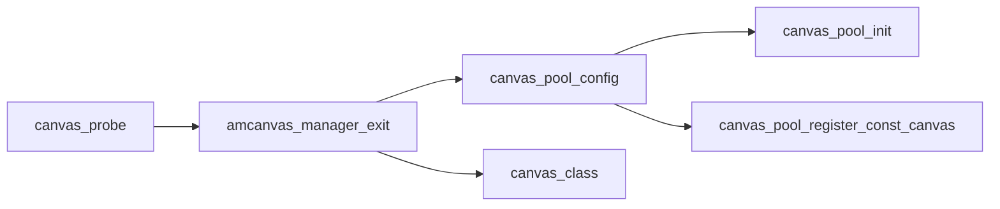
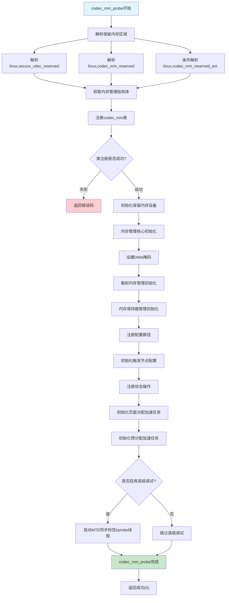
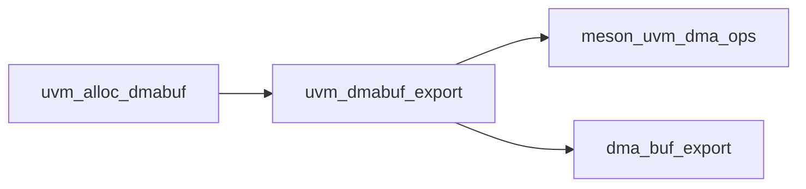
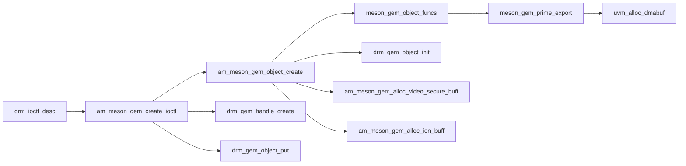
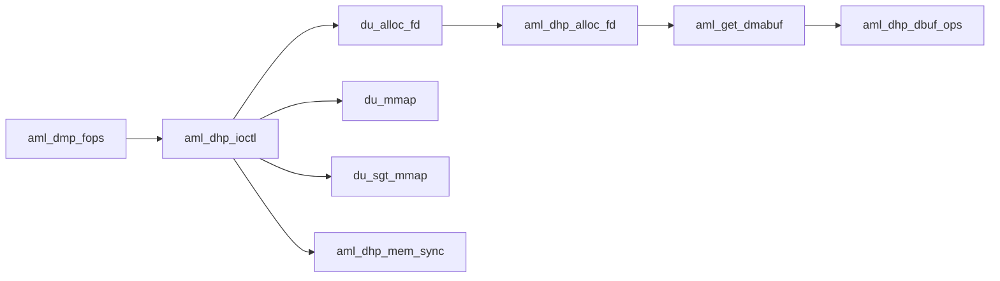
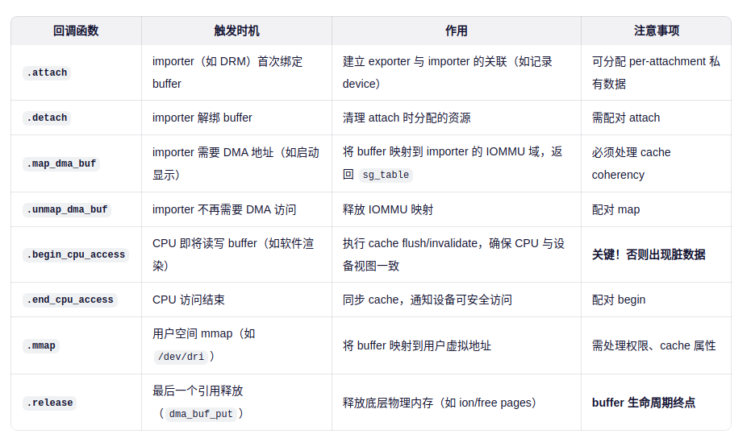
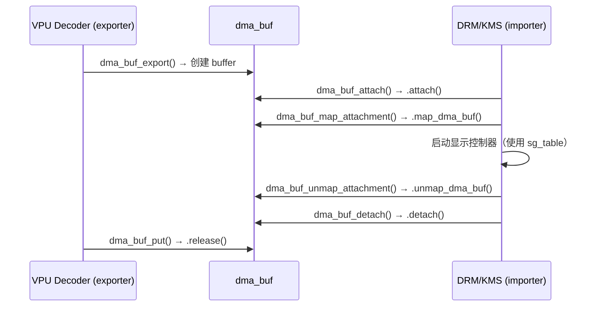
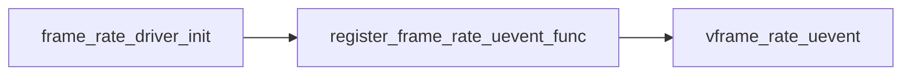
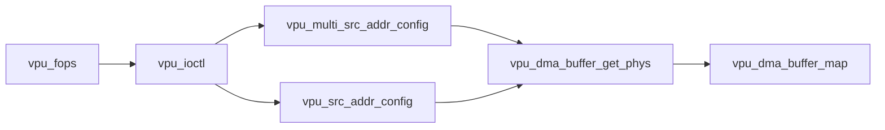

<!-- more -->
- [Meson Media](#meson-media)
  - [common](#common)
    - [arch](#arch)
    - [canvas](#canvas)
      - [数据结构](#数据结构)
      - [主要功能API](#主要功能api)
    - [codec\_mm](#codec_mm)
    - [uvm](#uvm)
    - [meson gem](#meson-gem)
  - [media driver](#media-driver)
    - [frame provider](#frame-provider)
    - [frame adapter](#frame-adapter)
    - [frame sink](#frame-sink)

# Meson Media
media  路径：
```c
common_drivers/drivers/media
atv_demod  cec          di_local  di_v4l     enhancement  gdc      Makefile      osd              vin   vrr
avsync     common       di_mini   dpss       frame_sync   info     media_main.c  video_processor  vout
camera     deinterlace  di_multi  dtv_demod  frc          Kconfig  media_main.h  video_sink       vpq
```
## common
媒体子系统通用模块集合，包含以下核心组件：

主要模块分类：
- 内存管理模块：

1. codec_mm/ - 编解码内存管理
1. dma-buf-heaps/ - DMA缓冲区堆管理
1. ion_dev/ - ION设备管理
1. uvm/ - 统一视频内存管理

- 图形处理模块：

1. ge2d/ - 2D图形引擎
1. canvas/ - canvas管理
1. vicp/ - 视频图像协处理器

- 硬件抽象模块：

1. vpu/ - 视频处理单元
1. vpu_security/ - VPU安全模块
1. lut_dma/ - LUT DMA管理
1. rdma/ - RDMA管理

- 框架支持模块：

1. vfm/ - 视频框架管理
1. media_proxy/ - 媒体代理
1. sw_sync/ - 软件同步
1. resource_mgr/ - 资源管理


### arch

arch/目录主要是寄存器、时钟等特定硬件相关，不做深究。
```c
$ ls arch/
clk  Makefile  registers
```

### canvas



```c
$ ls canvas/
canvas.c  canvas_mgr.c  canvas_priv.h  canvas_reg.h  Kconfig  Makefile
```

#### 数据结构

- 读写宏

>#define canvas_io_read(addr) readl(addr)
>#define canvas_io_write(addr, val) writel((val), addr)

```c
struct canvas_device_info {
	const char *device_name;
	spinlock_t lock; /* spinlock for canvas */
	struct resource res;
	unsigned char __iomem *reg_base;
	struct canvas_s canvasPool[CANVAS_MAX_NUM];
	int max_canvas_num;
	struct platform_device *canvas_dev;
	ulong flags;
	ulong fiq_flag;
};
```
- 定义全局的canvas_info

> static struct canvas_device_info *canvas_info;

- canvas pool

> struct canvas_s canvasPool[CANVAS_MAX_NUM];

```c
12  struct canvas_s {
13  	struct kobject kobj;
14  	u32 index;
15  	ulong addr;
16  	u32 width;
17  	u32 height;
18  	u32 wrap;
19  	u32 blkmode;
20  	u32 endian;
21  	u32 dataL;
22  	u32 dataH;
23  };
```

#### 主要功能API

- canvas_lut_data_build
将canvas参数转换成寄存器

- canvas管理函数

1. canvas_config_ex() - 完整canvas配置
1. canvas_config() - 简化canvas配置
1. canvas_read() - 读取canvas状态
1. canvas_copy() - canvas复制
1. canvas_update_addr() - 更新canvas地址

- 硬件抽象层

1. canvas_config_locked() - 带锁的硬件配置
1. canvas_read_hw() - 硬件寄存器读取
1. canvas_lut_data_parser() - 寄存器数据解析

### codec_mm

- Makefile

```c
13 $(MEDIA_MODULE_NAME)-$(CONFIG_AMLOGIC_MEDIA_CODEC_MM) += common/codec_mm/codec_mm.o
14 $(MEDIA_MODULE_NAME)-$(CONFIG_AMLOGIC_MEDIA_CODEC_MM) += common/codec_mm/codec_mm_scatter.o
15 $(MEDIA_MODULE_NAME)-$(CONFIG_AMLOGIC_MEDIA_CODEC_MM) += common/codec_mm/codec_mm_keeper.o
16 $(MEDIA_MODULE_NAME)-$(CONFIG_AMLOGIC_MEDIA_CODEC_MM) += common/codec_mm/dmabuf_manage.o
17 $(MEDIA_MODULE_NAME)-$(CONFIG_AMLOGIC_MEDIA_CODEC_MM) += common/codec_mm/codec_mm_track.o
18 $(MEDIA_MODULE_NAME)-$(CONFIG_AMLOGIC_MEDIA_CODEC_MM) += common/codec_mm/codec_mm_track_kps.o
19 $(MEDIA_MODULE_NAME)-$(CONFIG_AMLOGIC_MEDIA_CODEC_MM) += common/codec_mm/codec_mm_state.o
20 $(MEDIA_MODULE_NAME)-$(CONFIG_AMLOGIC_MEDIA_CODEC_MM) += common/codec_mm/codec_mm_sys.o
21 $(MEDIA_MODULE_NAME)-$(CONFIG_AMLOGIC_MEDIA_CODEC_MM) += common/codec_mm/codec_mm_prealloc.o
```

- codec_mm_driver
```c
static struct platform_driver codec_mm_driver = {
	.probe = codec_mm_probe,
	.remove = NULL,
	.driver = {
			.owner = THIS_MODULE,
			.name = "codec_mm",
			.of_match_table = amlogic_mem_dt_match,
		}
};
```



- dmabuf_manage_init


> #define DMABUF_MANAGE_EXTEND_EXPORT_DMABUF _IOWR(DMABUF_MANAGE_IOC_MAGIC, 201, struct dmabuf_manage_extend_buffer)
> #define DMABUF_MANAGE_EXTEND_GET_DMABUFINFO _IOWR(DMABUF_MANAGE_IOC_MAGIC, 202, struct dmabuf_manage_extend_buffer)
> #define DMABUF_MANAGE_EXTEND_ALLOCDMABUF   _IOWR(DMABUF_MANAGE_IOC_MAGIC, 204, struct dmabuf_manage_extend_buffer)
> #define DMABUFMANAGE_DEV "/dev/secmem"

```c
static int dmabuf_manage_alloc_dmabuf(unsigned long args)
{
	int res = -EFAULT;
	struct dmabuf_manage_buffer info;
	int fd_flags = O_RDWR | O_CLOEXEC;
	struct dmabuf_manage_block *block;
	struct dma_buf *dbuf;
	int alloc_page = 0;

	pr_enter();
	memset(&info, 0, sizeof(struct dmabuf_manage_buffer));
	res = copy_from_user((void *)&info, (void __user *)args, sizeof(info));

	block = kzalloc(sizeof(*block), GFP_KERNEL);

	alloc_page = info.size / PAGE_SIZE;
   if (alloc_page == 0) {
		alloc_page = 1;
	}
	block->paddr = codec_mm_alloc_for_dma("dmabuf", alloc_page,
		PAGE_SHIFT, CODEC_MM_FLAGS_DMA);

	block->size = PAGE_ALIGN(info.size);
	block->handle = info.handle;
	block->type = info.type;
	block->flags |= DMABUF_ALLOC_FROM_CMA;
	dbuf = get_dmabuf(block, fd_flags);
	res = dma_buf_fd(dbuf, fd_flags);

	return res;

}
```

*dmabuf_manage_export*

```c
//将物理内存区域导出为DMA缓冲区文件描述符
static long dmabuf_manage_export(unsigned long args, int extend)
{
	int ret;
	struct dmabuf_manage_block *block;
	struct dma_buf *dbuf;
	int fd;
	int fd_flags = O_CLOEXEC;
	struct secmem_extend_block extend_block;

	pr_enter();
	block = (struct dmabuf_manage_block *)
		kzalloc(sizeof(*block), GFP_KERNEL);

	ret = copy_from_user((void *)block, (void __user *)args,
		sizeof(struct secmem_block));

	block->type = DMA_BUF_TYPE_SECMEM;
	dbuf = get_dmabuf(block, fd_flags);
	fd = dma_buf_fd(dbuf, fd_flags);

	return fd;
}
```


*dmabuf_manage_get_handle*

```c
//通过DMA缓冲区文件描述符获取对应的句柄标识
static long dmabuf_manage_get_handle(unsigned long args)
{
	int ret;
	long res = -EFAULT;
	int fd;
	struct dma_buf *dbuf;
	struct dmabuf_manage_block *block;

	pr_enter();
	ret = copy_from_user((void *)&fd, (void __user *)args, sizeof(fd));

	dbuf = dma_buf_get(fd);

   block = dbuf->priv;
	if (block->extend)
		res = block->handle;//句柄
	else
		res = (long)(block->handle & (0xffffffff));
	dma_buf_put(dbuf);
	return res;
}
```

*dmabuf_manage_get_phyaddr*
```c
//通过DMA缓冲区文件描述符获取对应的物理地址
static long dmabuf_manage_get_phyaddr(unsigned long args)
{
	int ret;
	long res = -EFAULT;
	int fd;
	struct dma_buf *dbuf;
	struct dmabuf_manage_block *block;

	pr_enter();
	ret = copy_from_user((void *)&fd, (void __user *)args, sizeof(fd));
	dbuf = dma_buf_get(fd);
	block = dbuf->priv;
	if (block->extend)
		res = block->paddr;//物理地址
	else
		res = (long)(block->paddr & (0xffffffff));
	dma_buf_put(dbuf);

	return res;
}
```

*dmabuf_manage_import*
```c
//导入DMA缓冲区文件描述符，获取对应的物理内存地址，用于设备直接内存访问
static long dmabuf_manage_import(unsigned long args)
{
	int ret;
	long res = -EFAULT;
	int fd;
	struct dma_buf *dbuf;
	struct dma_buf_attachment *attach;
	struct sg_table *sgt;
	dma_addr_t paddr;
	struct dmabuf_manage_block *block;

	pr_enter();
	ret = copy_from_user((void *)&fd, (void __user *)args, sizeof(fd));

	dbuf = dma_buf_get(fd);

	attach = dma_buf_attach(dbuf, dmabuf_manage_dev);

	sgt = dma_buf_map_attachment(attach, DMA_FROM_DEVICE);

	paddr = sg_dma_address(sgt->sgl);
	block = dbuf->priv;
	if (block->extend)
		res = paddr;
	else
		res = (long)(paddr & (0xffffffff));
	dma_buf_unmap_attachment(attach, sgt, DMA_FROM_DEVICE);
   dma_buf_detach(dbuf, attach);
	dma_buf_put(dbuf);
	return res;
}
```

*dmabuf_manage_register_channel*
```c
//注册安全视频解码通道，为特定解码器创建专用的安全DMA缓冲区
static long dmabuf_manage_register_channel(unsigned long args)
{
	struct secure_vdec_channel *channel = NULL;
	struct secure_pool_info *pool = NULL;
	int ret = 0;
	int fd = -1;
	int fd_flags = O_CLOEXEC;
	struct dmabuf_manage_block *block = NULL;
	struct dma_buf *dbuf = NULL;

	mutex_lock(&g_secure_pool_mutex);
	pr_enter();

	channel = (struct secure_vdec_channel *)kzalloc(sizeof(*channel), GFP_KERNEL);

	ret = copy_from_user((void *)channel, (void __user *)args, sizeof(*channel));

	pool = dmabuf_manage_get_secure_vdec_pool(channel->id_high, channel->id_low);//通过通道ID查找对应的安全内存池
	if (pool) {
		pool->channel_register = 1;
		block = (struct dmabuf_manage_block *)
			kzalloc(sizeof(*block), GFP_KERNEL);

		block->size = pool->block_size;
		block->type = DMA_BUF_TYPE_SECURE_VDEC;
		block->priv = (void *)channel;

		dbuf = get_dmabuf(block, fd_flags);

		fd = dma_buf_fd(dbuf, fd_flags);//获取fd

	}
	mutex_unlock(&g_secure_pool_mutex);
	return fd;//返回fd
}

```

### uvm

> common/common14-5.15/common/common_drivers/drivers/media/common/uvm

uvm是exporter，分配dmabuf
```c
struct dma_buf *uvm_alloc_dmabuf(size_t len, size_t align, ulong flags)
{
	struct uvm_handle *handle;
	struct dma_buf *dmabuf;

	handle = uvm_handle_alloc(len, align, flags);
	if (IS_ERR_OR_NULL(handle))
		return ERR_PTR(-ENOMEM);

	dmabuf = uvm_dmabuf_export(handle);
	if (IS_ERR_OR_NULL(dmabuf)) {
		kfree(handle);
		return ERR_PTR(-EINVAL);
	}
	UVM_PRINTK(UVM_DBG, "%s. len=%zu dmabuf:0x%px handle:0x%px\n",
		   __func__, len, dmabuf, handle);

	return dmabuf;
}
EXPORT_SYMBOL(uvm_alloc_dmabuf);
```


1. meson_uvm_dma_ops
```c
//谁分配内存，谁提供 dma_buf_ops，并负责其全生命周期管理
static struct dma_buf_ops meson_uvm_dma_ops = {
	.attach = meson_uvm_attach,
	.detach = meson_uvm_detach,
	.map_dma_buf = meson_uvm_map_dma_buf,
	.unmap_dma_buf = meson_uvm_unmap_dma_buf,
	.release = meson_uvm_release,
	.begin_cpu_access = meson_uvm_begin_cpu_access,
	.end_cpu_access = meson_uvm_end_cpu_access,
	.vmap = meson_uvm_vmap,
	.vunmap = meson_uvm_vunmap,
	.mmap = meson_uvm_mmap,
};
```
### meson gem
*drm 中的exporter*




1. meson_gem_object_funcs
```c
static const struct drm_gem_object_funcs meson_gem_object_funcs = {
	.free = meson_gem_object_free,
	.export = meson_gem_prime_export,
	.get_sg_table = meson_gem_prime_get_sg_table,
	.vmap = meson_gem_prime_vmap,
	.vunmap = meson_gem_prime_vunmap,
	.mmap = meson_gem_prime_mmap,
	.vm_ops = &drm_gem_cma_vm_ops,
};
```
## media driver

> common/driver_modules/media_modules/drivers/

### frame provider

- amh_dhp

1. aml_dhp_init
```c
static int __init aml_dhp_init(void)
{
	struct aml_dhp_dev *dev = NULL;
	int ret = -1;

	dev = kmalloc(sizeof(*dev), GFP_KERNEL);
	if (!dev)
		return -ENOMEM;

	dev->dev_no = MKDEV(AML_DHP_MAJOR, 0);

	ret = register_chrdev_region(dev->dev_no, 1, DEVICE_NAME);

	cdev_init(&dev->cdev, &aml_dmp_fops);
	dev->cdev.owner = THIS_MODULE;

	ret = cdev_add(&dev->cdev, dev->dev_no, 1);

	ret = class_register(&dhp_class);

	dev->dev = device_create(&dhp_class, NULL,
		dev->dev_no, NULL, DEVICE_NAME);

	ret = dma_coerce_mask_and_coherent(dev->dev, DMA_BIT_MASK(64));

	INIT_LIST_HEAD(&dev->inst_head);
	mutex_init(&dev->mutex);
	dhp_func_reg(__aml_dhp_task);
	g_dev = dev;

	LOG_INFO("DHP driver init success.\n");

	return 0;
}

```

1. aml_dmp_fops



1. aml_dhp_dbuf_ops

```c
//dma_buf_ops 是 exporter（导出者）提供的回调函数集合
static const struct dma_buf_ops aml_dhp_dbuf_ops = {
	.attach		= aml_dhp_dbuf_attach,
	.detach		= aml_dhp_dbuf_detach,
	.map_dma_buf	= aml_dhp_dbuf_map,
	.unmap_dma_buf	= aml_dhp_dbuf_unmap,
	.begin_cpu_access = aml_dhp_dbuf_begin_cpu_access,
	.end_cpu_access	= aml_dhp_dbuf_end_cpu_access,
	.mmap		= aml_dhp_dbuf_mmap,
	.release	= aml_dhp_dbuf_release,
};
```
回调函数说明
#



- decoder
```c

static struct dma_buf_ops dmabuf_manage_ops = {
	.attach = dmabuf_manage_attach,
	.detach = dmabuf_manage_detach,
	.map_dma_buf = dmabuf_manage_map_dma_buf,
	.unmap_dma_buf = dmabuf_manage_unmap_dma_buf,
	.release = dmabuf_manage_buf_release,
	.mmap = dmabuf_manage_mmap
};
```

### frame adapter



```c
 void vframe_rate_uevent(int duration)
{
	char *configured[2];
	char framerate[40] = {0};

	sprintf(framerate, "FRAME_RATE_HINT=%lu",
		(unsigned long)duration);
	configured[0] = framerate;
	configured[1] = NULL;
	kobject_uevent_env(&frame_rate_dev->dev->kobj,
		KOBJ_CHANGE, configured);

	pr_debug("%s: sent uevent %s\n", __func__, configured[0]);
}

EXPORT_SYMBOL(vframe_rate_uevent);
```

### frame sink

> drivers/frame-sink


*vpu_dma_buffer_map*

```c
static int vpu_dma_buffer_map(struct vpu_dma_cfg *cfg)
{
	int ret = -1;
	int fd = -1;
	struct page *page = NULL;
	struct dma_buf *dbuf = NULL;
	struct dma_buf_attachment *d_att = NULL;
	struct sg_table *sg = NULL;
	void *vaddr = NULL;
	struct device *dev = NULL;
	enum dma_data_direction dir;

   /*cfg下传*/
	fd = cfg->fd;//用户空间传入的 dma-buf 文件描述符
	dev = cfg->dev;//当前设备的 struct device *（用于 IOMMU/attachment）
	dir = cfg->dir;//DMA 数据方向（DMA_TO_DEVICE / DMA_FROM_DEVICE）

	dbuf = dma_buf_get(fd);//通过 fd 获取 struct dma_buf *，增加引用计数。
	d_att = dma_buf_attach(dbuf, dev);//将该 buffer attach 到当前设备，建立 IOMMU 映射


#if LINUX_VERSION_CODE < KERNEL_VERSION(6, 2, 0)
	sg = dma_buf_map_attachment(d_att, dir);
#else
	sg = dma_buf_map_attachment_unlocked(d_att, dir);
#endif

	page = sg_page(sg->sgl);
	cfg->paddr = PFN_PHYS(page_to_pfn(page));//物理地址
	cfg->dbuf = dbuf;
	cfg->attach = d_att;
	cfg->vaddr = vaddr;//虚拟地址
	cfg->sg = sg;

	return 0;
}

```

---
感谢阅读！
`