ARMv8 平台的启动流程涉及多个引导阶段（BL0~BL33）、安全世界（TrustZone/TEE）、DDR 初始化、MMU/SMMU 配置、中断控制器初始化以及最终跳转到 Linux Kernel。本文从硬件上电复位出发，逐阶段剖析每个 BL 阶段的功能、异常等级切换、TEE 启动机制，并给出 Mermaid 流程图辅助理解。

<!-- more -->

- [一、ARMv8 异常等级与安全状态](#一armv8-异常等级与安全状态)
  - [1.1 Exception Level 划分](#11-exception-level-划分)
  - [1.2 安全状态与 TrustZone](#12-安全状态与-trustzone)
- [二、整体启动流程总览](#二整体启动流程总览)
- [三、BL0：片上 ROM 启动](#三bl0片上-rom-启动)
  - [3.1 硬件复位与 CPU 状态](#31-硬件复位与-cpu-状态)
  - [3.2 BL0 完成的工作](#32-bl0-完成的工作)
- [四、BL1：AP Trusted ROM / 第一阶段 Bootloader](#四bl1ap-trusted-rom--第一阶段-bootloader)
  - [4.1 运行环境](#41-运行环境)
  - [4.2 主要功能](#42-主要功能)
- [五、BL2：Trusted Boot Firmware](#五bl2trusted-boot-firmware)
  - [5.1 DDR 初始化](#51-ddr-初始化)
  - [5.2 安全外设初始化](#52-安全外设初始化)
  - [5.3 加载后续镜像](#53-加载后续镜像)
- [六、BL31：EL3 Runtime Firmware（ATF）](#六bl31el3-runtime-firmwareatf)
  - [6.1 EL3 永驻服务](#61-el3-永驻服务)
  - [6.2 GIC 中断初始化](#62-gic-中断初始化)
  - [6.3 PSCI 电源管理](#63-psci-电源管理)
  - [6.4 SMC 调用处理](#64-smc-调用处理)
- [七、BL32：Secure EL1 TEE OS](#七bl32secure-el1-tee-os)
  - [7.1 TEE 启动流程](#71-tee-启动流程)
  - [7.2 SMMU 安全配置](#72-smmu-安全配置)
  - [7.3 安全内存隔离](#73-安全内存隔离)
- [八、BL33：Non-Secure Bootloader（U-Boot / UEFI）](#八bl33non-secure-bootloaderu-boot--uefi)
  - [8.1 MMU 初始化](#81-mmu-初始化)
  - [8.2 外设驱动初始化](#82-外设驱动初始化)
  - [8.3 Kernel Image 加载与跳转](#83-kernel-image-加载与跳转)
- [九、Linux Kernel 早期启动](#九linux-kernel-早期启动)
  - [9.1 head.S 汇编阶段](#91-heads-汇编阶段)
  - [9.2 MMU 与页表建立](#92-mmu-与页表建立)
  - [9.3 中断控制器与 GIC 初始化](#93-中断控制器与-gic-初始化)
- [十、虚拟化：Hypervisor 与 Guest OS](#十虚拟化hypervisor-与-guest-os)
  - [10.1 EL2 Hypervisor 启动](#101-el2-hypervisor-启动)
  - [10.2 SMMU 虚拟化（Stage-2 Translation）](#102-smmu-虚拟化stage-2-translation)
- [十一、完整启动时序图](#十一完整启动时序图)

---

## 一、ARMv8 异常等级与安全状态

### 1.1 Exception Level 划分

ARMv8-A 定义了 4 个异常等级（Exception Level, EL），权限从低到高：

| 等级 | 典型软件 | 特权 |
|------|----------|------|
| EL0 | 用户态应用 / TEE TA | 最低 |
| EL1 | Linux Kernel / TEE OS (S-EL1) | 内核级 |
| EL2 | Hypervisor (KVM/Xen) | 虚拟化 |
| EL3 | Secure Monitor (ATF BL31) | 最高，控制安全/非安全切换 |

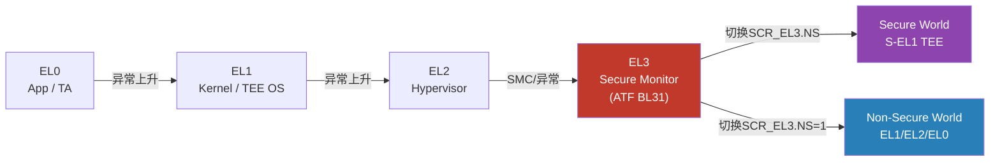

### 1.2 安全状态与 TrustZone

ARM TrustZone 将处理器划分为**安全世界（Secure World）**和**普通世界（Normal World）**。`SCR_EL3.NS` 位控制当前世界：
- `NS=0`：安全世界，访问所有内存/外设
- `NS=1`：普通世界，被 TrustZone 保护区域不可访问

EL3（Secure Monitor）是唯一能够在两个世界之间切换的等级，通过 `SMC`（Secure Monitor Call）指令触发。

---

## 二、整体启动流程总览

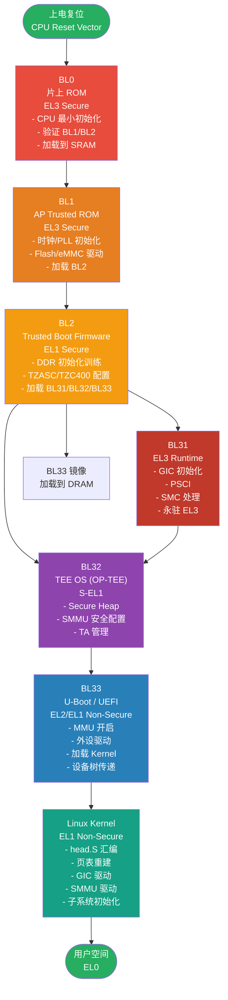

---

## 三、BL0：片上 ROM 启动

### 3.1 硬件复位与 CPU 状态

CPU 上电或复位后，PC 跳转到固定的复位向量（Reset Vector），通常为片上 ROM 起始地址（如 `0x00000000` 或 `0xFFFF0000`）。此时处于：
- **EL3**，**安全世界**
- AArch64 或 AArch32（由 `RES1` 引脚/熔丝决定）
- 寄存器处于 UNKNOWN 状态，需要软件初始化

### 3.2 BL0 完成的工作

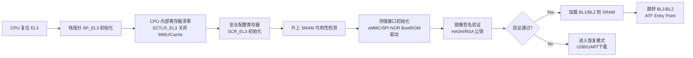

关键寄存器初始化：
```asm
/* 关闭 MMU，禁用 I/D Cache，进入已知状态 */
msr     SCTLR_EL3, xzr
isb

/* 配置安全状态：EL3 为 AArch64，允许访问安全内存 */
mov     x0, #(SCR_RES1_BITS | SCR_RW_BIT)
msr     SCR_EL3, x0

/* 设置异常向量表 */
adr     x0, bl0_vector_table
msr     VBAR_EL3, x0
isb
```

---

## 四、BL1：AP Trusted ROM / 第一阶段 Bootloader

### 4.1 运行环境

- **异常等级**：EL3，安全世界
- **运行介质**：片上 SRAM（DDR 尚未初始化）
- **入口**：ATF 标准入口 `bl1_entrypoint`

### 4.2 主要功能

| 功能 | 说明 |
|------|------|
| CPU 架构初始化 | 开启指令缓存（I-Cache），设置 CPACR/CPTR |
| PLL/时钟初始化 | 配置主 PLL，提升 CPU 频率至工作频率 |
| UART 初始化 | 早期调试串口输出 |
| 存储控制器初始化 | eMMC/UFS/SPI NOR 控制器基本配置 |
| BL2 镜像加载 | 从存储介质加载 BL2 到 SRAM/IRAM |
| 镜像认证 | 使用 TBB（Trusted Board Boot）验证 BL2 签名 |
| 跳转 BL2 | 通过 `bl1_run_next_image()` 跳转到 BL2 EL1 |

BL1 → BL2 的异常等级切换（EL3 → EL1 Secure）：
```c
/* ATF bl1_main.c 简化逻辑 */
void bl1_main(void)
{
    /* 加载 BL2 镜像描述 */
    image_info_t bl2_image = load_image(BL2_ID);

    /* 构造 BL2 入口参数：在 EL1 Secure 运行 */
    entry_point_info_t ep = {
        .pc    = bl2_image.image_base,
        .spsr  = SPSR_64(MODE_EL1, MODE_SP_ELX, DISABLE_ALL_EXCEPTIONS),
        /* NS bit = 0 → Secure EL1 */
    };

    /* ERET 到 EL1S */
    bl1_run_next_image(&ep);
}
```

---

## 五、BL2：Trusted Boot Firmware

BL2 在 **Secure EL1** 运行，是启动链中功能最复杂的阶段，核心职责是初始化 DDR 并加载后续所有镜像。

### 5.1 DDR 初始化

DDR 初始化是 BL2 最关键的硬件工作，分为以下步骤：

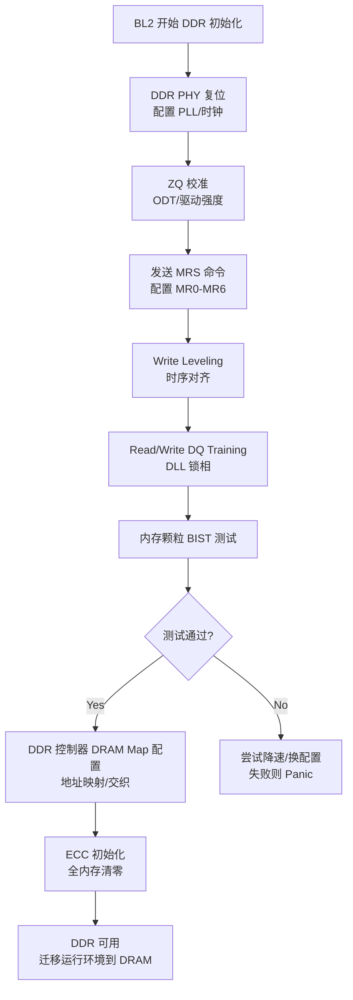

### 5.2 安全外设初始化

BL2 配置 TrustZone 内存/外设保护控制器，防止普通世界访问安全资源：

```c
/* TZC-400 配置示例（保护安全内存区域）*/
tzc400_init(TZC_BASE);
/* 区域0：默认拒绝所有访问 */
tzc400_configure_region0(TZC_REGION_S_NONE, 0);
/* 区域1：安全 TEE 内存，仅 Secure 可访问 */
tzc400_configure_region(1,
    TEE_DRAM_BASE, TEE_DRAM_BASE + TEE_DRAM_SIZE - 1,
    TZC_REGION_S_RDWR,   /* Secure RW */
    0);                   /* Non-Secure 拒绝 */
/* 区域2：共享内存，Normal World 只读 */
tzc400_configure_region(2,
    SHARED_MEM_BASE, SHARED_MEM_BASE + SHARED_MEM_SIZE - 1,
    TZC_REGION_S_RDWR,
    TZC_REGION_ACCESS_RDONLY(0));
tzc400_set_action(TZC_ACTION_ERR); /* 违规触发总线错误 */
```

### 5.3 加载后续镜像

BL2 依次加载 BL31（EL3 Runtime）、BL32（TEE OS）、BL33（U-Boot）并验证签名，然后通过 `bl2_run_next_image` 跳转到 BL31：

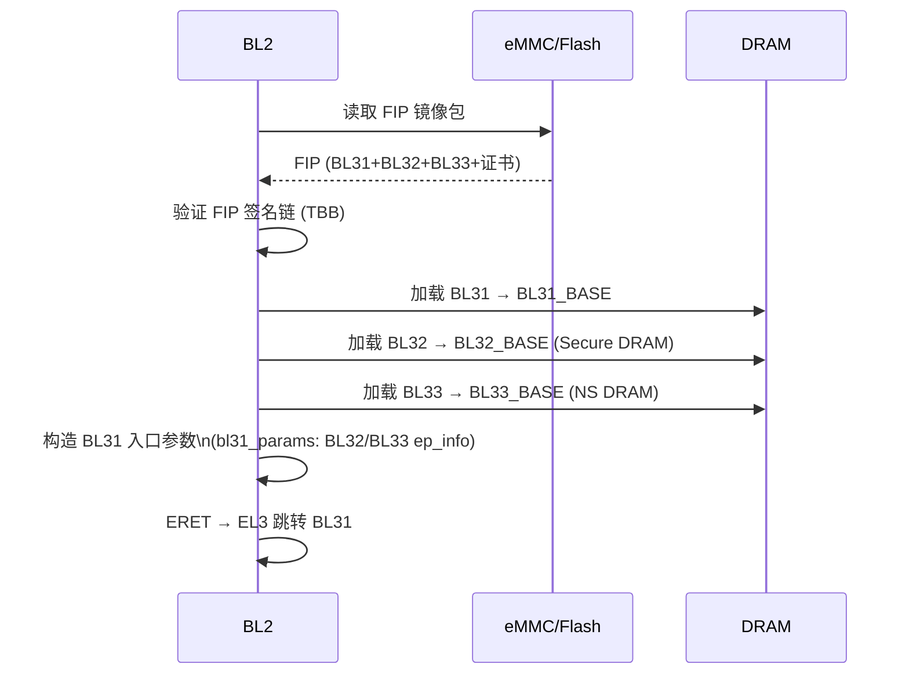

---

## 六、BL31：EL3 Runtime Firmware（ATF）

BL31 是**永驻 EL3** 的运行时固件，负责提供 EL3 级安全服务。系统运行期间，BL31 始终驻留在安全内存中，通过 `SMC` 接口对外提供服务。

### 6.1 EL3 永驻服务

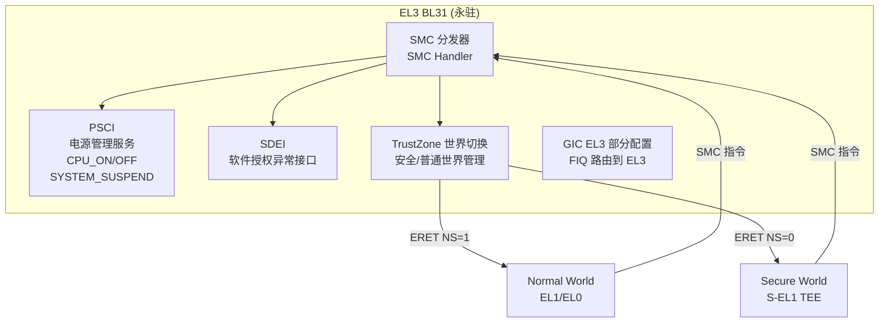

### 6.2 GIC 中断初始化

ARMv8 系统通常使用 GICv3/v4 中断控制器。BL31 完成 Distributor 和 Re-Distributor 的基础初始化：

```c
/* GICv3 初始化 (gicv3_driver_init) */
void gicv3_distif_init(void)
{
    /* 禁用 Distributor */
    gicd_write_ctlr(gicd_base, 0);

    /* 配置所有 SPI 为不触发（默认禁用）*/
    for (i = MIN_SPI_ID; i <= MAX_SPI_ID; i += 32)
        gicd_write_icenabler(gicd_base, i, 0xFFFFFFFF);

    /* 设置 SPI 默认优先级 */
    for (i = MIN_SPI_ID; i <= MAX_SPI_ID; i += 4)
        gicd_write_ipriorityr(gicd_base, i, GIC_HIGHEST_NS_PRIORITY);

    /* 启用 Affinity Routing (ARE_S/ARE_NS) */
    gicd_write_ctlr(gicd_base,
        CTLR_ENABLE_G0_BIT | CTLR_ENABLE_G1S_BIT |
        CTLR_ENABLE_G1NS_BIT | CTLR_ARE_S_BIT | CTLR_ARE_NS_BIT);
}
```

GIC 中断分组策略：

| 中断组 | 目标 | 触发信号 | 用途 |
|--------|------|----------|------|
| Group 0 | EL3 | FIQ | 安全中断，EL3 直接处理 |
| Group 1 Secure | S-EL1 TEE | FIQ | TEE 专用中断（TrustZone 外设）|
| Group 1 Non-Secure | EL1/EL2 | IRQ | Linux 普通中断 |

### 6.3 PSCI 电源管理

PSCI（Power State Coordination Interface）是 Linux 通过 SMC 调用 BL31 实现 CPU 热插拔、系统休眠的标准接口：

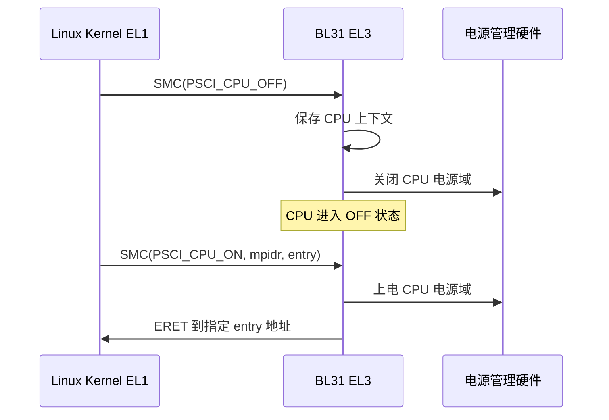

### 6.4 SMC 调用处理

```c
/* BL31 SMC 处理入口（简化）*/
uintptr_t smc_handler(uint32_t smc_fid, u_register_t x1,
                      u_register_t x2, u_register_t x3,
                      u_register_t x4, void *cookie,
                      void *handle, u_register_t flags)
{
    uint32_t owning_entity = GET_SMC_OEN(smc_fid);

    switch (owning_entity) {
    case OEN_ARM_START ... OEN_ARM_END:
        /* ARM 标准服务：PSCI, SDEI, etc. */
        return arm_svc_smc_handler(smc_fid, ...);
    case OEN_SIP_START ... OEN_SIP_END:
        /* 厂商 SiP 服务（如 Amlogic 私有服务）*/
        return sip_svc_smc_handler(smc_fid, ...);
    case OEN_TOS_START ... OEN_TOS_END:
        /* 路由到 TEE OS (BL32) */
        return optee_smc_handler(smc_fid, ...);
    }
}
```

---

## 七、BL32：Secure EL1 TEE OS

BL32 通常是 **OP-TEE**（Open Portable Trusted Execution Environment），运行于 **Secure EL1**，提供安全存储、密钥管理、DRM、指纹等可信服务。

### 7.1 TEE 启动流程

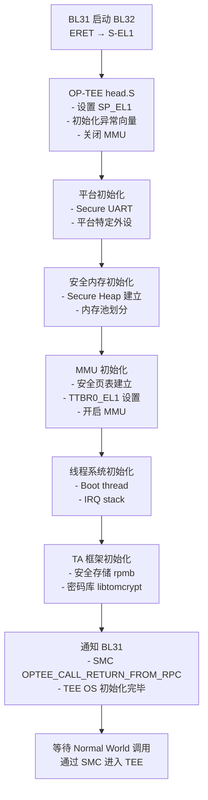

### 7.2 SMMU 安全配置

SMMU（System Memory Management Unit）是外设 DMA 的 MMU，BL2/BL32 需配置其安全属性，防止外设 DMA 访问安全内存：

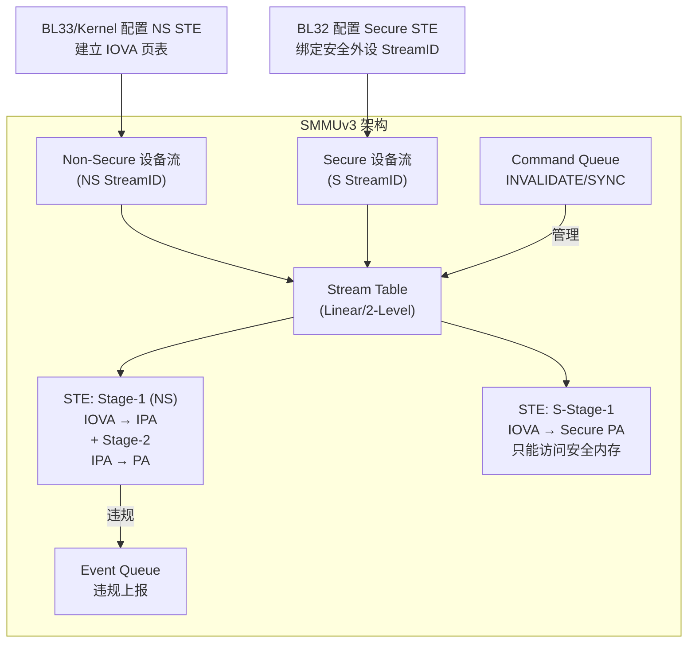

### 7.3 安全内存隔离

```
物理内存布局示例（基于 TZC-400 保护）：

0x00000000 ┌─────────────────────────────┐
           │  BL31 (EL3 Runtime Code)    │ ← Secure Only
0x04000000 ├─────────────────────────────┤
           │  OP-TEE OS (BL32)           │ ← Secure Only
           │  + Secure Heap              │
0x06000000 ├─────────────────────────────┤
           │  TEE Shared Memory          │ ← NS Read / S RW
0x06100000 ├─────────────────────────────┤
           │  Normal World DRAM          │ ← NS RW (主内存)
           │  (Linux Kernel, 用户空间)   │
0x80000000 └─────────────────────────────┘
```

---

## 八、BL33：Non-Secure Bootloader（U-Boot / UEFI）

BL31 启动完 BL32（TEE）后，通过 ERET 切换到普通世界，跳转到 BL33（通常是 U-Boot）。BL33 运行于 **EL2 或 EL1，普通世界**。

### 8.1 MMU 初始化

U-Boot 在 `board_init_f()` 阶段开启 MMU（用于 Cache 加速和内存保护）：

```c
/* U-Boot arch/arm/cpu/armv8/cache.c 简化 */
void enable_caches(void)
{
    /* 建立平坦映射页表（identity map）*/
    setup_pgtables();   /* TTBR0_EL1/EL2 指向页表基地址 */

    /* 设置 TCR_EL2：4KB 粒度，48-bit VA */
    write_tcr_el2(TCR_EL2_PS_BITS_48 | TCR_EL2_TG0_4K |
                  TCR_EL2_IRGN0_WBWA | TCR_EL2_ORGN0_WBWA |
                  TCR_EL2_T0SZ(16));

    /* MAIR：内存属性配置（Device/Normal/NC）*/
    write_mair_el2(MAIR_ATTR_DEVICE_nGnRE    << (0 * 8) |
                   MAIR_ATTR_NORMAL_WB_NTR_RA_WA << (1 * 8));

    isb();
    /* 开启 MMU + D-Cache + I-Cache */
    set_sctlr(get_sctlr() | CR_M | CR_C | CR_I);
    isb();
}
```

### 8.2 外设驱动初始化

U-Boot 的外设初始化顺序（`initcall_run_list`）：

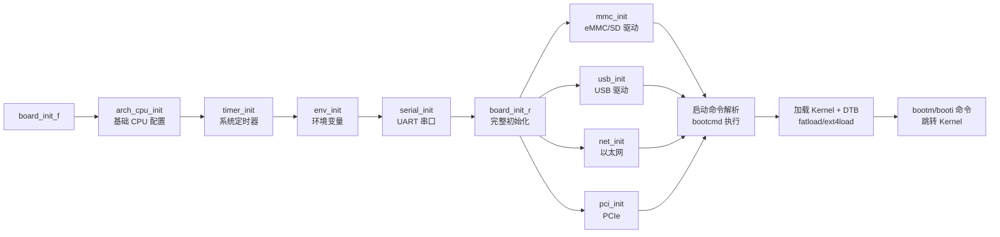

### 8.3 Kernel Image 加载与跳转

ARM64 Linux Kernel（Image/Image.gz）加载到 DRAM 后，U-Boot 通过 `booti` 命令跳转：

```bash
# U-Boot 典型启动命令
setenv bootargs "root=/dev/mmcblk0p2 rootwait console=ttyAML0,115200"
fatload mmc 0:1 ${kernel_addr_r} Image        # 加载 Kernel
fatload mmc 0:1 ${fdt_addr_r}    device.dtb   # 加载设备树
booti ${kernel_addr_r} - ${fdt_addr_r}        # 跳转
```

`booti` 实际调用流程（最终跳转到 Kernel entry）：

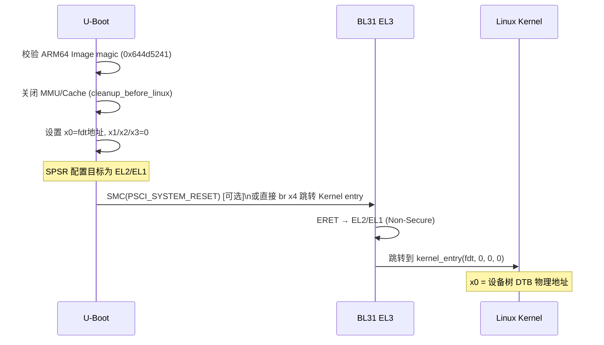

---

## 九、Linux Kernel 早期启动

### 9.1 head.S 汇编阶段

Linux Kernel 入口 `arch/arm64/kernel/head.S` 完成 MMU 开启前的准备工作：

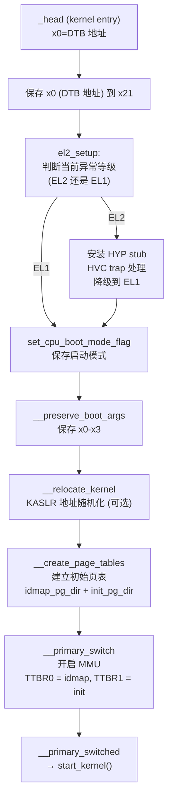

### 9.2 MMU 与页表建立

ARM64 Linux 使用 4 级页表（4KB 页，48-bit VA），内核地址空间从 `0xFFFF000000000000` 开始：

```
ARM64 虚拟地址空间划分 (48-bit VA, 4KB)：

0x0000000000000000 - 0x0000FFFFFFFFFFFF  用户空间 (TTBR0_EL1)
0xFFFF000000000000 - 0xFFFFFFFFFFFFFFFF  内核空间 (TTBR1_EL1)
                                          ↑ 包含：线性映射、vmalloc、vmemmap
```

### 9.3 中断控制器与 GIC 初始化

Linux 在 `start_kernel()` → `init_IRQ()` → DT 解析 GIC 节点后初始化 GICv3 驱动：

```c
/* drivers/irqchip/irq-gic-v3.c 关键初始化 */
static int gic_init_bases(...)
{
    /* 初始化 Distributor */
    gic_dist_init(gic_data);

    /* 每个 CPU 初始化 Redistributor + CPU Interface */
    gic_cpu_init(gic_data);        /* 设置 SRE, PMR, BPR */
    gic_smp_init();                /* 注册 IPI 中断 */

    /* 设置中断亲和性、优先级、触发方式 */
    set_handle_irq(gic_handle_irq);
}
```

GIC 中断处理流程：

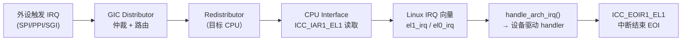

---

## 十、虚拟化：Hypervisor 与 Guest OS

### 10.1 EL2 Hypervisor 启动

当系统支持虚拟化时（如运行 KVM），Linux 可作为 Hypervisor 运行于 EL2，或通过 KVM 模块在 EL1 宿主机上管理 EL1 Guest：

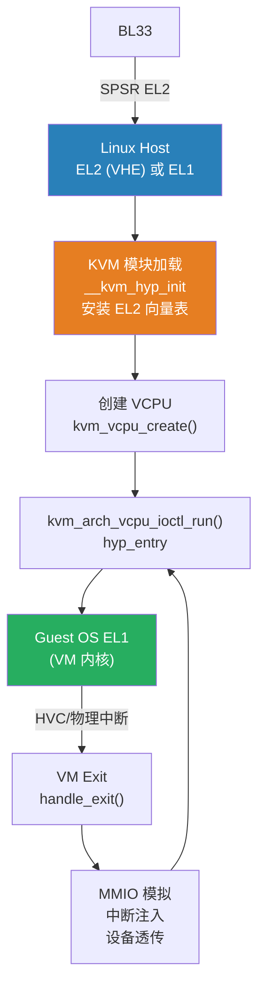

### 10.2 SMMU 虚拟化（Stage-2 Translation）

SMMU 支持两阶段地址翻译，配合 Hypervisor 实现外设直通（VFIO/IOMMU）：

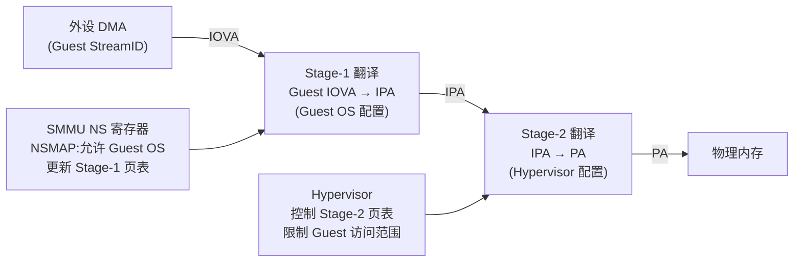

---

## 十一、完整启动时序图

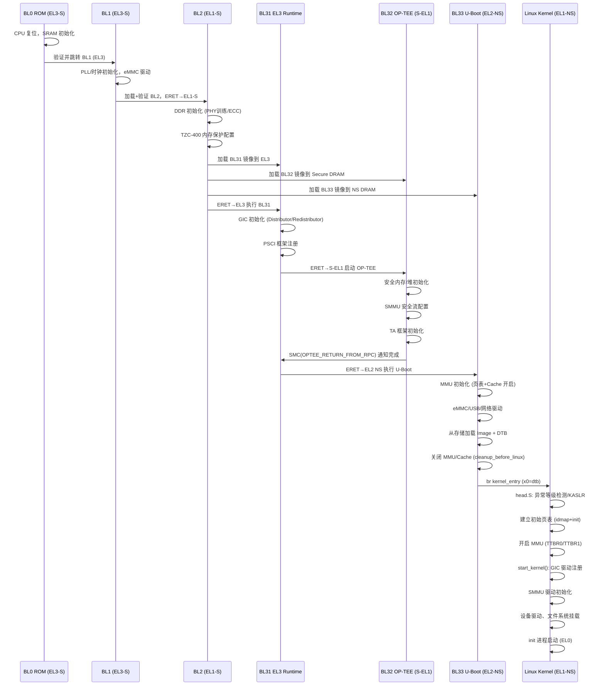

---

感谢阅读！
