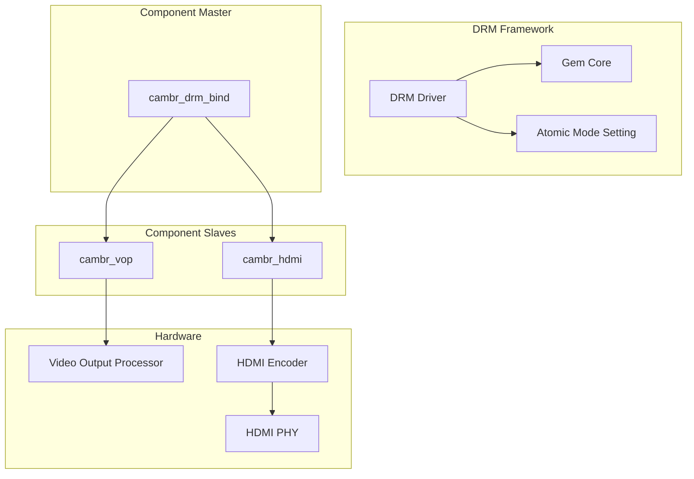

<!-- more -->

- [一、驱动概述](#一驱动概述)
- [二、整体架构](#二整体架构)
- [三、核心组件分析](#三核心组件分析)
  - [3.1 DRM 驱动主模块 (cambr_drm_drv)](#31-drm-驱动主模块-cambr_drm_drv)
  - [3.2 VOP 驱动 (cambr_vop_drv)](#32-vop-驱动-cambr_vop_drv)
  - [3.3 HDMI 驱动 (cambr_hdmi_drv)](#33-hdmi-驱动-cambr_hdmi_drv)
- [四、CRTC 与 Plane 实现](#四crtc-与-plane-实现)
  - [4.1 Plane 原子操作](#41-plane-原子操作)
  - [4.2 CRTC 模式设置](#42-crtc-模式设置)
  - [4.3 格式支持与 CSC](#43-格式支持与-csc)
- [五、Component 框架详解](#五component-框架详解)
- [六、GEM 与 DMA-BUF 集成](#六gem-与-dma-buf-集成)
- [七、关键寄存器配置](#七关键寄存器配置)
- [八、总结](#八总结)

---

## 一、驱动概述

本文分析的是一个面向 **Cambricon（寒武纪）SoC** 的完整 Linux DRM 驱动示例。该驱动展示了现代 DRM 子系统的典型实现模式，包括：
- Component 框架进行多组件管理
- DRM Atomic 模式设置
- GEM DMA 内存管理
- VOP（视频输出处理器）显示流水线
- HDMI 显示接口

```c
// cambr_drm_drv.h
#define DRIVER_NAME    "cndrm"
#define DRIVER_DESC    "Cambricon SoC DRM"
```

---

## 二、整体架构



**显示数据流**：
```
User Space (Framebuffer)
    ↓
Plane (Primary/Overlay) → OVL (Overlay Engine)
    ↓
RVDMA (Read Video DMA) → DPI (Display Pixel Interface)
    ↓
HDMI Encoder → HDMI PHY → Monitor
```

---

## 三、核心组件分析

### 3.1 DRM 驱动主模块 (cambr_drm_drv)

主模块负责：
1. 注册 platform driver
2. 初始化 DRM 核心
3. 管理 Component 框架

```c
// cambr_drm_drv.c
static struct drm_driver cambr_drm_driver = {
    .driver_features = DRIVER_MODESET | DRIVER_GEM | DRIVER_ATOMIC,
    .name            = DRIVER_NAME,
    .fops            = &cambr_drm_driver_fops,
    DRM_GEM_DMA_DRIVER_OPS_WITH_DUMB_CREATE(drm_gem_dma_dumb_create),
};
```

**关键特性**：
- `DRIVER_MODESET`：支持模式设置
- `DRIVER_GEM`：使用 GEM 内存管理
- `DRIVER_ATOMIC`：支持 Atomic 模式设置

**初始化流程**：

```c
static int cambr_drm_bind(struct device *dev)
{
    // 1. 分配 DRM 设备
    drm = drm_dev_alloc(&cambr_drm_driver, dev);
    
    // 2. 初始化模式配置
    drmm_mode_config_init(drm);
    drm->mode_config.max_width = CN_MAX_FB_WIDTH;  // 4096
    drm->mode_config.max_height = CN_MAX_FB_HEIGHT;  // 4096
    
    // 3. 初始化 Vblank
    drm_vblank_init(drm, MAX_CRTC);  // MAX_CRTC = 1
    
    // 4. 绑定子组件
    component_bind_all(dev, drm);
    
    // 5. 注册 DRM 设备
    drm_dev_register(drm, 0);
    
    // 6. 初始化 fbdev
    drm_fbdev_generic_setup(drm, 32);
}
```

### 3.2 VOP 驱动 (cambr_vop_drv)

VOP（Video Output Processor）是显示硬件的核心，负责：
- Plane 管理
- Overlay 叠加
- DMA 传输
- DPI 接口输出

```c
// cambr_vop_drv.c
static int cambr_vop_bind(struct device *dev, struct device *mdev, void *data)
{
    // 1. 创建 Primary Plane
    ret = cambr_plane_create(drm, &cndrm_vop->plane, DRM_PLANE_TYPE_PRIMARY);
    
    // 2. 创建 CRTC
    ret = cambr_crtc_init(drm, &cndrm_vop->crtc, &cndrm_vop->plane);
    
    // 3. 注册中断处理
    irq = platform_get_irq(pdev, 0);
    ret = devm_request_irq(&pdev->dev, irq, vop_irq_handler, ...);
}
```

### 3.3 HDMI 驱动 (cambr_hdmi_drv)

HDMI 驱动负责：
- Encoder 创建与配置
- Connector 检测与模式获取

```c
// cambr_hdmi_drv.c
static int cambr_hdmi_bind(struct device *dev, struct device *mdev, void *data)
{
    // 1. 初始化 Encoder
    ret = drm_encoder_init(drm, &cndrm_hdmi->encoder,
                           DRM_MODE_ENCODER_TMDS, NULL);
    
    // 2. 初始化 Connector
    ret = drm_connector_init(drm, &cndrm_hdmi->connector,
                            DRM_MODE_CONNECTOR_HDMIA);
    
    // 3. 关联 Encoder 与 Connector
    drm_connector_attach_encoder(&cndrm_hdmi->connector, 
                                  &cndrm_hdmi->encoder);
}
```

---

## 四、CRTC 与 Plane 实现

### 4.1 Plane 原子操作

Plane 在 Atomic 模式下工作，核心函数：

```c
// cambr_drm_crtc.c
static void cambr_plane_atomic_update(struct drm_plane *plane,
                                      struct drm_atomic_state *state)
{
    // 1. 获取 GEM 对象
    gem = drm_fb_dma_get_gem_obj(new_state->fb, 0);
    layer_mode.addr = gem->dma_addr;
    
    // 2. 配置 OVL 层
    vop_ovl_config(cndrm_vop->regs, OVL_LAYER2, &layer_mode);
    
    // 3. 配置 RVDMA
    vop_rvdma_config(cndrm_vop->regs, RCHN_GRP2, &layer_mode);
    
    // 4. 更新地址
    vop_update_plane(cndrm_vop->regs, RCHN_GRP2, &layer_mode);
    
    // 5. 启用 OVL 层
    vop_ovl_enable(cndrm_vop->regs, OVL_LAYER2, OVL_ENABLE);
}
```

### 4.2 CRTC 模式设置

```c
static const struct drm_crtc_helper_funcs cambr_crtc_helper_funcs = {
    .mode_valid   = cambr_crtc_mode_valid,
    .mode_fixup   = cambr_crtc_mode_fixup,
    .mode_set_nofb = cambr_crtc_mode_set_nofb,
    .atomic_flush = cambr_crtc_atomic_flush,
    .atomic_enable = cambr_crtc_atomic_enable,
    .atomic_disable = cambr_crtc_atomic_disable,
};

static void cambr_crtc_atomic_enable(struct drm_crtc *crtc,
                                      struct drm_atomic_state *state)
{
    // 1. 开启 VBlank 中断
    reg_clear(cndrm_vop->regs, VO_CMN_INTR_MASK, 
              RG_DISP_SOF_INTR_MASK);
    
    // 2. 开启 DPI
    reg_write(cndrm_vop->regs, DISP_DPI_EN, 0x00800005);
}
```

### 4.3 格式支持与 CSC

支持的格式：

```c
const struct cndrm_format_info cndrm_format_infos[] = {
    { .fourcc = DRM_FORMAT_ARGB8888, .pixel_format = PIXEL_FORMAT_ARGB8888_PACKED },
    { .fourcc = DRM_FORMAT_XRGB8888, .pixel_format = PIXEL_FORMAT_XRGB8888_PACKED },
    { .fourcc = DRM_FORMAT_NV12,     .csc_format = CSC_YUV420_RGB,
      .csc_conv_type = CSC_BT709_RGB, .pixel_format = PIXEL_FORMAT_YUV420_SEMI_PLANAR },
    { .fourcc = DRM_FORMAT_NV21,    .csc_format = CSC_YUV420_RGB,
      .csc_conv_type = CSC_BT709_RGB, .pixel_format = PIXEL_FORMAT_YVU420_SEMI_PLANAR },
    { .fourcc = DRM_FORMAT_NV16,    .csc_format = CSC_YUV422_RGB,
      .csc_conv_type = CSC_BT709_RGB, .pixel_format = PIXEL_FORMAT_YUV422_SEMI_PLANAR },
    { .fourcc = DRM_FORMAT_NV61,    .csc_format = CSC_YUV422_RGB,
      .csc_conv_type = CSC_BT709_RGB, .pixel_format = PIXEL_FORMAT_YVU422_SEMI_PLANAR },
};
```

**CSC (Color Space Conversion) 配置**：

```c
if (format->is_yuv == true) {
    // 配置 YUV->RGB 转换
    reg_write_field(cndrm_vop->regs, OVL_LAYER0_CSC_MAIN_CFG, 
                    0x00, 0x4, layer_mode.csc_format);
    reg_write_field(cndrm_vop->regs, OVL_LAYER0_CSC_MAIN_CFG, 
                    0x04, 0x4, layer_mode.csc_conv_type);
    // 启用 CSC
    reg_clear(cndrm_vop->regs, OVL_LAYER0_CSC_MAIN_CFG, CSC_BYPASS);
} else {
    // 绕过 CSC
    reg_set(cndrm_vop->regs, OVL_LAYER0_CSC_MAIN_CFG, CSC_BYPASS);
}
```

---

## 五、Component 框架详解

该驱动使用 Linux Component 框架管理多设备：

```c
// 1. 主设备定义
static const struct component_master_ops cambr_drm_ops = {
    .bind = cambr_drm_bind,
    .unbind = cambr_drm_unbind,
};

// 2. 子设备绑定
static const struct component_ops cambr_vop_ops = {
    .bind = cambr_vop_bind,
    .unbind = cambr_vop_unbind,
};

// 3. 设备树解析与组件匹配
for (i = 0; ; i++) {
    np = of_parse_phandle(dev->of_node, "ports", i);
    if (!np) break;
    
    // 添加 ports 节点
    component_match_add(dev, &match, compare_of, np);
    
    // 遍历每个 port 的 endpoint
    for_each_endpoint_of_node(np, ep) {
        remote = of_graph_get_remote_port_parent(ep);
        if (remote && of_device_is_available(remote)) {
            // 添加远程设备
            component_match_add(dev, &match, compare_of, remote);
        }
    }
}

// 4. 注册主设备
component_master_add_with_match(&pdev->dev, &cambr_drm_ops, match);
```

---

## 六、GEM 与 DMA-BUF 集成

使用 `drm_gem_dma_helper` 简化 GEM 实现：

```c
// 驱动定义使用宏自动生成 GEM 操作
DEFINE_DRM_GEM_DMA_FOPS(cambr_drm_driver_fops);

static struct drm_driver cambr_drm_driver = {
    // ...
    DRM_GEM_DMA_DRIVER_OPS_WITH_DUMB_CREATE(drm_gem_dma_dumb_create),
};
```

这会自动实现：
- `gem_create`：创建 GEM 对象
- `gem_mmap`：内存映射
- `dumb_create`：创建 dumb buffer
- `dumb_map_offset`：获取 mmap offset

**Framebuffer 映射**：

```c
static const struct drm_mode_config_funcs cambr_drm_mode_config_funcs = {
    .fb_create = drm_gem_fb_create,
    .atomic_check = drm_atomic_helper_check,
    .atomic_commit = drm_atomic_helper_commit,
};
```

---

## 七、关键寄存器配置

### 7.1 时钟与复位初始化

```c
void vosys_crg_init(const void __iomem *regs)
{
    // 视频系统时钟使能
    reg_write(regs, VOSYS_CRG_VOPROC0_VCLK_CLK_SEL, 0x00020002);
    reg_write(regs, VOSYS_CRG_CLK_EN_0, 0x80008000);
    reg_write(regs, VOSYS_CRG_CLK_EN_1, 0xFFC7FFC7);
    reg_write(regs, VOSYS_CRG_CLK_EN_2, 0xFFEFFFEF);
    reg_write(regs, VO_PROC_CRG_CLK_EN, 0xFFFFFFFF);
    
    // 复位控制
    reg_write(regs, VOSYS_CRG_RST_CTRL_0, 0xFFFFFFFF);
    reg_write(regs, VOSYS_CRG_RST_CTRL_1, 0xFFFFFFFF);
    reg_write(regs, VOSYS_CRG_RST_CTRL_2, 0xFFFFFF9F);
}
```

### 7.2 DPI 时序配置

```c
void vop_dpi_config(void __iomem *regs)
{
    // DPI 控制
    reg_write(regs, DISP_DPI_CL_CTRL, 0x00);
    
    // 时序参数
    reg_write(regs, DISP_DPI_TIM_CFG0, 0x00580094);  // Hsync/Vsync
    reg_write(regs, DISP_DPI_TIM_CFG1, 0x0780002C);  // Vbp/Vfp
    reg_write(regs, DISP_DPI_TIM_CFG4, 0x00040024);  // Vact
    reg_write(regs, DISP_DPI_TIM_CFG5, 0x04380005);  // Hact high
    reg_write(regs, DISP_DPI_TIM_CFG6, 0x04380780);  // Hact low
    
    // 数据复用配置
    reg_write(regs, DISP_DPI_DATA_MUX4, 0x3bcdeb38);
    reg_write(regs, DISP_DPI_OUTSTAGE_CFG, 0x00002406);
}
```

---

## 八、总结

该 Cambricon DRM 驱动展示了现代 Linux DRM 子系统的完整实现模式：

| 特性 | 实现方式 |
|------|----------|
| **多组件管理** | Component 框架 |
| **内存管理** | GEM DMA Helper |
| **模式设置** | Atomic Mode Setting |
| **显示引擎** | VOP (OVL + RVDMA + DPI) |
| **输出接口** | HDMI (TMDS) |
| **格式支持** | ARGB8888, XRGB8888, NV12/21, NV16/61 |
| **色彩空间** | BT.709 YUV→RGB |

这个驱动是学习 DRM 子系统的优秀范例，涵盖了从用户空间到底层硬件的完整数据通路。

---

感谢阅读！