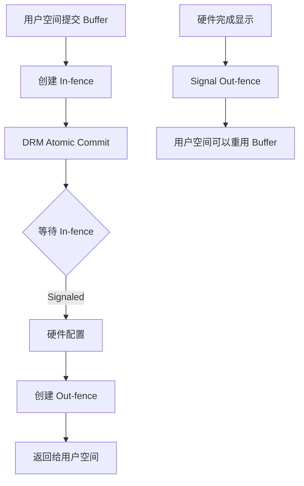
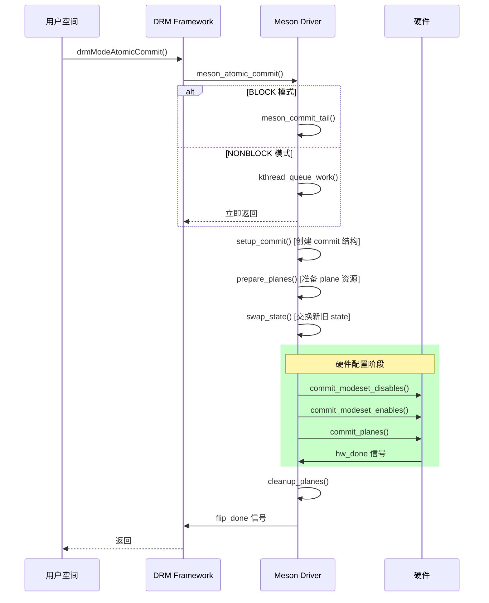
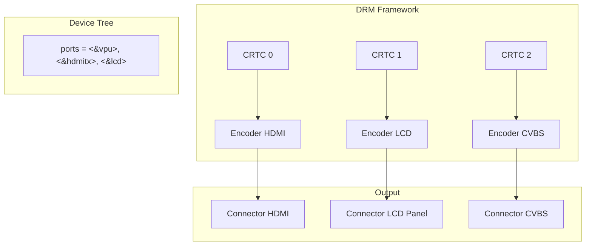
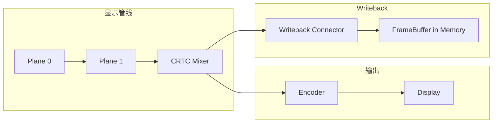

<!-- more -->

- [一、DMA-buf 申请与释放流程](#一dma-buf-申请与释放流程)
  - [1.1 GEM 对象创建流程](#11-gem-对象创建流程)
  - [1.2 DMA heap 内存分配](#12-dma-heap-内存分配)
  - [1.3 内存释放流程](#13-内存释放流程)
  - [1.4 高频问题](#14-高频问题)
- [二、Fence 同步机制详解](#二fence-同步机制详解)
  - [2.1 DMA-fence 核心概念](#21-dma-fence-核心概念)
  - [2.2 Present Fence 实现](#22-present-fence-实现)
  - [2.3 Video Plane Fence](#23-video-plane-fence)
  - [2.4 Fence 等待与回调](#24-fence-等待与回调)
  - [2.5 高频问题](#25-高频问题)
- [三、Atomic Commit 流程深度解析](#三atomic-commit-流程深度解析)
  - [3.1 调用链路](#31-调用链路)
  - [3.2 State 状态转换](#32-state-状态转换)
  - [3.3 Plane/CRTC/Encoder 配置时序](#33-planecrtcencoder-配置时序)
  - [3.4 Commit 完成回调机制](#34-commit-完成回调机制)
  - [3.5 高频问题](#35-高频问题)
  - [四、State 状态管理](#四state-状态管理)
  - [4.1 Atomic State 结构](#41-atomic-state-结构)
  - [4.2 State 复制与检查](#42-state-复制与检查)
  - [4.3 State 交换与回滚](#43-state-交换与回滚)
  - [4.4 State 交换与提交 (commit)](#44-state-交换与提交-commit)
  - [4.5 acquire_ctx 锁管理机制](#45-acquire_ctx-锁管理机制)
  - [4.6 allow_modeset 标志位](#46-allow_modeset-标志位)
  - [4.7 State 复制流程详解](#47-state-复制流程详解)
  - [4.8 State 错误处理与回滚](#48-state-错误处理与回滚)
  - [4.9 Legacy vs Atomic 状态管理差异](#49-legacy-vs-atomic-状态管理差异)
  - [4.10 Commit 回调执行顺序](#410-commit-回调执行顺序)
  - [4.11 drm_private_state 使用场景](#411-drm_private_state-使用场景)
- [五、多路送显架构](#五多路送显架构)
  - [5.1 CRTC/Encoder 注册机制](#51-crtcencoder-注册机制)
  - [5.2 资源分配与克隆模式](#52-资源分配与克隆模式)
  - [5.3 多路输出配置](#53-多路输出配置)
- [六、性能优化考量](#六性能优化考量)
  - [6.1 非阻塞 Commit](#61-非阻塞-commit)
  - [6.2 Async Update](#62-async-update)
  - [6.3 内存带宽优化](#63-内存带宽优化)
- [七、HDMI 与 TX (HDMI Transmitter) 差异](#七hdmi-与-tx-hdmi-transmitter-差异)
  - [7.1 架构定位](#71-架构定位)
  - [7.2 信号特性](#72-信号特性)
  - [7.3 时序要求](#73-时序要求)
- [八、常见问题与要点](#八常见问题与要点)
- [九、DRM Writeback 回写机制](#九drm-writeback-回写机制)
  - [9.1 Writeback 核心概念](#91-writeback-核心概念)
  - [9.2 Writeback 数据结构](#92-writeback-数据结构)
  - [9.3 Writeback 流程解析](#93-writeback-流程解析)
  - [9.4 Capture Port 配置](#94-capture-port-配置)
  - [9.5 典型应用场景](#95-典型应用场景)
  - [9.6 高频问题](#96-高频问题)
- [十、Sync/Async/Nonblock 送显模式](#十synciasyncnonblock-送显模式)
  - [10.1 Sync Commit（同步送显）](#101-sync-commit同步送显)
  - [10.2 Nonblock Commit（非阻塞送显）](#102-nonblock-commit非阻塞送显)
  - [10.3 Async Update（异步平面更新）](#103-async-update异步平面更新)
  - [10.4 Legacy Cursor Update（传统光标更新）](#104-legacy-cursor-update传统光标更新)
  - [10.5 三种模式详细对比](#105-三种模式详细对比)
  - [10.6 Meson 驱动的 Commit 模式选择](#106-meson-驱动的-commit-模式选择)
  - [10.7 高频问题](#107-高频问题)
- [总结](#总结)

---

## 一、DMA-buf 申请与释放流程

### 1.1 GEM 对象创建流程

在 Meson DRM 驱动中，GEM 对象创建通过 `am_meson_gem_object_create()` 函数完成：

```c
// meson_gem.c:636
struct am_meson_gem_object *am_meson_gem_object_create(
    struct drm_device *dev,
    unsigned int flags,
    unsigned long size)
{
    // 1. 分配 am_meson_gem_object 结构体
    meson_gem_obj = kzalloc(sizeof(*meson_gem_obj), GFP_KERNEL);
    
    // 2. 初始化 DRM GEM 对象
    ret = drm_gem_object_init(dev, &meson_gem_obj->base, size);
    
    // 3. 根据 flags 分配内存缓冲区
    if ((flags & MESON_USE_VIDEO_PLANE) && (flags & MESON_USE_PROTECTED))
        ret = am_meson_gem_alloc_video_secure_buff(meson_gem_obj);  // 安全内存
    else
        ret = am_meson_gem_alloc_ion_buff(meson_gem_obj, flags);    // ION/DMA heap
    
    // 4. 如果是 UVM 缓冲区，初始化 uvm_buf_obj
    if (meson_gem_obj->is_uvm) {
        meson_gem_obj->ubo.arg = meson_gem_obj;
        meson_gem_obj->ubo.dev = dev->dev;
    }
    
    return meson_gem_obj;
}
```

### 1.2 DMA heap 内存分配

Meson 驱动支持多种内存分配方式：

```c
// meson_gem.c:60 - 内存分配核心函数
static int am_meson_gem_alloc_ion_buff(struct am_meson_gem_object *meson_gem_obj, int flags)
{
    // 优先级：heap-fb -> heap-gfx -> heap-codecmm -> system
    char DMAHEAP[][20] = {"heap-fb", "heap-gfx", "heap-codecmm"};
    
    for (i = 0; i < 3; i++) {
        heap = dma_heap_find(DMAHEAP[i]);
        dmabuf = dma_heap_buffer_alloc(heap, size, O_RDWR, DMA_HEAP_VALID_HEAP_FLAGS);
        if (!IS_ERR_OR_NULL(dmabuf))
            break;
    }
    
    // 创建 DMA attachment 和 sg_table
    attachment = dma_buf_attach(dmabuf, dev->dev);
    sg_table = dma_buf_map_attachment(attachment, DMA_BIDIRECTIONAL);
    
    // 同步 cache
    dma_sync_sg_for_device(dev->dev, sg_table->sgl, sg_table->nents, DMA_TO_DEVICE);
    
    // 获取物理地址
    meson_gem_obj->addr = PFN_PHYS(page_to_pfn(page));
}
```

<callout emoji="💡" background-color="light-blue">
**关键点**：分配顺序是 heap-fb -> heap-gfx -> heap-codecmm -> system，这确保了显示内存的优先分配。
</callout>

### 1.3 内存释放流程

```c
// meson_gem.c:306 - GEM 对象释放
void meson_gem_object_free(struct drm_gem_object *obj)
{
    struct am_meson_gem_object *meson_gem_obj = to_am_meson_gem_obj(obj);
    
    // 1. 安全内存释放
    if ((flags & MESON_USE_VIDEO_PLANE) && (flags & MESON_USE_PROTECTED))
        am_meson_gem_free_video_secure_buf(meson_gem_obj);
    // 2. ION/DMA heap 释放
    else if (!obj->import_attach)
        am_meson_gem_free_ion_buf(obj->dev, meson_gem_obj);
    // 3. Prime 导入的缓冲区释放
    else
        drm_prime_gem_destroy(obj, meson_gem_obj->sg);
    
    // 4. 释放 mmap offset
    drm_gem_free_mmap_offset(obj);
    
    // 5. 释放 GEM 对象引用
    drm_gem_object_release(obj);
    
    kfree(meson_gem_obj);
}
```

### 1.4 高频问题

| 问题 | 答案要点 |
|------|----------|
| DMA-buf 与 GEM 的关系？ | GEM 是 DRM 的内存管理抽象，DMA-buf 是跨驱动共享机制，PRIME 是桥接两者的接口 |
| 为什么要用 DMA heap？ | DMA heap 提供专门的内存池（fb/gfx/codecmm），保证内存连续性和带宽 |
| 内存分配的 flags 有什么区别？ | MESON_USE_SCANOUT(扫描输出)、MESON_USE_VIDEO_PLANE(视频)、MESON_USE_PROTECTED(安全) |

---

## 二、Fence 同步机制详解

### 2.1 DMA-fence 核心概念

DMA-fence 是 Linux 内核用于跨设备同步的核心机制，解决硬件操作异步完成时的数据依赖问题。



### 2.2 Present Fence 实现

Present Fence 用于用户空间同步页面 flip：

```c
// meson_crtc.c:236 - Fence ops 定义
static const char *meson_crtc_fence_get_driver_name(struct dma_fence *fence)
{
    return "meson";
}

static const char *meson_crtc_fence_get_timeline_name(struct dma_fence *fence)
{
    return "present_fence";  // Timeline 名称
}

static const struct dma_fence_ops meson_crtc_fence_ops = {
    .get_driver_name = meson_crtc_fence_get_driver_name,
    .get_timeline_name = meson_crtc_fence_get_timeline_name,
};

// 创建 fence
struct dma_fence *meson_crtc_create_fence(spinlock_t *lock)
{
    fence = kzalloc(sizeof(*fence), GFP_KERNEL);
    dma_fence_init(fence, &meson_crtc_fence_ops, lock, 0, 0);
    return fence;
}
```

用户空间通过 ioctl 获取 present fence：

```c
// meson_crtc.c:265 - IOCTL 实现
int meson_crtc_creat_present_fence_ioctl(struct drm_device *dev, void *data, struct drm_file *file_priv)
{
    struct drm_meson_present_fence *arg = data;
    struct am_meson_crtc *amcrtc = ...;
    
    // 创建 fence
    fence = meson_crtc_create_fence(&pre_fence->lock);
    
    // 导出为 sync_file fd
    sync_file = sync_file_create(fence);
    fd = get_unused_fd_flags(O_CLOEXEC);
    fd_install(fd, sync_file->file);
    
    arg->fd = fd;
    pre_fence->fence = fence;
    pre_fence->sync_file = sync_file;
}
```

### 2.3 Video Plane Fence

Video Plane 使用独立的 fence 机制管理视频帧释放：

```c
// meson_plane.c:859 - Video fence 创建
static struct dma_fence *am_meson_video_create_fence(spinlock_t *lock)
{
    fence = kzalloc(sizeof(*fence), GFP_KERNEL);
    dma_fence_init(fence, &am_meson_video_plane_fence_ops, lock, 0, 0);
    return fence;
}

// Fence 与 vframe 绑定
static void bind_video_fence_vframe(struct meson_vpu_video *video, 
    struct dma_fence *fence, u32 index, struct vframe_s *vf)
{
    info->fence = fence;
    info->vf = vf;
}

// Fence 信号 - 当视频帧显示完成时调用
static void video_fence_signal(struct meson_vpu_video *video, struct vframe_s *vf)
{
    list_for_each_safe(...) {
        if (info_cur->vf == vf) {
            dma_fence_signal(info_cur->fence);  // 信号 fence
            dma_fence_put(info_cur->fence);
            info_cur->fence = NULL;
        }
    }
}
```

### 2.4 Fence 等待与回调

Atomic commit 中的 fence 等待：

```c
// meson_atomic.c:185 - Commit tail 阶段
static void meson_commit_tail(struct drm_atomic_state *old_state)
{
    // 1. 等待所有 plane 的 fence
    drm_atomic_helper_wait_for_fences(dev, old_state, false);
    
    // 2. 等待之前的 commit 完成
    meson_drm_atomic_helper_wait_for_dependencies(old_state);
    
    // 3. 执行硬件配置
    if (funcs->atomic_commit_tail)
        funcs->atomic_commit_tail(old_state);
    
    // 4. 标记完成
    drm_atomic_helper_commit_cleanup_done(old_state);
}
```

用户空间传入的 in-fence 处理：

```c
// meson_async_atomic.c:86 - 读取 in_fence_fd
} else if (property == config->prop_in_fence_fd) {
    if (state->fence)
        return -EINVAL;
    
    state->fence = sync_file_get_fence(val);  // 获取用户空间的 fence
    if (!state->fence)
        return -EINVAL;
}
```

### 2.5 高频问题

| 问题 | 答案要点 |
|------|----------|
| 隐式 fence vs 显式 fence？ | 隐式 fence 附加在 buffer 上自动同步；显式 fence 通过 sync_file fd 传递给用户空间可见 |
| fence 的生命周期？ | 创建 -> 添加到 dma_resv -> 等待 -> 信号 -> 释放引用 |
| 为什么需要 timeline fence？ | 支持更细粒度的同步，类似 Vulkan semaphore，可查询进度 |

---

## 三、Atomic Commit 流程深度解析

### 3.1 调用链路



### 3.2 State 状态转换

```c
// meson_crtc.c:141 - CRTC state 复制
static struct drm_crtc_state *meson_crtc_duplicate_state(struct drm_crtc *crtc)
{
    new_state = kzalloc(sizeof(*new_state), GFP_KERNEL);
    
    // 复制基础 state
    __drm_atomic_helper_crtc_duplicate_state(crtc, &new_state->base);
    
    // 复制私有 state
    new_state->crtc_hdr_process_policy = cur_state->crtc_hdr_process_policy;
    new_state->crtc_dv_enable = cur_state->crtc_dv_enable;
    new_state->vmode = cur_state->vmode;
    new_state->seamless = cur_state->seamless;
    // ...
    
    return &new_state->base;
}
```

### 3.3 Plane/CRTC/Encoder 配置时序

```c
// meson_atomic.c:652 - Commit tail RPM
void meson_atomic_helper_commit_tail_rpm(struct drm_atomic_state *old_state)
{
    // 1. 禁用不再使用的资源
    drm_atomic_helper_commit_modeset_disables(dev, old_state);
    
    // 2. 使能需要使用的资源（模式设置）
    drm_atomic_helper_commit_modeset_enables(dev, old_state);
    
    // 3. 配置 plane（帧缓冲、位置、缩放）
    drm_atomic_helper_commit_planes(dev, old_state, DRM_PLANE_COMMIT_ACTIVE_ONLY);
    
    // 4. 伪造 vblank
    drm_atomic_helper_fake_vblank(old_state);
    
    // 5. 标记硬件完成
    drm_atomic_helper_commit_hw_done(old_state);
    
    // 6. 等待 vblank
    meson_drm_atomic_helper_wait_for_vblanks(dev, old_state);
    
    // 7. 清理 plane 资源
    drm_atomic_helper_cleanup_planes(dev, old_state);
}
```

CRTC 具体实现：

```c
// meson_crtc.c:655 - CRTC enable
static void am_meson_crtc_atomic_enable(struct drm_crtc *crtc, 
    struct drm_atomic_state *state)
{
    // 验证并设置显示模式
    vout_func_validate_vmode(state->mode.name);
    vout_func_set_state(state->mode.name);
    
    // 更新 VIU 配置
    vout_func_update_viu();
    
    // 开启 vblank 中断
    drm_crtc_vblank_on(crtc);
}
```

### 3.4 Commit 完成回调机制

```c
// meson_atomic.c:120 - 等待 commit 完成
static int meson_drm_crtc_commit_wait(struct drm_crtc_commit *commit)
{
    // 1. 等待硬件编程完成 (100ms 超时)
    ret = wait_for_completion_timeout(&commit->hw_done, HZ / 10);
    if (!ret)
        return -ETIMEDOUT;
    
    // 2. 等待 flip 完成
    ret = wait_for_completion_timeout(&commit->flip_done, HZ / 10);
    if (!ret)
        return -ETIMEDOUT;
    
    return 0;
}

// drm_crtc_commit 结构
struct drm_crtc_commit {
    struct completion flip_done;     // 用户空间 flip 完成
    struct completion hw_done;      // 硬件编程完成
    struct completion cleanup_done; // 清理完成
    struct drm_crtc *crtc;
    struct drm_pending_vblank_event *event;
};
```

### 3.5 高频问题

| 问题 | 答案要点 |
|------|----------|
| 为什么需要 atomic commit？ | 保证多对象更新的原子性，避免中间状态导致的闪烁或异常 |
| blocking vs non-blocking commit？ | Blocking 在 commit 返回前完成硬件配置；non-blocking 立即返回，通过 kthread 异步执行 |
| 如何检测 stall？ | 检查 commit_list 中是否有未完成的 commit，防止用户空间提交过快 |

---

## 四、State 状态管理

### 4.1 Atomic State 结构

```c
// DRM framework - drm_atomic_state
struct drm_atomic_state {
    struct drm_device *dev;
    struct drm_modeset_acquire_ctx *acquire_ctx;
    
    // 状态数组指针
    struct drm_crtc_state **crtc_states;
    struct drm_plane_state **plane_states;
    struct drm_connector_state **connector_states;
    
    // Commit 跟踪
    struct drm_crtc_commit **crtcs;
    struct work_struct commit_work;  // 异步 commit work
    
    bool allow_modeset:1;
    bool legacy_cursor_update:1;
    bool async_update:1;
};

// Meson 私有 CRTC state
struct am_meson_crtc_state {
    struct drm_crtc_state base;
    enum vmode_e vmode;              // 当前显示模式
    enum vmode_e preset_vmode;       // 预设模式
    bool seamless;                   // 无缝切换
    bool crtc_dv_enable;            // Dolby Vision
    bool crtc_hdr_enable;           // HDR
    u8 crtc_hdr_process_policy;     // HDR 处理策略
};
```

### 4.2 State 复制与检查

```c
// meson_crtc.c:841 - CRTC atomic check
static int meson_crtc_atomic_check(struct drm_crtc *crtc, 
    struct drm_atomic_state *state)
{
    struct am_meson_crtc_state *new_state = to_am_meson_crtc_state(state);
    
    // 检查 HDR/DV 参数变化
    if (new_state->crtc_hdr_process_policy != cur_state->crtc_hdr_process_policy ||
        new_state->crtc_dv_enable != cur_state->crtc_dv_enable) {
        new_state->base.mode_changed = true;
    }
    
    // VPU pipeline 检查
    return vpu_pipeline_check(priv->pipeline, crtc, state);
}
```

### 4.3 State 交换与回滚

```c
// drm_atomic_helper_swap_state - 交换新旧 state
int drm_atomic_helper_swap_state(struct drm_atomic_state *state, bool commit)
{
    // 遍历所有 CRTC
    for_each_crtc_in_state(state, crtc, old_crtc_state, new_crtc_state, i) {
        // 1. 保存当前硬件状态到 old_crtc_state
        crtc->funcs->atomic_flush(crtc, old_crtc_state);
        
        // 2. 用 new_crtc_state 替换 crtc->state
        crtc->state = new_crtc_state;
        new_crtc_state->state = state;
    }
    
    // 同样的逻辑应用于 plane 和 connector
}
```

---

### 4.4 State 交换与提交 (commit)

```c
// drm_atomic_helper_swap_state - 交换新旧 state
int drm_atomic_helper_swap_state(struct drm_atomic_state *state, bool commit)
{
    // 遍历所有 CRTC
    for_each_crtc_in_state(state, crtc, old_crtc_state, new_crtc_state, i) {
        // 1. 保存当前硬件状态到 old_crtc_state
        crtc->funcs->atomic_flush(crtc, old_crtc_state);
        
        // 2. 用 new_crtc_state 替换 crtc->state
        crtc->state = new_crtc_state;
        new_crtc_state->state = state;
    }
    
    // 同样的逻辑应用于 plane 和 connector
}
```

### 4.5 acquire_ctx 锁管理机制

`acquire_ctx` (`struct drm_modeset_acquire_ctx`) 是 modeset 锁获取的上下文管理器，用于死锁避免：

```c
// meson_async_atomic.c - 锁初始化
struct drm_modeset_acquire_ctx ctx;
drm_modeset_acquire_init(&ctx, 0);
state->acquire_ctx = &ctx;

// 死锁处理
if (ret == -EDEADLK) {
    drm_atomic_state_clear(state);
    drm_modeset_backoff(&ctx);  // 随机化锁获取顺序
    goto retry;
}
```

### 4.6 allow_modeset 标志位

`allow_modeset` 控制是否允许完整 modeset 操作：

```c
// meson_async_atomic.c
state->allow_modeset = false;  // Async atomic 禁用 modeset

// meson_crtc.c - 强制 mode changed
if (atomic_state->allow_modeset) {
    if (cur_state->crtc_dv_enable != new_state->crtc_dv_enable)
        crtc_state->mode_changed = true;
}
```

### 4.7 State 复制流程详解

**CRTC State 复制**：

```c
// meson_crtc.c - 复制 state
static struct drm_crtc_state *meson_crtc_duplicate_state(struct drm_crtc *crtc)
{
    struct am_meson_crtc_state *new_state, *cur_state;
    cur_state = to_am_meson_crtc_state(crtc->state);
    
    new_state = kzalloc(sizeof(*new_state), GFP_KERNEL);
    __drm_atomic_helper_crtc_duplicate_state(crtc, &new_state->base);
    
    // 复制 Meson 特定状态
    new_state->crtc_hdr_process_policy = cur_state->crtc_hdr_process_policy;
    new_state->crtc_dv_enable = cur_state->crtc_dv_enable;
    new_state->vmode = cur_state->vmode;
    new_state->seamless = false;  // 新状态默认非 seamless
    
    return &new_state->base;
}
```

**深拷贝 vs 浅拷贝字段**：

| 字段类型 | 复制方式 | 说明 |
|---------|---------|------|
| `fb` (framebuffer) | 引用计数 +1 | 浅拷贝，共享指针 |
| `fence` | 需要深拷贝 | 每个 state 独立 fence |
| `driver-private` | 驱动实现 | 通常深拷贝 |
| `property values` | 直接复制值 | 浅拷贝 |

### 4.8 State 错误处理与回滚

```c
// 失败时的恢复机制
void drm_atomic_state_clear(struct drm_atomic_state *state)
{
    int i;
    
    // 清理 connector states
    for (i = 0; i < state->num_connector; i++) {
        if (state->connectors[i].state) {
            drm_connector_state_put(state->connectors[i].state);
            state->connectors[i].state = NULL;
        }
    }
    // 同样的逻辑用于 CRTC 和 Plane
}

// Meson 驱动错误处理
err:
    drm_atomic_helper_cleanup_planes(dev, state);
    return ret;
```

### 4.9 Legacy vs Atomic 状态管理差异

**Legacy Cursor Update**：

```c
// meson_atomic.c
if (state->legacy_cursor_update) {
    ret = drm_atomic_helper_setup_commit(state, nonblock);
    state->legacy_cursor_update = false;
}
```

| 特性 | Legacy Cursor | Atomic |
|------|--------------|--------|
| 锁获取 | 非阻塞快速路径 | 标准 modeset 锁 |
| VBlank 等待 | 跳过（完全异步） | 可选等待 |
| 事件发送 | 即时 | 提交完成时 |

### 4.10 Commit 回调执行顺序

```
┌─────────────────────────────────────────────────────────────────┐
│  PHASE 1: Check & Prepare                                       │
│  ─────────────────────────────────────────────                  │
│  1. drm_atomic_helper_commit_duplicated_flags()                 │
│  2. [Driver] .atomic_check() callbacks                         │
│     ├── plane->helper_private->atomic_check()                  │
│     ├── crtc->helper_private->atomic_check()                    │
│     └── connector->helper_private->atomic_check()               │
│                                                                  │
│  PHASE 2: Hardware Commit                                        │
│  ─────────────────────────────────────────────                  │
│  3. drm_atomic_helper_swap_state()  // 原子交换 new ↔ old state  │
│  4. drm_atomic_helper_commit_modeset_disables()                 │
│  5. drm_atomic_helper_commit_modeset_enables()                  │
│  6. drm_atomic_helper_commit_planes()                           │
│  7. [Driver] .atomic_flush()                                    │
│                                                                  │
│  PHASE 3: Completion                                             │
│  ─────────────────────────────────────────────                  │
│  8. drm_atomic_helper_commit_hw_done()                          │
│  9. drm_atomic_helper_wait_for_vblanks()                        │
│  10. drm_atomic_helper_cleanup_planes()                         │
└─────────────────────────────────────────────────────────────────┘
```

### 4.11 drm_private_state 使用场景

`drm_private_state` 用于驱动自定义的私有状态，不属于标准 CRTC/Plane/Connector：

```c
// meson_crtc.c - Pipeline 级别状态
static void meson_crtc_atomic_print_state(...)
{
    struct meson_vpu_pipeline_state *mvps;
    struct drm_private_state *obj_state;
    
    obj_state = priv->pipeline->obj.state;
    mvps = container_of(obj_state, struct meson_vpu_pipeline_state, obj);
}
```

**典型使用场景**：
- Pipeline 级别状态（如 meson 的 VPU pipeline）
- 跨多个 CRTC 的共享资源状态
- 驱动特定硬件块的状态

---

## 五、多路送显架构

### 5.1 CRTC/Encoder 注册机制

```c
// meson_drv.c:283 - DRM bind
static int am_meson_drm_bind(struct device *dev)
{
    // 1. 初始化 DRM 设备
    drm = drm_dev_alloc(&meson_driver, dev);
    
    // 2. 初始化 mode config
    drm_mode_config_init(drm);
    
    // 3. 初始化 VPU topology
    vpu_topology_init(pdev, priv);
    
    // 4. 绑定所有子组件驱动 (HDMI, LCD, CVBS)
    ret = component_bind_all(dev, &priv->bound_data);
    
    // 5. 初始化 per-CRTC commit 线程
    ret = meson_worker_thread_init(priv, drm->mode_config.num_crtc);
    
    // 6. 注册 DRM 设备
    drm_dev_register(drm, 0);
}
```

### 5.2 资源分配与克隆模式

```c
// meson_of_parser.c - 设备树解析
struct meson_of_conf {
    u32 crtc_masks[ENCODER_MAX];  // 每个 encoder 可用的 CRTC
    u32 crtcmask_osd;             // OSD 层 CRTC 映射
    u32 crtcmask_video;           // Video 层 CRTC 映射
};

// 默认配置
for (i = 0; i < ENCODER_MAX; i++)
    conf->crtc_masks[i] = 1;  // 默认使用 CRTC0

// 设备树覆盖示例:
// crtc_masks = <0x1>, <0x2>, <0x4>  // HDMI->CRTC0, LCD->CRTC1, CVBS->CRTC2
```

### 5.3 多路输出配置



<callout emoji="💡" background-color="light-blue">
**多路模式**：
- **克隆模式**：多个 encoder 使用相同 CRTC，显示相同内容
- **扩展模式**：每个 encoder 独立 CRTC，显示不同内容
- **混合模式**：部分共享，部分独立
</callout>

---

## 六、性能优化考量

### 6.1 非阻塞 Commit

```c
// meson_atomic.c:470 - commit 入口
int meson_atomic_commit(struct drm_device *dev, 
    struct drm_atomic_state *state, bool nonblock)
{
    // 设置 commit 跟踪结构
    ret = meson_drm_atomic_helper_setup_commit(state, nonblock);
    
    // 准备 plane 资源
    ret = drm_atomic_helper_prepare_planes(dev, state);
    
    // 交换 state
    ret = drm_atomic_helper_swap_state(state, true);
    
    if (nonblock) {
        // 创建 kthread work
        work_item->crtc_id = crtc_index;
        kthread_init_work(&work_item->kthread_work, meson_commit_work);
        
        // 队列到 per-CRTC worker
        worker = &priv->commit_thread[crtc_index].worker;
        kthread_queue_work(worker, &work_item->kthread_work);
        
        return 0;  // 立即返回
    } else {
        // 同步等待完成
        meson_commit_tail(state);
    }
}
```

### 6.2 Async Update

对于纯 plane 更新（非模式切换），可以走 async 路径：

```c
// meson_atomic.c:491 - async update 路径
if (state->async_update) {
    // 准备 plane
    ret = drm_atomic_helper_prepare_planes(dev, state);
    
    // 交换 state
    ret = drm_atomic_helper_swap_state(state, true);
    
    // 直接执行 plane update，不走完整 commit
    meson_atomic_helper_async_commit(dev, state);
    
    // 清理
    drm_atomic_helper_cleanup_planes(dev, state);
    
    return 0;
}
```

### 6.3 内存带宽优化

| 优化点 | 实现方式 |
|--------|----------|
| DMA heap 优先级 | heap-fb > heap-gfx > heap-codecmm |
| Cache 策略 | 对非缓存内存使用 `pgprot_writecombine()` |
| 零拷贝 | 通过 DMA-buf 直接共享，无需 memcpy |

---

## 七、HDMI 与 TX (HDMI Transmitter) 差异

### 7.1 架构定位

```
         CPU                  HDMI Transmitter          Display Device
    +-----------+            +-------------+           +-------------+
    |   VPU     |   ---PCIe--|   HDMI TX   |---TMDS----|   Monitor   |
    | (显示引擎)|            |  (物理层)   |           |             |
    +-----------+            +-------------+           +-------------+
    
    DRM 驱动层                VOUT/HDMI TX 驱动
    meson_drm.ko              hdmitx21.ko
```

- **DRM (meson_drm.ko)**：负责显示管线管理、模式设置、buffer 提交
- **HDMI TX (hdmitx21.ko)**：负责物理层信号生成、EDID、HDCP、InfoFrame

### 7.2 信号特性

| 特性 | DRM (显示引擎) | HDMI TX (发送器) |
|------|----------------|------------------|
| 信号类型 | 内部 RGB/CSC 格式 | 外部 TMDS/FRL |
| 时钟域 | 像素时钟 (pixel clock) | 串行时钟 (serdes clock) |
| 数据宽度 | 48/64-bit 并行 | 1.65-3.4 Gbps 串行 |
| 同步方式 | VSYNC/HSYNC 内部 | CEA-861 标准 |

### 7.3 时序要求

```c
// hdmitx21/hdmi_tx_video.c - 视频参数配置
struct hdmi_video_format {
    u32 hsync_width;    // 水平同步宽度
    u32 hback_porch;   // 后沿
    u32 hactive;       // 有效像素
    u32 hfront_porch;  // 前沿
    
    u32 vsync_width;   // 垂直同步
    u32 vback_porch;
    u32 vactive;
    u32 vfront_porch;
    
    u32 pixel_repeat;  // 像素重复
    u32 color_depth;   // 色深 (8/10/12-bit)
};
```

<callout emoji="⚠️" background-color="light-yellow">
**关键差异**：HDMI TX 需要遵循 EIA/CEA-861 标准，包含严格的时序参数要求；而 DRM 内部可以使用更灵活的内部时序。
</callout>

---

## 八、常见问题与要点

<callout emoji="📝" background-color="pale-gray">
**高频问题汇总**
</callout>

1. **DMA-buf 的核心作用是什么？**
   - 跨设备零拷贝共享内存

2. **fence 如何解决同步问题？**
   - 显式同步：用户空间管理 fence fd
   - 隐式同步：附加到 buffer 自动等待

3. **atomic commit 为什么要设计成原子的？**
   - 避免多对象更新时的中间状态

4. **如何实现多路显示？**
   - 多个 CRTC + encoder + connector
   - 设备树配置 crtc_masks

5. **commit 超时如何处理？**
   - 设置超时检测 (100ms)
   - 打印错误信息并返回 -ETIMEDOUT

6. **异步更新和普通更新的区别？**
   - 异步更新只更新 plane，不触发完整模式设置

7. **HDMI 和 TX 的关系？**
   - DRM 负责模式和数据，TX 负责物理层发送

8. **遇到黑屏如何调试？**
    - 检查 dmesg 日志
    - 验证 drm_atomic_check 返回值
    - 确认 vblank 中断状态

---

## 十、DRM Writeback 回写机制

### 10.1 Writeback 核心概念

DRM Writeback 是 DRM 4.20 引入的框架，允许硬件将显示管线的内容捕获回写到内存缓冲区。这与传统的"显示输出"相反——不是把 buffer 送到屏幕，而是把屏幕内容写回 buffer。



**典型应用场景**：
- **屏幕录制**：捕获屏幕内容用于录制
- **帧缓冲复制**：复制当前显示内容到另一个缓冲区
- **后处理管线**：捕获显示内容进行软件处理后再显示
- **调试/诊断**：保存当前显示状态用于调试

### 10.2 Writeback 数据结构

```c
// meson_writeback.h - Amlogic 扩展的 writeback 结构
struct am_drm_writeback {
    struct meson_connector base;                    // 基类
    struct drm_writeback_connector wb_connector;   // DRM writeback connector
    struct drm_device drm_dev;                    // DRM 设备
    struct work_struct writeback_work;             // 捕获工作队列
    struct workqueue_struct *writeback_wq;        // workqueue
    struct drm_framebuffer *fb;                   // 目标帧缓冲
    u32 capture_port;                             // 捕获端口
    struct drm_property *capture_port_prop;        // 捕获端口属性
};

// DRM framework - writeback connector
struct drm_writeback_connector {
    struct drm_connector base;
    struct drm_encoder encoder;
    // ...
};
```

### 10.3 Writeback 流程解析

```c
// meson_writeback.c:396 - Writeback 初始化
int am_meson_writeback_create(struct drm_device *drm)
{
    // 1. 分配 writeback 结构
    drm_writeback = kzalloc(sizeof(*drm_writeback), GFP_KERNEL);
    
    // 2. 设置 encoder 的 CRTC 掩码
    wb_connector->encoder.possible_crtcs = BIT(0);
    
    // 3. 获取支持的像素格式
    ret = meson_writeback_get_format(writeback_fmts);
    
    // 4. 注册 writeback connector
    ret = drm_writeback_connector_init(drm, wb_connector,
        &am_writeback_connector_funcs,
        &am_writeback_encoder_helper_funcs,
        writeback_fmts, ARRAY_SIZE(writeback_fmts));
    
    // 5. 创建 workqueue
    drm_writeback->writeback_wq = alloc_workqueue("writeback_capture",
        WQ_HIGHPRI | WQ_CPU_INTENSIVE, 0);
    
    // 6. 初始化 work
    INIT_WORK(&drm_writeback->writeback_work, meson_writeback_capture_work);
}
```

### 10.4 Atomic Commit 流程

```c
// meson_writeback.c:50 - Atomic check
static int meson_writeback_connector_atomic_check(struct drm_connector *conn,
    struct drm_atomic_state *state)
{
    conn_state = drm_atomic_get_new_connector_state(state, conn);
    
    // 检查是否有 writeback job
    if (!conn_state->writeback_job)
        return 0;
    
    crtc_state = drm_atomic_get_new_crtc_state(state, conn_state->crtc);
    fb = conn_state->writeback_job->fb;
    
    // 检查帧缓冲尺寸是否匹配
    if (fb->width != crtc_state->mode.hdisplay ||
        fb->height != crtc_state->mode.vdisplay) {
        DRM_ERROR("Invalid framebuffer size %ux%u\n", fb->width, fb->height);
        return -EINVAL;
    }
    
    // 检查像素格式是否支持
    for (i = 0; i < ARRAY_SIZE(writeback_fmts); i++) {
        if (fb->format->format == writeback_fmts[i])
            break;
    }
    
    return 0;
}

// meson_writeback.c:194 - Atomic commit
static void meson_writeback_connector_atomic_commit(struct drm_connector *conn,
    struct drm_atomic_state *old_atomic_state)
{
    conn_state = drm_atomic_get_old_connector_state(old_atomic_state, conn);
    drm_writeback = connector_to_am_writeback(conn);
    fb = conn_state->writeback_job->fb;
    drm_writeback->fb = fb;
    
    // 队列到 workqueue 执行捕获
    drm_writeback_queue_job(&drm_writeback->wb_connector, conn_state);
    queue_work(drm_writeback->writeback_wq, &drm_writeback->writeback_work);
}

// meson_writeback.c:182 - Work 处理
static void meson_writeback_capture_work(struct work_struct *work)
{
    drm_writeback = container_of(work, struct am_drm_writeback, writeback_work);
    
    // 执行实际捕获
    meson_writeback_capture_picture(drm_writeback->fb, drm_writeback->capture_port);
    
    // 通知完成
    drm_writeback_signal_completion(&drm_writeback->wb_connector, 0);
}
```

### 10.5 Capture Port 配置

Meson 支持多种捕获端口：

```c
// meson_writeback.c:352 - 捕获端口枚举
static const struct drm_prop_enum_list writeback_capture_port_enum_list[] = {
    { TVIN_PORT_VIU1_WB0_VD1, "video" },      // 仅视频层
    { TVIN_PORT_VIU1_WB0_OSD1, "osd" },       // 仅 OSD 层
    { TVIN_PORT_VIU1_WB0_VPP, "video&osd" }, // 视频和 OSD 混合
};
```

**硬件架构**：
- `TVIN_PORT_VIU1_WB0_VD1`：Video Decoder 输入
- `TVIN_PORT_VIU1_WB0_OSD1`：OSD1 层
- `TVIN_PORT_VIU1_WB0_VPP`：Video Post Processor 输出（全部混合）

### 10.6 典型应用场景

```c
// 用户空间使用示例
struct drm_mode_capture {
    u32 fb_id;          // 捕获目标帧缓冲
    u32 out_fence;       // 输出 fence
    u32 connector_id;    // writeback connector ID
    u32 flags;
};

// 1. 创建用于捕获的帧缓冲
drmModeFB2Create(dev, width, height, DRM_FORMAT_NV12, handles, pitches, offsets, &fb_id);

// 2. 提交 writeback job
drm_writeback_queue_job(connector, fb_id, &out_fence);

// 3. 等待捕获完成
sync_file_wait(out_fence, 1000);

// 4. 使用捕获的缓冲区
// ... 对捕获内容进行处理
```

### 10.7 高频问题

| 问题 | 答案要点 |
|------|----------|
| Writeback 和普通 Plane 的区别？ | Plane 是数据源，Writeback 是数据汇；Plane 输出到屏幕，Writeback 捕获屏幕内容 |
| Writeback 为什么用 workqueue？ | 捕获操作可能耗时，不能在 atomic commit 回调中同步完成 |
| Capture Port 是什么？ | 选择捕获哪个 pipeline 节点：video only / osd only / mixed |
| Writeback 和 V4L2 capture 的区别？ | Writeback 是 DRM 框架的一部分，与 DRM atomic commit 集成更好 |

---

## 十一、Sync/Async/Nonblock 送显模式

在 DRM 中，根据用户空间的需求和硬件能力，存在三种不同的 commit 模式，适用于不同场景。

### 11.1 Sync Commit（同步送显）

同步 commit 是最基础的模式，用户空间的 `drmModeAtomicCommit()` 会阻塞直到硬件配置完成。

```c
// meson_atomic.c:573 - 同步 commit 路径
if (!nonblock) {
    meson_commit_reenter_inc(priv, crtc_index, BLOCK_MODE);
    meson_commit_tail(state);  // 同步等待完成
    meson_commit_reenter_dec(priv, crtc_index, BLOCK_MODE);
}
```

**特点**：
- IOCTL 会在硬件配置完成后才返回
- 简单可靠，但可能导致用户空间卡顿
- 适用于关键显示场景（如模式切换）

**阻塞点分析**：

| 阶段 | 阻塞原因 | 典型耗时 |
|------|---------|---------|
| modeset_disables | 等待 CRTC 禁用完成 | 1-2 帧 |
| modeset_enables | 等待 CRTC 启用 + 模式设置 | 2-3 帧 |
| commit_planes | 等待 plane 配置完成 | <1 帧 |
| wait_for_vblank | 等待 VBLANK 中断 | 1 帧 |

**典型应用场景**：
- 初始化时的首次显示配置
- 分辨率/刷新率切换（模式切换）
- HDMI 热插拔后的恢复
- 显示设备唤醒

### 11.2 Nonblock Commit（非阻塞送显）

非阻塞 commit 立即返回，硬件配置通过 kthread 异步完成：

```c
// meson_atomic.c:564 - 非阻塞 commit 入口
if (nonblock) {
    work_item = kzalloc(sizeof(*work_item), GFP_KERNEL);
    work_item->work = &state->commit_work;
    work_item->crtc_id = crtc_id;
    work_item->commit_flag = nonblock;
    
    // 初始化 kthread work
    kthread_init_work(&work_item->kthread_work, meson_commit_work);
    
    // 队列到 per-CRTC worker
    worker = &priv->commit_thread[crtc_index].worker;
    kthread_queue_work(worker, &work_item->kthread_work);
    
    return 0;  // 立即返回，不等待完成
}
```

**kthread worker 处理**：

```c
// meson_atomic.c:238 - 异步执行
static void meson_commit_work(struct kthread_work *work)
{
    struct meson_commit_work_item *work_item = container_of(work,
        struct meson_commit_work_item, kthread_work);
    struct drm_atomic_state *state = container_of(work_item->work,
        struct drm_atomic_state, commit_work);
    
    meson_commit_reenter_inc(priv, work_item->crtc_id, NONBLOCK_MODE);
    meson_commit_tail(state);  // 在 kthread 中执行
    meson_commit_reenter_dec(priv, work_item->crtc_id, NONBLOCK_MODE);
    kfree(work_item);
}
```

**per-CRTC kthread 初始化**：

```c
// meson_drv.c:233 - 为每个 CRTC 创建独立线程
static int meson_worker_thread_init(struct meson_drm *priv, unsigned int num_crtcs)
{
    for (i = 0; i < num_crtcs; i++) {
        worker = &drm_thread->worker;
        kthread_init_worker(worker);
        
        // 创建高优先级线程 (SCHED_FIFO, priority=16)
        snprintf(thread_name, 16, "crtc%d_commit", i);
        drm_thread->thread = kthread_run(kthread_worker_fn, worker, thread_name);
        
        sched_setscheduler(drm_thread->thread, SCHED_FIFO, &param);
    }
}
```

**典型应用场景**：
- 游戏渲染循环（高帧率需求）
- 视频播放（平滑播放）
- UI 动画（桌面动画、窗口拖动）
- 多窗口合成

<callout emoji="💡" background-color="light-blue">
**关键设计**：每个 CRTC 有独立的 kthread，确保多路输出的并行性，一个 CRTC 阻塞不影响其他。
</callout>

### 11.3 Async Update（异步平面更新）

异步更新是最高效的模式，专门针对纯 plane 更新（不涉及模式切换）：

```c
// meson_atomic.c:491 - async update 路径
if (state->async_update) {
    priv->pan_async_commit_ran = true;
    
    // 准备 plane 资源
    ret = drm_atomic_helper_prepare_planes(dev, state);
    
    // 交换 state
    ret = drm_atomic_helper_swap_state(state, true);
    
    // 直接执行 plane 更新，跳过完整 commit
    meson_atomic_helper_async_commit(dev, state);
    
    // 清理
    drm_atomic_helper_cleanup_planes(dev, state);
    
    return 0;
}
```

**触发条件**：
- 仅修改 plane 属性（位置、缩放、帧缓冲）
- 不涉及 CRTC 启用/禁用或模式切换
- DRM 框架自动检测并设置 `state->async_update = true`

**Plane 的 async_update 回调**：

```c
// meson_plane.c:1740 - Video plane 异步更新
void meson_video_plane_async_update(struct drm_plane *plane, struct drm_atomic_state *state)
{
    new_state = drm_atomic_get_new_plane_state(state, plane);
    
    // 更新 plane 状态（原地修改）
    plane->state->fb = new_state->fb;
    plane->state->src_x = new_state->src_x;
    plane->state->crtc_x = new_state->crtc_x;
    
    // 准备 video fence（如果是新帧）
    if (!meson_video_plane_is_repeat_frame(plane, new_state))
        meson_video_prepare_fence(plane, new_state, mvv);
    
    // 更新硬件
    vpu_pipeline_video_update(sub_pipe, new_state->state);
}
```

**Async Update vs Nonblock 关键差异**：

| 特性 | Async Update | Nonblock Commit |
|------|--------------|-----------------|
| 跳过 stages | 跳过 modeset | 跳过 modeset |
| modeset 逻辑 | **完全跳过** | **完全跳过** |
| commit 等待 | 无等待 | hw_done/flip_done |
| 适用操作 | Plane 位置/缩放 | Plane 新增/删除 |
| fence 等待 | 无 | 可选 |

**典型应用场景**：
- 视频播放中的帧更新
- OSD 菜单显示/隐藏
- 窗口缩放/移动（不改变分辨率）
- Cursor 位置更新

### 11.4 Legacy Cursor Update（传统光标更新）

对于游标更新，DRM 提供了完全异步的路径：

```c
// meson_async_atomic.c:375 - 设置 legacy 标志
state->legacy_cursor_update = true;
ret = drm_atomic_commit(state);
```

**特殊处理**：

```c
// meson_atomic.c:376 - legacy cursor 特殊处理
if (state->legacy_cursor_update) {
    ret = meson_drm_atomic_helper_setup_commit(state, nonblock);
    state->legacy_cursor_update = false;  // 强制清除
    DRM_DEBUG_ATOMIC("legacy_cursor_update force to false!\n");
}
```

**Legacy Cursor 的独特特性**：
- 不等待之前的 commit 完成
- 允许新 cursor commit 覆盖旧 cursor commit
- 适用于高频光标移动场景

### 11.5 三种模式详细对比

| 特性 | Sync Commit | Nonblock Commit | Async Update |
|------|-------------|-----------------|--------------|
| **IOCTL 返回时机** | 硬件完成 | 立即返回 | 立即返回 |
| **执行线程** | 调用线程 | per-CRTC kthread | 调用线程 |
| **阻塞点** | 全部 | 无 | 无 |
| **适用场景** | 模式切换/初始化 | 高帧率渲染 | 纯 plane 更新 |
| **modeset 支持** | ✅ 完整 | ✅ 完整 | ❌ 跳过 |
| **framebuffer 引用** | 旧 FB 等待释放 | 旧 FB 可立即释放 | 旧 FB 可立即释放 |
| **性能** | 低 | 中 | 高 |
| **帧同步** | 强 | 中 | 弱 |
| **死锁风险** | 低 | 中 | 低 |
| **commit 依赖** | 无 | 可选等待 | 无 |

**性能数据对比**：

```
Sync Commit 延迟构成：
├─ prepare_planes:    ~100μs
├─ swap_state:       ~50μs
├─ modeset_disables: ~16ms (1帧 @60Hz)
├─ modeset_enables:  ~33ms (2帧 @60Hz)
└─ wait_for_vblank:  ~16ms (1帧 @60Hz)
总计:                 ~65ms

Nonblock Commit 延迟构成：
├─ prepare_planes:   ~100μs (阻塞)
├─ swap_state:       ~50μs (阻塞)
└─ kthread 队列:     ~1μs (立即返回)
总计:                 ~150μs (返回时间)

Async Update 延迟构成：
├─ prepare_planes:   ~100μs
├─ swap_state:       ~50μs
└─ plane 更新:       ~10μs
总计:                 ~160μs
```

**应用场景决策树**：

```mermaid
graph TD
    A[需要送显] --> B{涉及模式切换?]
    B -->|是| C[Sync Commit]
    B -->|否| D{涉及 CRTC 启用/禁用?]
    D -->|是| E[Nonblock Commit]
    D -->|否| F{只修改 Plane?]
    F -->|是| G{HDR/色彩变化?]
    G -->|否| H[Async Update]
    G -->|是| E
    F -->|否| E
```

### 11.6 Meson 驱动的 Commit 模式选择

**驱动如何决定使用哪种模式**：

```c
// meson_atomic.c:470 - 入口判断
int meson_atomic_commit(..., bool nonblock)
{
    // 1. 检查是否是 async_update
    if (state->async_update) {
        // 走 Async Update 快速路径
        return handle_async_update(dev, state);
    }
    
    // 2. 检查是否是 legacy_cursor_update
    if (state->legacy_cursor_update) {
        // 走 Legacy Cursor 路径
        return handle_legacy_cursor(dev, state);
    }
    
    // 3. 根据 nonblock 标志选择
    if (nonblock) {
        // 队列到 kthread，异步执行
        kthread_queue_work(...);
        return 0;
    } else {
        // 同步执行
        meson_commit_tail(state);
        return 0;
    }
}
```

**用户空间如何指定模式**：

| IOCTL Flags | 模式 |
|------------|------|
| `DRM_MODE_ATOMIC_NONBLOCK` | Nonblock Commit |
| `DRM_MODE_ATOMIC_ASYNC` | Async Update（框架自动设置） |
| 无 flags | Sync Commit |

### 11.7 高频问题

| 问题 | 答案要点 |
|------|----------|
| nonblock 和 async_update 有什么区别？ | nonblock 是完整的 atomic commit 走异步路径；async_update 只更新 plane，跳过模式设置 |
| 为什么要用 per-CRTC kthread？ | 确保多路输出的并行性，一个 CRTC 阻塞不影响其他 |
| legacy_cursor_update 为什么特殊处理？ | 游标更新频率高，DRM 允许完全异步，不需要等待之前的 commit |
| commit 超时如何处理？ | 检测 flip_done 和 hw_done 超时（100ms），打印错误并返回 |

---

## 总结

DRM 子系统是 Linux 显示驱动的核心框架，涉及内存管理、同步机制、状态管理多个复杂模块。本文通过 Meson 驱动代码分析了：

- **DMA-buf**：通过 GEM 对象管理内存，支持多种分配策略
- **Fence**：Present fence 和 Video fence 实现跨设备同步
- **Atomic Commit**：完整的原子更新流程和状态管理
- **多路显示**：通过设备树配置实现灵活的多输出支持

掌握这些核心机制，对于从事显示驱动开发和都有重要帮助。

---

感谢阅读！
