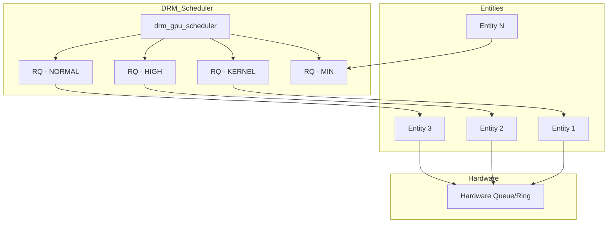
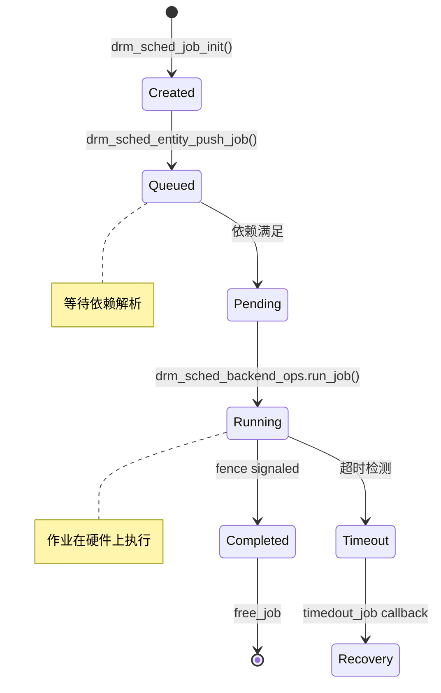
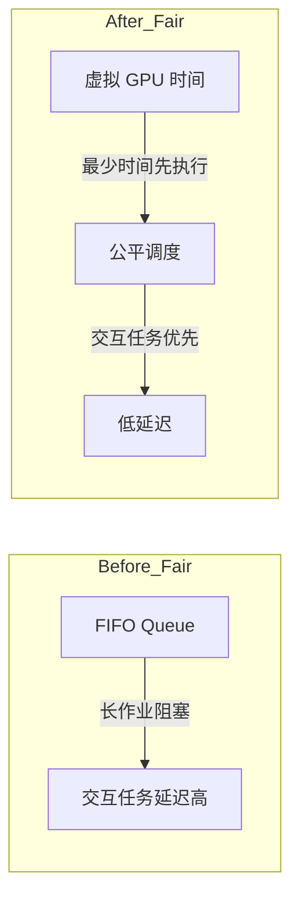
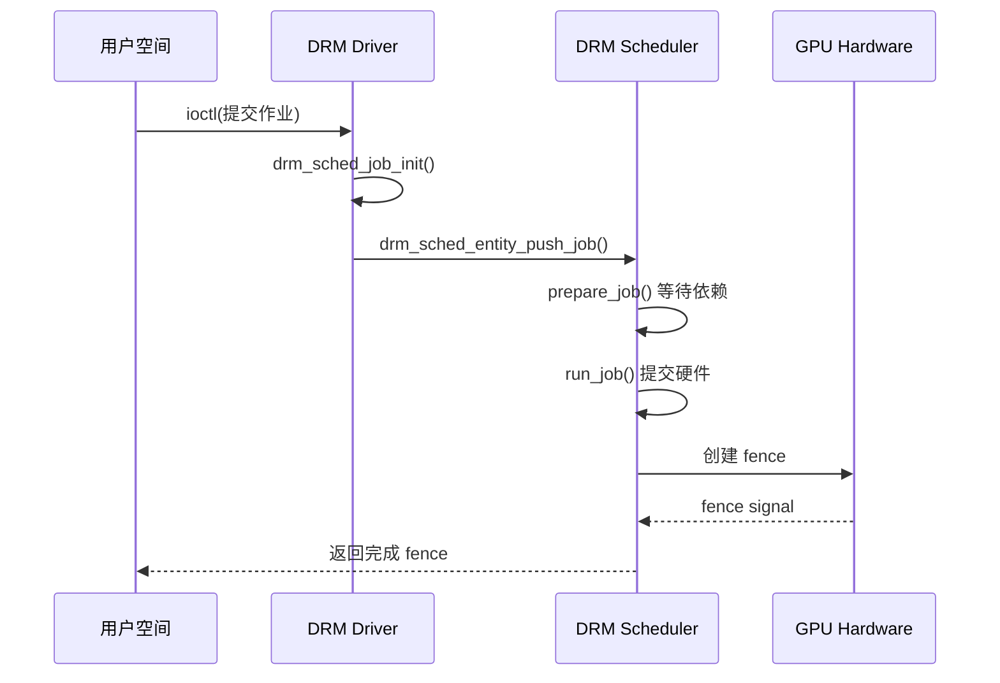
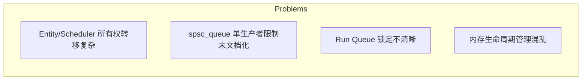
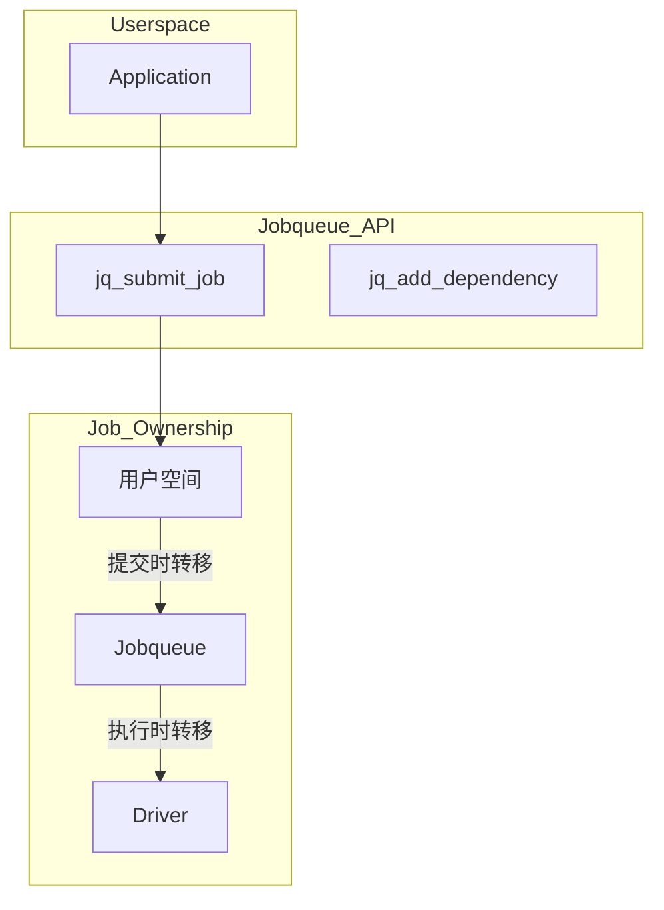

<!-- more -->

- [一、背景与问题](#一背景与问题)
- [二、DRM GPU Scheduler 核心架构](#二drm-gpu-scheduler-核心架构)
  - [2.1 核心数据结构](#21-核心数据结构)
  - [2.2 Scheduler、Entity、Run Queue 关系](#22-schedulerentityrun-queue-关系)
  - [2.3 Job 生命周期](#23-job-生命周期)
- [三、调度策略详解](#三调度策略详解)
  - [3.1 FIFO 策略](#31-fifo-策略)
  - [3.2 RR 策略](#32-rr-策略)
  - [3.3 Fair(er) 调度器 - CFS -inspired](#33-fairer-调度器--cfs-inspired)
- [四、依赖管理与同步机制](#四依赖管理与同步机制)
- [五、超时与错误处理](#五超时与错误处理)
- [六、DRM Jobqueue - 下一代基础设施](#六drm-jobqueue--下一代基础设施)
  - [6.1 解决的问题](#61-解决的问题)
  - [6.2 架构设计](#62-架构设计)
  - [6.3 与 DRM Scheduler 的对比](#63-与-drm-scheduler-的对比)
  - [6.4 目标用户](#64-目标用户)
  - [6.5 状态与未来](#65-状态与未来)
- [七、总结与展望](#七总结与展望)

---

## 一、背景与问题

现代 Linux 系统中的 GPU 工作负载日益复杂：多个渲染上下文同时提交任务、图形应用与计算任务并发执行、不同优先级的作业需要公平调度。**DRM GPU Scheduler** 正是为解决这些挑战而设计的共享基础设施。

<callout emoji="💡" background-color="light-blue">
DRM GPU Scheduler 是 Linux 内核 DRM 子系统中的共享组件，被 AMD、Intel、NVIDIA、Mesa 等多种 GPU 驱动用于管理作业提交、依赖解析、超时检测和调度算法。
</callout>

传统 FIFO（先入先出）调度存在以下问题：
- **公平性问题**：长时间运行的作业会阻塞短时交互式任务
- **优先级饥饿**：高优先级作业可能因低优先级作业长期占用而延迟
- **延迟抖动**：交互式应用的响应时间不可预测

---

## 二、DRM GPU Scheduler 核心架构

### 2.1 核心数据结构

```c
// include/drm/gpu_scheduler.h
enum drm_sched_priority {
    DRM_SCHED_PRIORITY_MIN,
    DRM_SCHED_PRIORITY_NORMAL,
    DRM_SCHED_PRIORITY_HIGH,
    DRM_SCHED_PRIORITY_KERNEL,
    DRM_SCHED_PRIORITY_COUNT
};

/* 调度策略 */
#define DRM_SCHED_POLICY_RR    0   // Round Robin
#define DRM_SCHED_POLICY_FIFO  1   // First In First Out (default)
extern int drm_sched_policy;
```

### 2.2 Scheduler、Entity、Run Queue 关系



**核心概念**：
- **drm_gpu_scheduler**：每个硬件 Ring 对应一个调度器实例
- **drm_sched_rq**：按优先级分类的运行队列
- **drm_sched_entity**：作业容器，通常绑定到 DRM 文件句柄
- **drm_sched_job**：实际要执行的任务单元

```c
// 调度器结构 - include/drm/gpu_scheduler.h
struct drm_gpu_scheduler {
    const struct drm_sched_backend_ops    *ops;
    unsigned int            hw_submission_limit;  // 硬件队列最大长度
    timeout_t               timeout;              // 作业超时时间
    const char              *name;
    struct drm_sched_rq     sched_rq[DRM_SCHED_PRIORITY_COUNT];  // 优先级队列数组
    struct task_struct     *thread;               // 调度线程
    // ...
};

// 运行队列
struct drm_sched_rq {
    spinlock_t              lock;
    struct drm_gpu_scheduler *sched;
    struct list_head        entities;              // 实体链表
    struct drm_sched_entity *current_entity;      // 当前执行的实体
    struct rb_root_cached   rb_tree_root;         // FIFO 调度的红黑树
};

// 实体 - 作业容器
struct drm_sched_entity {
    struct list_head        list;
    struct drm_sched_rq     *rq;
    enum drm_sched_priority priority;
    // ...
};
```

### 2.3 Job 生命周期



---

## 三、调度策略详解

### 3.1 FIFO 策略

默认调度策略，按照作业提交时间选择下一个执行实体：

```c
// drivers/gpu/drm/scheduler/sched_main.c
static __always_inline bool drm_sched_entity_compare_before(struct rb_node *a,
                                                            const struct rb_node *b)
{
    struct drm_sched_entity *ent_a = rb_entry(a, struct drm_sched_entity, rb_tree_node);
    struct drm_sched_entity *ent_b = rb_entry(b, struct drm_sched_entity, rb_tree_node);
    
    return ktime_before(ent_a->oldest_job_waiting, ent_b->oldest_job_waiting);
}
```

**问题**：
- 长作业阻塞短作业
- 交互式应用响应延迟不可预测
- 无法区分"紧急"和"普通"作业

### 3.2 RR 策略

轮询策略，时间片轮转：

```c
// drivers/gpu/drm/scheduler/sched_main.c
MODULE_PARM_DESC(sched_policy, 
    "Specify the scheduling policy for entities on a run-queue, "
    __stringify(DRM_SCHED_POLICY_RR) " = Round Robin, "
    __stringify(DRM_SCHED_POLICY_FIFO) " = FIFO (default).");
```

### 3.3 Fair(er) 调度器 - CFS-inspired

2025 年 Igalia 团队提出的**Fair(er) Scheduler**，灵感来自 Linux CFS（完全公平调度器）：



**核心改进**：
1. **虚拟 GPU 时间**：每个实体记录已消耗的 GPU 时间
2. **红黑树排序**：按虚拟时间选择下一个执行实体
3. **交互客户端友好**：略微偏好短作业

```c
// 新的调度策略 - 基于虚拟时间
struct drm_sched_entity {
    // ...
    u64                     gpu_time;         // 已消耗的 GPU 时间
    u64                     vruntime;         // 虚拟运行时间 (CFS 概念)
    // ...
};
```

<callout emoji="✅" background-color="light-green">
Fair(er) Scheduler 已于 2025 年从 RFC 阶段毕业，正在推进进入 Linux 主线。
</callout>

---

## 四、依赖管理与同步机制

DRM Scheduler 利用 **DMA-fence** 实现作业间依赖：

```c
// include/drm/gpu_scheduler.h
struct drm_sched_backend_ops {
    /**
     * @prepare_job: 准备作业，检查并等待依赖 fence
     */
    struct dma_fence *(*prepare_job)(struct drm_sched_job *sched_job,
                                     struct drm_sched_entity *s_entity);
                                     
    /**
     * @run_job: 依赖满足后，实际提交到硬件
     */
    struct dma_fence *(*run_job)(struct drm_sched_job *sched_job);
};

// Scheduler fence 结构
struct drm_sched_fence {
    struct dma_fence        scheduled;   // 作业调度时信号
    struct dma_fence        finished;    // 作业完成时信号
    struct dma_fence       *parent;      // 硬件 fence
    struct drm_gpu_scheduler *sched;
};
```

**依赖流程**：



---

## 五、超时与错误处理

当作业执行超时（GPU hang）时，调度器触发恢复流程：

```c
// include/drm/gpu_scheduler.h
enum drm_gpu_sched_stat (*timedout_job)(struct drm_sched_job *sched_job);

/* 返回状态 */
enum drm_gpu_sched_stat {
    DRM_GPU_SCHED_STAT_NOMINAL,   // 正常
    DRM_GPU_SCHED_STAT_ENODEV,    // 设备不可用
    DRM_GPU_SCHED_STAT_RESET,     // 已开始恢复
    DRM_GPU_SCHED_STAT_NO_HANG    // GPU 未挂起，跳过重置
};
```

**超时处理流程**（2025 年新改进）：

1. 超时定时器触发 `drm_sched_job_timedout()`
2. 调用驱动的 `timedout_job()` 回调
3. 驱动执行 GPU reset 或返回 `DRM_GPU_SCHED_STAT_NO_HANG`
4. 恢复后重新提交作业

<callout emoji="⚠️" background-color="light-yellow">
2025 年新增的 `DRM_GPU_SCHED_STAT_NO_HANG` 状态允许驱动跳过不必要的 GPU reset，优化了某些工作负载下的恢复效率。
</callout>

---

## 六、DRM Jobqueue - 下一代基础设施

对于固件负责调度的现代 GPU（如某些 AMD/NVIDIA 驱动），DRM Scheduler 显得过于复杂。**DRM Jobqueue** 应运而生，旨在成为固件调度 GPU 的轻量级负载均衡器、依赖管理器和超时处理器。

### 6.1 解决的问题

当前 DRM Scheduler 存在的历史负担：



- **所有权转移复杂**：Job 从 Entity 转移到 Scheduler，Ownership 语义不清晰
- **竞态条件**：`drm_sched_entity_push_job()` 不能并行调用同一 Entity
- **内存泄漏**：Teardown 时 pending_list 可能非空导致 `free_job()` 永不调用

### 6.2 架构设计



**核心 API 设计**：

```rust
// rust/kernel/drm/jq.rs - 简洁的 API
pub fn jq_submit_job(job: &Job, dependencies: &[DmaFence]) -> Result<()>

// 作业所有权转移：
// 1. 用户空间 -> Jobqueue (jq_submit_job)
// 2. Jobqueue -> Driver (执行时)
```

### 6.3 与 DRM Scheduler 的对比

| 特性 | DRM Scheduler | DRM Jobqueue |
|------|---------------|--------------|
| **架构复杂度** | 高（Entity/RunQueue/Scheduler 多层） | 极简（单一 Queue） |
| **调度功能** | 完整调度 + 负载均衡 | 仅负载均衡 |
| **所有权模型** | Job 在多组件间流转 | 线性转移（用户→队列→驱动） |
| **实现语言** | C | Rust（与新驱动集成） |
| **适用场景** | 内核调度 GPU | 固件调度 GPU |

### 6.4 目标用户

1. **NVIDIA Nova 驱动**：新一代开源驱动，使用固件调度
2. **AMD GPU（部分）**：某些型号固件负责作业排序
3. **未来 Rust 驱动**：新驱动多采用 Rust 实现

### 6.5 状态与未来

<callout emoji="🔧" background-color="light-blue">
Jobqueue 仍处于开发阶段，2025 年 11 月 XDC 大会上展示了初始 Rust 原型。
</callout>

- **当前状态**：RFC/WIP 阶段，Rust 骨架代码已提交
- **设计目标**：提供 C 兼容接口，兼容现有 C 驱动
- **长期愿景**：统一 DRM 作业提交接口，保留 Scheduler 给需要它的驱动

---

## 七、总结与展望

| 特性 | FIFO | RR | Fair(er) | Jobqueue |
|------|------|-----|----------|----------|
| 调度算法 | 提交时间 | 时间片轮转 | 虚拟 GPU 时间 | 负载均衡 |
| 公平性 | 低 | 中 | 高 | N/A |
| 适用场景 | 简单 | 有限 | 图形+计算混合 | 固件调度 GPU |
| 实现语言 | C | C | C | Rust |
| 主线状态 | 已支持 | 已支持 | 推进中 | RFC/WIP |
| 所有权模型 | Entity→Scheduler 多层 | 同上 | 同上 | 线性转移 |

DRM GPU Scheduler 经历了从简单 FIFO 到智能调度的演进，Fair(er) Scheduler 的加入将显著提升交互式应用的体验，而 Jobqueue 则为未来架构铺平道路。

---

感谢阅读！