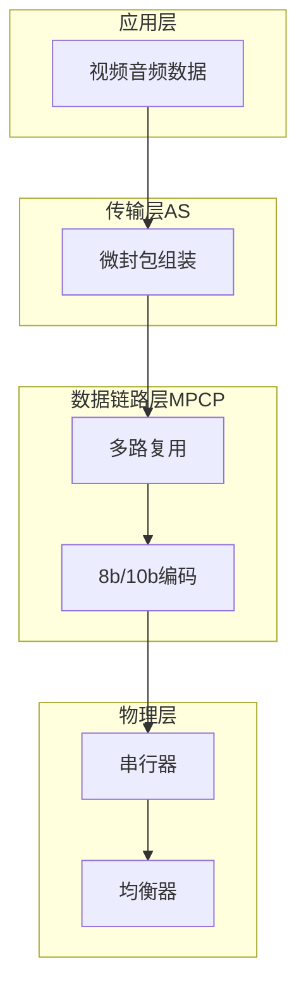
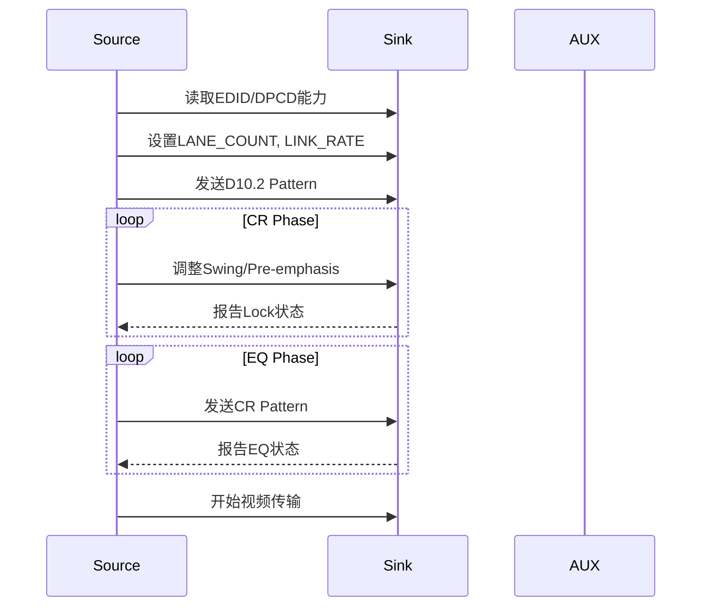
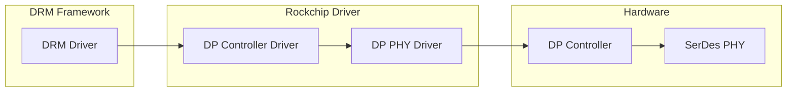

<!-- more -->
- [DisplayPort协议详解](#displayport协议详解)
  - [1. DisplayPort概述](#1-displayport概述)
    - [1.1 DP版本演进](#11-dp版本演进)
    - [1.2 DP接口特性](#12-dp接口特性)
  - [2. DP协议分层](#2-dp协议分层)
    - [2.1 物理层(PHY)](#21-物理层phy)
    - [2.2 数据链路层(MPCP)](#22-数据链路层mpcp)
    - [2.3 传输层(AS)](#23-传输层as)
    - [2.4 应用层](#24-应用层)
  - [3. Link Training过程](#3-link-training过程)
    - [3.1 Training准备阶段](#31-training准备阶段)
    - [3.2 通道偏斜校正(Channel EQ)](#32-通道偏斜校正channel-eq)
    - [3.3 CR阶段(Channel Equalization)](#33-cr阶段channel-equalization)
    - [3.4 EQ阶段(Emphasis)](#34-eq阶段emphasis)
    - [3.5 完整Link Training流程](#35-完整link-training流程)
  - [4. AUX CH通信](#4-aux-ch通信)
  - [5. RK3588 DP控制器](#5-rk3588-dp控制器)

# DisplayPort协议详解

## 1. DisplayPort概述

DisplayPort(简称DP)是由视频电子标准协会(VESA)制定的数字显示接口标准，主要用于连接电脑和显示器，也可用于连接电视、投影仪等设备。

### 1.1 DP版本演进

| 版本 | 最大带宽 | 最大分辨率@刷新率 | 主要特性 |
|------|----------|------------------|----------|
| DP 1.0 | 8.64 Gbps | 2560×1600@60Hz | 初始版本 |
| DP 1.2 | 17.28 Gbps | 3840×2160@60Hz | 多流传输(MST) |
| DP 1.3 | 25.92 Gbps | 5120×2880@60Hz | DSC压缩 |
| DP 1.4 | 32.4 Gbps | 7680×4320@60Hz | HDR、DP IN |
| DP 2.0 | 80 Gbps | 7680×4320@60Hz | 128b/132b编码 |

### 1.2 DP接口特性

- **主链路(Main Link)**: 1/2/4条Lane，支持1.62/2.7/5.4/8.1/10 Gbps速率
- **AUX通道(AUX CH)**: 1 Mbps差分双向通信，用于配置和EDID读取
- **热插拔检测(HPD)**: Sink发出中断信号通知Source

## 2. DP协议分层



### 2.1 物理层(PHY)

物理层负责高速串行数据的发送和接收，包括：

- **串行器/解串器**: 并行/串行转换
- **发送端预加重(Pre-emphasis)**: 补偿信道损耗
- **接收端均衡(EQ)**: 恢复信号完整性
- **时钟恢复(CDR)**: 从数据流中提取时钟

### 2.2 数据链路层(MPCP)

MPCP(MAC/PHY Control Protocol)实现：

- **8b/10b编码**: 直流平衡、确保跳变密度
- **通道分配**: 多Lane时的数据分发
- **时钟同步**: 嵌入时钟恢复
- **BCH纠错**: 检测和纠正传输错误

### 2.3 传输层(AS)

AS(Assembly Sub-layer)负责：

- **数据分帧**: 定义SA、DA、SPD等字段
- **视频数据封装**: CEA-861格式
- **音频数据封装**: IEC 60958格式

### 2.4 应用层

- **视频格式**: 支持CEA-861/VESA格式
- **色彩空间**: RGB、YCbCr444/422/420
- **位深**: 6/8/10/12/16 bit
- **音频**: LPCM、Dolby、DTS等

## 3. Link Training过程

Link Training是DP Source和Sink建立高速链路的关键过程，通过AUX CH交换配置参数，确保信号可靠传输。

### 3.1 Training准备阶段

Source首先读取Sink的EDID获取支持能力：

```
DPCD Register 0x000: Max LINK_RATE
DPCD Register 0x001: Max LANE_COUNT
DPCD Register 0x002: Supported power levels
```

Source设置link rate和lane count后，进入Training状态：

```c
// 设置Link配置
DPCD 0x100 = link_rate;      // 0x06=1.62G, 0x0A=2.7G, 0x14=5.4G, 0x1E=8.1G
DPCD 0x101 = lane_count;     // 1/2/4 lanes
DPCD 0x102 |= 0x01;          // 设置Link Training开始
```

### 3.2 通道偏斜校正(Channel EQ)

训练信号Pattern为D10.2(高频时钟序列)，用于：

1. **信号完整性检测**: 验证链路可传输高速数据
2. **电压幅度测量**: 确定最优驱动强度
3. **通道偏斜检测**: 测量各Lane延迟差异

### 3.3 CR阶段(Channel Equalization)

CR阶段调整均衡器参数：

| 参数 | 寄存器 | 说明 |
|------|--------|------|
| Voltage Swing | DPCD 0x103-0x106 | 信号幅度(0-3级) |
| Pre-emphasis | DPCD 0x107-0x10A | 预加重电平(0-3级) |

均衡器设置组合：

```c
// Swing/Pre-emphasis组合
{0, 0}, {0, 1}, {0, 2}, {0, 3},
{1, 0}, {1, 1}, {1, 2}, {2, 0},
{2, 1}, {3, 0}, {3, 1}, {3, 2}
```

### 3.4 EQ阶段(Emphasis)

EQ阶段使用PRBS7/CR-Pattern验证：

- **眼图质量**: 判断信号眼图开度
- **误码率**: BER < 10^-9
- **FFE设置**: 决定最终均衡参数

### 3.5 完整Link Training流程



关键寄存器状态检查：

```c
// CR阶段状态
DPCD 0x202: LANE0_1_STATUS
// bit[1] = lane1_symbol_locked
// bit[0] = lane0_symbol_locked

// EQ阶段状态  
DPCD 0x204: LANE0_1_2_3_5_EQUALIZER
// bit[3] = lane3_eq_done
// bit[2] = lane2_eq_done
// bit[1] = lane1_eq_done
// bit[0] = lane0_eq_done
```

## 4. AUX CH通信

AUX CH是DP的带外配置通道，支持：

- **地址空间**: 16-bit地址，寻址能力寄存器、EDID、HPD
- **传输速率**: 1 Mbps
- **协议格式**: I2C-like，带握手和重试

```c
// AUX CH读写示例
typedef enum {
    AUX_CMD_WRITE  = 0x8,  // Native Write
    AUX_CMD_READ   = 0x9,  // Native Read
    AUX_CMD_I2C_WR = 0x0,  // I2C Write
    AUX_CMD_I2C_RD = 0x1,  // I2C Read
} aux_cmd_t;
```

常用DPCD地址：

| 地址 | 功能 | 说明 |
|------|------|------|
| 0x000-0x00F | 能力寄存器 | 版本、速率、lane数 |
| 0x100-0x1FF | Link配置 | 训练参数 |
| 0x200-0x2FF | Link状态 | 训练结果 |
| 0x600-0x6FF | HDCP | 内容保护 |

## 5. RK3588 DP控制器

RK3588集成Synopsys DesignWare DP TX控制器：

- **DP版本**: DP 1.4a
- **最大带宽**: 32.4 Gbps (4 Lane × 8.1 Gbps)
- **分辨率**: 最高8K@60Hz (需DSC)
- **视频格式**: RGB/YUV444/YUV422/YUV420

```c
// RK3588 DP主要寄存器
struct rockchip_dp {
    struct reg_base *regs;          // 基址
    struct clk *pclk;                // APB时钟
    struct clk *grf_clk;            // GRF时钟
    struct reset *rst;              //复位
    struct phy *phy;                 // SerDes PHY
    enum dp_pixel_encoding encoding; // 像素编码格式
    int lane_count;                  // Lane数量
    int link_rate;                   // 链路速率
};
```

RK3588 DP软件架构：



---
感谢阅读！
