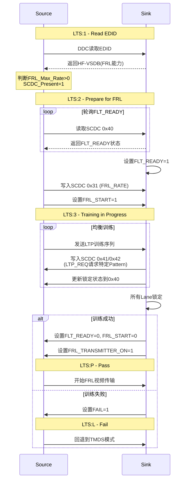
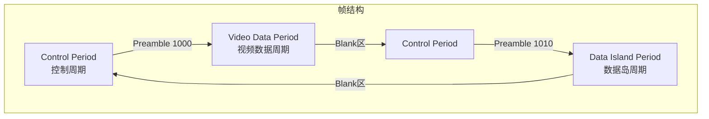
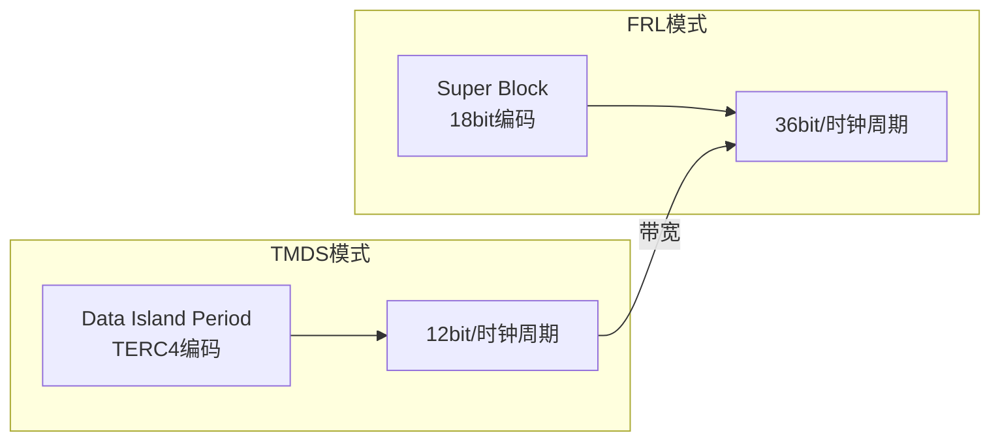
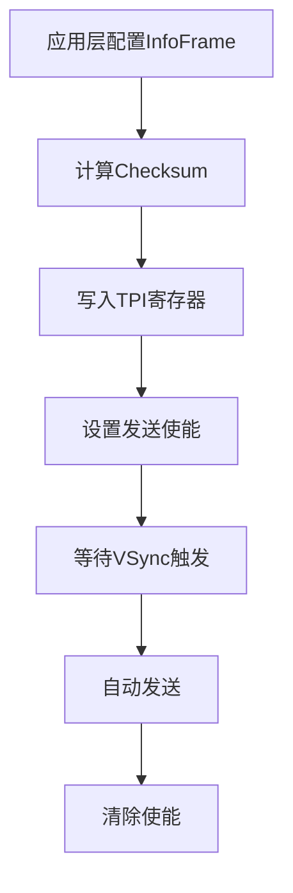

<!-- more -->
- [HDMI 2.1 FRL协议详解](#hdmi-21-frl协议详解)
  - [1. FRL概述](#1-frl概述)
    - [1.1 为什么需要FRL](#11-为什么需要frl)
    - [1.2 FRL速率等级](#12-frl速率等级)
  - [2. EDID能力发现](#2-edid能力发现)
    - [2.1 HF-VSDB字段](#21-hf-vsdb字段)
  - [3. SCDC寄存器配置](#3-scdc寄存器配置)
    - [3.1 SCDC地址空间](#31-scdc地址空间)
    - [3.2 FRL\_RATE配置](#32-frl_rate配置)
    - [3.3 状态标志寄存器](#33-状态标志寄存器)
  - [4. Link Training状态机](#4-link-training状态机)
    - [4.1 LTS状态说明](#41-lts状态说明)
    - [4.2 完整训练流程](#42-完整训练流程)
  - [5. LTP训练序列](#5-ltp训练序列)
  - [6. TMDS传输周期](#6-tmds传输周期)
    - [6.1 三种传输周期](#61-三种传输周期)
    - [6.2 Control Period](#62-control-period)
    - [6.3 Video Data Period](#63-video-data-period)
    - [6.4 Data Island Period](#64-data-island-period)
    - [6.5 周期时序关系](#65-周期时序关系)
  - [7. HDMI vs DP对比](#7-hdmi-vs-dp对比)
  - [8. Packet传输机制详解](#8-packet传输机制详解)
    - [8.1 TMDS vs FRL Packet传输差异](#81-tmds-vs-frl-packet传输差异)
    - [8.2 TMDS Packet类型](#82-tmds-packet类型)
    - [8.3 InfoFrame发送流程](#83-infoframe发送流程)
    - [8.4 FRL Super Block结构](#84-frl-super-block结构)
    - [8.5 LTP训练序列详解](#85-ltp训练序列详解)
    - [8.6 FFE (Feed-Forward Equalizer) 控制](#86-ffe-feed-forward-equalizer-控制)
  - [9. 问答精选](#9-问答精选)
    - [Q1: HDMI 2.1为什么需要FRL而不是继续使用TMDS?](#q1-hdmi-21为什么需要frl而不是继续使用tmds)
    - [Q2: HDMI FRL训练失败后如何处理?](#q2-hdmi-frl训练失败后如何处理)
    - [Q3: HDMI和DP的主要区别是什么？](#q3-hdmi和dp的主要区别是什么)
    - [Q4: HDMI的Data Island Period和Video Data Period有什么区别？](#q4-hdmi的data-island-period和video-data-period有什么区别)
    - [Q5: FRL Link Training过程中，Sink如何请求特定的LTP？](#q5-frl-link-training过程中sink如何请求特定的ltp)

# HDMI 2.1 FRL协议详解

## 1. FRL概述

FRL(Fixed Rate Link)是HDMI 2.1引入的高速传输模式，用于替代传统的TMDS(Transition-Minimized Differential Signaling)模式，支持最高48Gbps带宽。

### 1.1 为什么需要FRL

| 对比项 | TMDS (HDMI 2.0) | FRL (HDMI 2.1) |
|--------|-----------------|----------------|
| 最大带宽 | 18 Gbps | 48 Gbps |
| 编码方式 | 8b/10b | 16b/18b |
| 最大分辨率 | 4K@60Hz | 8K@120Hz, 10K |
| 时钟嵌入 | 独立时钟 | 内嵌于数据流 |
| 训练机制 | 无 | Link Training |

### 1.2 FRL速率等级

HDMI 2.1定义了6种FRL速率：

| FRL等级 | Lane数 | 每Lane速率 | 总带宽 | 典型应用 |
|---------|--------|-----------|--------|----------|
| FRL1 | 3 | 3 Gbps | 9 Gbps | 4K@30Hz |
| FRL2 | 3 | 6 Gbps | 18 Gbps | 4K@60Hz |
| FRL3 | 4 | 6 Gbps | 24 Gbps | 4K@120Hz |
| FRL4 | 4 | 8 Gbps | 32 Gbps | 8K@30Hz |
| FRL5 | 4 | 10 Gbps | 40 Gbps | 8K@60Hz |
| FRL6 | 4 | 12 Gbps | 48 Gbps | 8K@120Hz, 10K |

> 注：FRL1/FRL2向后兼容TMDS模式

## 2. EDID能力发现

### 2.1 HF-VSDB字段

Source首先通过DDC(I2C地址0xA0/0xA1)读取Sink的EDID，解析HF-VSDB(HDMI Forum Vendor-Specific Data Block)字段：

```
EDID Extension Block → CEA-861 Extension → HF-VSDB

关键字段：
├── FRL_Max_Rate     // 最大支持FRL速率 (1-6)
├── FRL_Max_Lanes    // 最大Lane数 (3或4)
├── SCDC_Present     // 必须为1才支持FRL
└── ...              // 其他能力字段
```

Sink支持FRL的判断条件：
```c
if (FRL_Max_Rate > 0 && SCDC_Present == 1 && Sink_Version != 0) {
    // Sink支持FRL模式
}
```

## 3. SCDC寄存器配置

### 3.1 SCDC地址空间

SCDC(Status and Control Data Channel)是HDMI 2.1的配置接口，通过DDC访问(地址0xA8/0xA9)：

| 地址范围 | 功能 | 说明 |
|----------|------|------|
| 0x00-0x0F | 版本信息 | SCDC版本、源版本 |
| 0x10-0x1F | 更新标志 | 配置变更通知 |
| 0x20-0x2F | 配置寄存器 | TMDS/FRL模式配置 |
| 0x30-0x3F | FRL配置 | FRL速率、训练参数 |
| 0x40-0x4F | 状态标志 | 链路锁定状态 |
| 0x50-0xFF | 扩展功能 | CED(误码统计)等 |

### 3.2 FRL_RATE配置

```c
// SCDC 0x31 - Sink Configuration Register
typedef struct {
    uint8_t FFE_LEVELS : 4;  // 前置加重电平
    uint8_t FRL_RATE    : 4;  // FRL速率配置
} scdc_frl_control_t;

// FRL_RATE字段
| 值  | 速率配置        |
|-----|----------------|
| 0   | 禁用FRL(TMDS)  |
| 1   | 3Gbps × 3 lanes|
| 2   | 6Gbps × 3 lanes|
| 3   | 6Gbps × 4 lanes|
| 4   | 8Gbps × 4 lanes|
| 5   | 10Gbps × 4 lanes|
| 6   | 12Gbps × 4 lanes|
```

### 3.3 状态标志寄存器

```c
// SCDC 0x40 - Status Flag Register
typedef struct {
    uint8_t CLK_DETECTED   : 1;  // 时钟检测
    uint8_t CH0_LOCKED     : 1;  // Lane0锁定
    uint8_t CH1_LOCKED     : 1;  // Lane1锁定
    uint8_t CH2_LOCKED     : 1;  // Lane2锁定
    uint8_t CH3_LOCKED     : 1;  // Lane3锁定
    uint8_t FLT_READY      : 1;  // 训练就绪
    uint8_t FAIL           : 1;  // 训练失败
    uint8_t DSC_DECODE     : 1;  // DSC解码状态
} scdc_status_flag_t;

// SCDC 0x10 - Source Test Update Register
typedef struct {
    uint8_t RR_TEST        : 1;  // 读写测试
    uint8_t UPDATE         : 1;  // 配置更新
    uint8_t ...            : 6;
} scdc_test_update_t;
```

## 4. Link Training状态机

### 4.1 LTS状态说明

| 状态 | 名称 | Source行为 | Sink行为 |
|------|------|-----------|----------|
| LTS:1 | Read EDID | 读取解析EDID | 提供EDID，设置SCDC |
| LTS:2 | Prepare for FRL | 轮询FLT_READY | 准备完成后设置FLT_READY=1 |
| LTS:3 | Training in Progress | 发送LTP Pattern | 评估信号，请求Pattern类型 |
| LTS:4 | FRL Rate Change | 调整FRL Rate | 请求新速率(可选) |
| LTS:P | Pass | 开始视频传输 | 准备接收视频数据 |
| LTS:L | Fail | 回退TMDS模式 | 进入TMDS |

### 4.2 完整训练流程



## 5. LTP训练序列

LTP(Link Training Pattern)是FRL训练使用的特殊序列：

| LTP类型 | 用途 | 说明 |
|---------|------|------|
| LTP1 | 时钟恢复 | 低频训练序列 |
| LTP2 | 通道特性 | 中频特性测量 |
| LTP3 | 均衡训练 | 高频均衡调整 |
| LTP4 | 全景验证 | 综合眼图验证 |
| PRBS | 误码检测 | 伪随机序列BER测试 |

Sink通过SCDC配置请求特定LTP：

```c
// SCDC 0x41 - Lane 0/1 LTP请求
typedef struct {
    uint8_t LN0_LTP_REQ : 4;  // Lane0请求的LTP类型
    uint8_t LN1_LTP_REQ : 4;  // Lane1请求的LTP类型
} ln01_ltp_req_t;

// SCDC 0x42 - Lane 2/3 LTP请求
typedef struct {
    uint8_t LN2_LTP_REQ : 4;  // Lane2请求的LTP类型
    uint8_t LN3_LTP_REQ : 4;  // Lane3请求的LTP类型
} ln23_ltp_req_t;
```

Source根据Sink反馈调整：
- **FFE(Feed-Forward Equalization)** 电平
- **驱动电压幅度**
- **均衡器增益**

## 6. TMDS传输周期

HDMI使用TMDS编码，在一个视频帧的传输过程中，有三种交替的传输周期。理解这些周期对于HDMI协议解析和调试至关重要。

### 6.1 三种传输周期



| 周期类型 | 编码方式 | 每周期bit | 位置 | 主要内容 |
|----------|----------|----------|------|----------|
| Control Period | 2b/10b | 6bit | 消隐区 | HS/VS同步, Preamble |
| Video Data Period | 8b/10b | 24bit | 有效像素 | RGB/YCbCr像素数据 |
| Data Island Period | 4b/10b | 12bit | 消隐区 | 音频/InfoFrame |

### 6.2 Control Period

**作用**：
- 传输HSYNC、VSYNC同步信号
- 传输Preamble前导码，告知下一个周期类型
- Sink字符同步恢复
- 任何两个非Control Period之间**必须**有Control Period

**CTL编码**：
| CTL3:0 | 下一个周期类型 |
|--------|---------------|
| 1000 | Video Data Period |
| 1010 | Data Island Period |

**编码方式**：使用特殊10bit控制码，每通道传输2bit(HS/VS/CTL0/CTL1)，共6bit

### 6.3 Video Data Period

**位置**：传输有效视频像素

**结构**：
```
[Preamble 8字符] → [Leading Guard Band 2字符] → [有效像素数据]
```

**数据映射**：
| TMDS Channel | RGB模式 | YCbCr模式 |
|--------------|---------|-----------|
| Channel 0 | Blue | Cr/Cb |
| Channel 1 | Green | Y |
| Channel 2 | Red | Cb/Cr |

**编码方式**：8b/10b，每时钟周期传输24bit像素

**Guard Band码**：
- Channel 2/1: `0b1011001100`
- Channel 0: `0b0100110011`

### 6.4 Data Island Period

**位置**：水平/垂直消隐期间

**传输内容**：
- 音频数据包(Audio Sample Packets)
- InfoFrame信息帧(AVI, Audio, Vendor等)
- 辅助数据

**结构**：
```
[Preamble 8字符] → [Leading Guard Band 2字符] → [数据包] × N → [Trailing Guard Band 2字符]
```

**数据映射**：
- Channel 0/1/2: 各4bit
- 每TMDS时钟周期传输12bit
- 使用TERC4编码(TMDS Error Reduction Coding)

**Guard Band码**：
- Channel 2/1: `0b0100110011`
- Channel 0: 保留

### 6.5 周期时序关系

**行级视角**：
```
         ┌─────────────────────────────────────────────────────────────┐
         │                    一行视频数据传输                            │
         ├──────────┬────────────────────┬──────────────┬─────────────┤
         │ Control  │   Video Data       │   Control    │  Data       │
         │ Period   │   Period           │   Period     │  Island     │
         ├──────────┼────────────────────┼──────────────┼─────────────┤
  同步信号│  HS/VS   │   Active Video    │   HS/VS      │   HS/VS     │
  Preamble│  1000    │   (像素数据)       │   1010       │             │
  编码方式│  2b/10b  │   8b/10b          │   2b/10b     │   4b/10b    │
  数据内容│  同步/控制│   RGB/YCbCr像素   │   同步/控制   │   音频/Info │
         └──────────┴────────────────────┴──────────────┴─────────────┘
                           有效像素                消隐区(含音频)
```

**帧级视角**：
```
┌─────────────────────────────────────────────────────────────────┐
│ Frame (完整帧)                                                   │
├─────────────────────────────────────────────────────────────────┤
│ 第1场/帧头 Control ──> Video Data ──> Control ──> Data Island ──►│
├─────────────────────────────────────────────────────────────────┤
│ Active Line N     Control ──> Video Data ──> Control ──► DI ──►│
├─────────────────────────────────────────────────────────────────┤
│ Blanking Lines    Control ──> Data Island ──> Control ──► DI ──►│
│ (消隐区传输音频)                                                    │
├─────────────────────────────────────────────────────────────────┤
│ 最后一帧尾     Control ──> Video Data ──> Control              │
└─────────────────────────────────────────────────────────────────┘

关键点：
1. Control Period是"交通灯"，告诉Sink下一个要进入什么模式
2. Video Data传输有效图像像素
3. Data Island分散在消隐区，传输音频和InfoFrame
4. 消隐区 = Back Porch + Sync + Front Porch
```

## 7. HDMI vs DP对比

| 特性 | HDMI 2.1 FRL | DisplayPort 1.4 |
|------|-------------|-----------------|
| 最大带宽 | 48 Gbps | 32.4 Gbps |
| 训练配置 | SCDC寄存器 | DPCD寄存器 |
| 配置通道 | DDC(I2C) | AUX CH |
| 编码方式 | 16b/18b | 8b/10b |
| 纠错机制 | Reed-Solomon FEC | BCH |
| 训练状态 | LTS:1/2/3/P/L | CR/EQ阶段 |
| 热插拔 | HPD脉冲 | HPD中断 |
| 内容保护 | HDCP 2.2/2.3 | HDCP 2.2/2.3 |

| 特性 | HDMI 2.1 FRL | DisplayPort 2.0 UHBR |
|------|---------------|---------------------|
| 最大带宽 | 48 Gbps | 80 Gbps |
| 编码方式 | 16b/18b | 128b/132b |
| 训练机制 | SCDC+LTS状态机 | DPRX状态机 |
## 8. Packet传输机制详解

在HDMI协议中，Packet是传输辅助数据（音频、InfoFrame、厂商特定信息）的基本单元。理解Packet的传输机制对于实现HDMI功能至关重要。

### 8.1 TMDS vs FRL Packet传输差异



| 特性 | TMDS模式 | FRL模式 |
|------|----------|---------|
| 编码方式 | TERC4 (4b/10b) | 16b/18b |
| 每时钟周期 | 12bit | 36bit |
| 数据岛周期 | 分散在消隐区 | 嵌入Super Block |
| 传输类型 | 包(Packet) | 流(Stream) |

### 8.2 TMDS Packet类型

HDMI定义了多种Packet类型，通过Header + Body结构传输：

| Packet Type | HB[0] | 用途 | 传输频率 |
|-------------|-------|------|----------|
| Audio Sample Packet | 0x02 | 音频采样数据 | 每帧 |
| Audio InfoFrame | 0x04 | 音频通道配置 | 帧期间隔 |
| AVI InfoFrame | 0x06 | 视频格式信息 | 每帧 |
| Vendor-Specific VSIF | 0x81 | 厂商特定信息 | 需时 |
| SPD InfoFrame | 0x83 | Source设备信息 | 需时 |
| GCP (General Control) | 0x08 | 颜色深度/3D信息 | 需时 |
| VSI (Vendor-Specific Info) | 0xA0 | HDMI许可信息 | 需时 |

**Packet结构**：
```
[Packet Header - 4字节] → [Packet Body - 28字节]
    ├── HB0: Packet Type
    ├── HB1: Packet Version
    ├── HB2: Length
    └── HB3: Party/Reserved
    
    └── DB0-DB27: 数据内容
```

### 8.3 InfoFrame发送流程



**代码实现示例**：

```c
// HDMI TX Packet管理 - hdmi_tx_pktmgmt.c
static void tpi_info_send(u8 sel, u8 *data, bool no_chksum_flag)
{
    u32 checksum = 0;
    u32 i;
    
    // 1. 选择InfoFrame类型
    hdmitx21_wr_reg(TPI_INFO_FSEL_IVCTX, sel);
    
    // 2. 计算Checksum (前30字节累加，取反)
    if (!no_chksum_flag) {
        for (i = 0; i < 30; i++) {
            checksum += data[i];
        }
        checksum = (u8)(0x100 - (checksum & 0xFF));
        data[4] = checksum;  // AVI DB1位置
    }
    
    // 3. 写入数据到TPI寄存器
    for (i = 0; i < 30; i++) {
        hdmitx21_wr_reg(TPI_INFO_BYTE00_IVCTX + i, data[i]);
    }
    
    // 4. 使能发送 (AVI + Audio + GCP)
    hdmitx21_wr_reg(TPI_INFO_EN_IVCTX, 0xe0);
}

// InfoFrame类型选择 (sel值映射)
enum info_frame_sel {
    INFOFRAME_AVI      = 0,  // AVI InfoFrame
    INFOFRAME_EMP_VRR  = 1,  // EMP (VRR/QMS)
    INFOFRAME_AUDIO   = 2,  // Audio InfoFrame
    INFOFRAME_SPD     = 3,  // SPD InfoFrame
    INFOFRAME_EMP_SBTM = 4, // EMP SBTM
    INFOFRAME_VSIF    = 5,  // Vendor VSIF
    INFOFRAME_DRM     = 6,  // DRM InfoFrame
    INFOFRAME_GCP     = 7,  // GCP
    INFOFRAME_HFVSIF  = 8,  // HF-VSIF
    INFOFRAME_EMP2    = 9,  // EMP
    INFOFRAME_SBTM    = 10, // SBTM
};
```

### 8.4 FRL Super Block结构

FRL模式使用Super Block作为基本传输单元，相比TMDS具有更高效率：

```
Super Block结构 (4个FRL时钟周期):
┌──────────────────────────────────────────────────────────────────┐
│ Lane 0     │ Lane 1     │ Lane 2     │ Lane 3     │             │
├────────────┼────────────┼────────────┼────────────┤             │
│ 18bit × 4  │ 18bit × 4  │ 18bit × 4  │ 18bit × 4  │ = 288bit    │
└─────────────────────────────────────────────────────────────────┘

每18bit组成:
┌────────────────┬────────────────┬────────────────┐
│  Data (16bit)  │  ECC (2bit)    │                │
└────────────────┴────────────────┴────────────────┘
```

**Super Block类型**：

| 类型 | 用途 | 数据内容 |
|------|------|----------|
| Video Super Block | 有效像素行 | RGB/YCrCb像素数据 |
| Audio Super Block | 音频数据 | Audio Sample Packets |
| Control Super Block | 控制信息 | InfoFrame/同步 |
| Idle Super Block | 空闲填充 | 0x0000 |

### 8.5 LTP训练序列详解

LTP(Link Training Pattern)是FRL Link Training的核心，用于调整Source和Sink之间的信号特性：

```c
// LTP Pattern定义
enum ltp_pattern {
    LTP_D10_2      = 0x1111,  // D10.2训练序列
    LTP_SCRAMBLER  = 0x2222,  // 扰码训练序列
    LTP_NONE2      = 0x3333,  // 无训练
    LTP_PRBS7      = 0x4444,  // PRBS7误码测试
    LTP_PRBS15     = 0x5555,  // PRBS15误码测试
    LTP_PRBS31     = 0x6666,  // PRBS31误码测试
    LTP_EEEE       = 0xEEEE,  // FFE更新请求
    LTP_FFFF       = 0xFFFF,  // 速率切换请求
};
```

**训练序列作用**：

| 训练阶段 | LTP类型 | 目的 | Sink评估指标 |
|----------|---------|------|-------------|
| 阶段1 | LTP_D10_2 | 基础时钟恢复 | 时钟锁定 |
| 阶段2 | LTP_SCRAMBLER | 通道特性测量 | 眼图开启 |
| 阶段3 | LTP_PRBS7 | 高频特性 | BER < 10^-9 |
| 阶段4 | LTP_EEEE | FFE调整 | 信号质量最优 |

### 8.6 FFE (Feed-Forward Equalizer) 控制

FFE是FRL训练中的关键参数，用于补偿信道损耗：

```c
// SCDC FFE配置
typedef struct {
    uint8_t FFE_LEVELS     : 4;  // FFE强度等级
    uint8_t FRL_RATE       : 4;  // FRL速率
} scdc_frl_control_t;

// FFE等级与补偿关系
// FFE等级越高，高频增益越大
// 补偿公式: Gain(dB) = FFE_LEVEL × 3dB

// 训练过程中Sink通过LTP反馈调整FFE:
void update_ffe_level(int lane, int level) {
    // 写入SCDC 0x31 FFE_LEVELS字段
    uint8_t val = (level & 0x0F) | (current_frl_rate << 4);
    scdc_write(0x31, val);
}
```

**FFE与线缆长度的关系**：

| 线缆类型 | 推荐FFE等级 | 补偿能力 |
|----------|------------|----------|
| 短线(<1m) | 0-1 | 最小 |
| 标准线(1-3m) | 2-3 | 中等 |
| 长线(>3m) | 4 | 最大 |

---

## 9. 问答精选

### Q1: HDMI 2.1为什么需要FRL而不是继续使用TMDS?

**参考答案**：
- TMDS最大带宽仅18Gbps，无法支持8K@60Hz或更高分辨率
- FRL使用16b/18b编码（vs TMDS的8b/10b），效率提升约11%
- FRL支持4 Lane（TMDS仅3 Lane），理论带宽达48Gbps
- FRL引入Link Training机制，可自适应调整信号特性

### Q2: HDMI FRL训练失败后如何处理?

**参考答案**：
1. 训练失败标志：SCDC 0x40[5] FAIL=1
2. 回退策略：
   - 尝试降低FRL速率（FRL6→FRL5→...→FRL1）
   - 降级到TMDS模式（4K@60Hz可满足）
3. 恢复流程：
   - 设置FRL_START=0, FRL_RATE=0
   - 重新进入TMDS模式
   - 通知上层应用降级显示

### Q3: HDMI和DP的主要区别是什么？

**参考答案**：
| 特性 | HDMI 2.1 | DisplayPort 1.4/2.0 |
|------|----------|---------------------|
| 配置通道 | DDC(I2C) | AUX CH |
| 编码 | 16b/18b / 8b/10b | 8b/10b / 128b/132b |
| 训练接口 | SCDC | DPCD |
| 热插拔 | HPD脉冲 | HPD中断+Irq |
| 授权 | 需要HDMI许可 | 免费 |

### Q4: HDMI的Data Island Period和Video Data Period有什么区别？

**参考答案**：
- Video Data Period：传输有效像素，使用8b/10b编码，每时钟24bit
- Data Island Period：传输辅助数据（音频/InfoFrame），使用TERC4编码，每时钟12bit
- 两者通过Control Period的Preamble (1000/1010) 区分

### Q5: FRL Link Training过程中，Sink如何请求特定的LTP？

**参考答案**：
Sink通过SCDC寄存器请求：
- SCDC 0x41: Lane 0/1 LTP请求 (LN0_LTP_REQ[3:0], LN1_LTP_REQ[3:0])
- SCDC 0x42: Lane 2/3 LTP请求 (LN2_LTP_REQ[3:0], LN3_LTP_REQ[3:0])

Source根据请求发送对应LTP，Sink评估信号质量后调整FFE_LEVELS参数。

---

感谢阅读！
