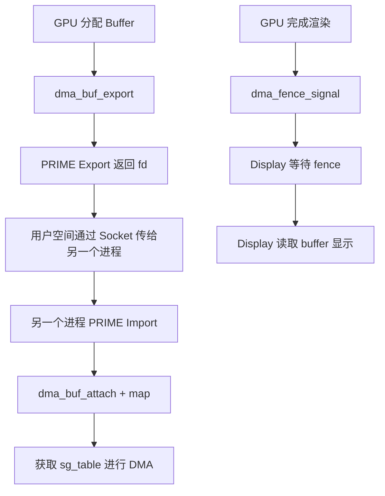

<!-- more -->

- [一、背景与问题](#一背景与问题)
- [二、DMA-buf 核心机制](#二dma-buf-核心机制)
  - [2.1 基本概念](#21-基本概念)
  - [2.2 核心数据结构](#22-核心数据结构)
  - [2.3 Exporter 与 Importer](#22-exporter-与-importer)
  - [2.4 dma-buf 文件系统](#24-dma-buf-文件系统)
- [三、DMA-fence 同步机制](#三dma-fence-同步机制)
  - [3.1 为什么需要 fence](#31-为什么需要-fence)
  - [3.2 fence 数据结构](#32-fence-数据结构)
  - [3.3 fence 等待与信号](#33-fence-等待与信号)
  - [3.4 典型使用流程](#34-典型使用流程)
- [四、DRM 中的 PRIME 机制](#四drm-中的-prime-机制)
  - [4.1 PRIME 简介](#41-prime-简介)
  - [4.2 Export 流程](#42-export-流程)
  - [4.3 Import 流程](#43-import-流程)
  - [4.4 PRIME 缓存机制](#44-prime-缓存机制)
- [五、代码示例](#五代码示例)
  - [5.1 Exporter 示例](#51-exporter-示例)
  - [5.2 DMA-fence 示例](#52-dma-fence-示例)
- [六、总结](#六总结)

---

## 一、背景与问题

在现代 Linux 系统中，显示子系统涉及多个硬件组件的协同工作：GPU、视频解码器、显示控制器、摄像头等。这些组件之间需要高效地共享视频帧数据。传统方式是通过内存拷贝，但这种方式在 4K 视频、GPU 渲染等高带宽场景下效率极低。

**DMA-buf** 应运而生，它提供了一种无需拷贝的缓冲区共享机制，使得不同硬件设备可以直接访问同一块物理内存。

<callout emoji="💡" background-color="light-blue">
DMA-buf 的核心思想：将物理内存页描述为可在设备间流转的"文件句柄"，通过文件描述符传递实现零拷贝共享。
</callout>

---

## 二、DMA-buf 核心机制

### 2.1 基本概念

DMA-buf 的本质是 **buffer 与 file 的结合**：
- **Buffer**：实际的物理内存页
- **File**：Linux 文件描述符，用于在进程和驱动之间传递

这样设计的好处是：
1. 统一的传递媒介（file descriptor）
2. 引用计数管理生命周期
3. 跨进程共享变得简单

### 2.2 核心数据结构

```c
// include/linux/dma-buf.h
struct dma_buf {
    struct module *owner;
    const struct dma_buf_ops *ops;
    struct file *file;
    void *priv;
    size_t size;
    // ...
};
```

**dma_buf_ops** 是 Exporter 必须实现的核心接口：

```c
struct dma_buf_ops {
    bool cache_sgt_mapping;
    
    /* 附件管理 */
    int (*attach)(struct dma_buf *, struct dma_buf_attachment *);
    void (*detach)(struct dma_buf *, struct dma_buf_attachment *);
    
    /* DMA 映射 - 核心接口 */
    struct sg_table * (*map_dma_buf)(struct dma_buf_attachment *,
                     enum dma_data_direction);
    void (*unmap_dma_buf)(struct dma_buf_attachment *,
                  struct sg_table *,
                  enum dma_data_direction);
                  
    /* CPU 访问 */
    int (*begin_cpu_access)(struct dma_buf *, enum dma_data_direction);
    int (*end_cpu_access)(struct dma_buf *, enum dma_data_direction);
    
    /* 内存映射 */
    int (*mmap)(struct dma_buf *, struct vm_area_struct *vma);
    int (*vmap)(struct dma_buf *dmabuf, struct iosys_map *map);
    void (*vunmap)(struct dma_buf *dmabuf, struct iosys_map *map);
    
    /* 释放 */
    void (*release)(struct dma_buf *);
};
```

### 2.3 Exporter 与 Importer

| 角色 | 职责 |
|------|------|
| **Exporter** | 分配物理内存，实现 dma_buf_ops，将 dmabuf 导出为 fd |
| **Importer** | 接收 fd，附加到设备，获取 scatter-gather 列表进行 DMA |

**Exporter 工作流程**：

```c
static int exporter_init(void)
{
    DEFINE_DMA_BUF_EXPORT_INFO(exp_info);
    struct dma_buf *dmabuf;

    exp_info.ops = &exp_dmabuf_ops;    // 实现 dma_buf_ops
    exp_info.size = PAGE_SIZE;          // buffer 大小
    exp_info.flags = O_CLOEXEC;         // 文件标志
    exp_info.priv = " exporter私有数据";

    dmabuf = dma_buf_export(&exp_info);
    if (IS_ERR(dmabuf))
        return PTR_ERR(dmabuf);

    return 0;
}
```

### 2.4 dma-buf 文件系统

Linux 提供 debugfs 接口查看当前系统的 dmabuf 对象：

```bash
cat /sys/kernel/debug/dma_buf/bufinfo
```

输出示例：
```
Dma-buf Objects:
size            flags           mode            count           exp_name        ino
00004096        00000000        00080005        00000001        dma_buf 00000088
        Attached Devices:
Total 0 devices attached

Total 1 objects, 4096 bytes
```

---

## 三、DMA-fence 同步机制

### 3.1 为什么需要 fence

当多个设备（GPU、VPU、Display）共享同一个 buffer 时，必须解决同步问题：
- GPU 还在写入时，Display 可能已经开始读取
- 必须保证"生产者"完成工作后，"消费者"才能使用

**DMA-fence** 提供了一种优雅的同步机制，通过 fence 信号来协调不同硬件设备的操作顺序。

### 3.2 fence 数据结构

```c
struct dma_fence {
    spinlock_t *lock;
    const struct dma_fence_ops *ops;
    u64 context;      // 唯一上下文 ID
    u64 seqno;       // 序列号
    unsigned long flags;
    struct list_head cb_list;
    // ...
};
```

**fence 操作**：
- `dma_fence_signal()` - 标记 fence 已完成
- `dma_fence_wait()` - 等待 fence 信号
- `dma_fence_add_callback()` - 添加回调函数

### 3.3 fence 等待与信号

fence 支持两种等待模式：
1. **阻塞等待** - `dma_fence_wait(fence, true)`
2. **非阻塞轮询** - `dma_fence_wait(fence, false)`

### 3.4 典型使用流程

```c
// 创建 fence
static struct dma_fence *create_fence(void)
{
    struct dma_fence *fence;
    fence = kzalloc(sizeof(*fence), GFP_KERNEL);
    dma_fence_init(fence, &fence_ops, &fence_lock, context, seqno);
    return fence;
}

// 等待 fence（用户空间）
ret = ioctl(fd, DMA_FENCE_IN_CMD, &in_fence_fd);
in_fence = sync_file_get_fence(in_fence_fd);
dma_fence_wait(in_fence, true);  // 阻塞等待

// 发出 fence（生产者完成）
dma_fence_signal(out_fence);

// 创建 sync_file 供用户空间获取
sync_file = sync_file_create(out_fence);
out_fence_fd = get_unused_fd_flags(O_CLOEXEC);
fd_install(out_fence_fd, sync_file->file);
```

---

## 四、DRM 中的 PRIME 机制

### 4.1 PRIME 简介

PRIME 是 DRM 框架中用于用户空间缓冲区分享的机制：
- **Export**：将 GEM buffer 导出为 dmabuf，返回 fd 给用户空间
- **Import**：从用户空间接收 fd，转换为 GEM buffer

<callout emoji="💡" background-color="light-blue">
PRIME 的命名来源于 "Pixel Resource Import/Export"，是跨进程、跨设备缓冲共享的标准方案。
</callout>

### 4.2 Export 流程

```
用户空间请求 GEM buffer 的 fd
        ↓
drm_gem_prime_export()
        ↓
dma_buf_export()
        ↓
返回 fd 给用户空间
```

核心代码：
```c
// drm_prime.c
struct dma_buf *drm_gem_dmabuf_export(struct drm_device *dev,
                                       struct drm_gem_object *obj,
                                       struct dma_buf_export_info *exp_info)
{
    exp_info->ops = dev->driver->gem_prime_ops->ops;
    exp_info->priv = obj;
    
    return dma_buf_export(exp_info);
}
```

### 4.3 Import 流程

```
用户空间传递 fd 给 DRM driver
        ↓
drm_gem_prime_import()
        ↓
dma_buf_attach() + dma_buf_map_dma_buf()
        ↓
创建 GEM object 并返回
```

### 4.4 PRIME 缓存机制

DRM 使用红黑树缓存 import/export 关系，避免重复创建：

```c
struct drm_prime_member {
    struct dma_buf *dma_buf;
    uint32_t handle;
    struct rb_node dmabuf_rb;
    struct rb_node handle_rb;
};
```

这确保：
- 同一个 buffer 在同一进程内只有一个 handle
- 用户空间可以检测重复 import

---

## 五、代码示例

### 5.1 Exporter 示例

```c
#include <linux/dma-buf.h>
#include <linux/module.h>

static const struct dma_buf_ops exp_dmabuf_ops = {
    .map_dma_buf = exporter_map_dma_buf,
    .unmap_dma_buf = exporter_unmap_dma_buf,
    .release = exporter_release,
};

static int __init exporter_init(void)
{
    DEFINE_DMA_BUF_EXPORT_INFO(exp_info);
    struct dma_buf *dmabuf;

    exp_info.ops = &exp_dmabuf_ops;
    exp_info.size = PAGE_SIZE;
    exp_info.flags = O_CLOEXEC;
    exp_info.priv = "exporter";

    dmabuf = dma_buf_export(&exp_info);
    if (IS_ERR(dmabuf))
        return PTR_ERR(dmabuf);

    return 0;
}

MODULE_INFO(import_ns, "DMA_BUF");
MODULE_LICENSE("GPL v2");
```

### 5.2 DMA-fence 示例

```c
#include <linux/dma-fence.h>
#include <linux/sync_file.h>

static const char *dma_fence_get_name(struct dma_fence *fence)
{
    return "example-fence";
}

static const struct dma_fence_ops fence_ops = {
    .get_driver_name = dma_fence_get_name,
    .get_timeline_name = dma_fence_get_name,
};

// 创建 fence
fence = kzalloc(sizeof(*fence), GFP_KERNEL);
dma_fence_init(fence, &fence_ops, &fence_lock, context, seqno);

// 信号 fence（生产者完成）
dma_fence_signal(fence);

// 创建 sync_file 返回给用户空间
sync_file = sync_file_create(fence);
fd = get_unused_fd_flags(O_CLOEXEC);
fd_install(fd, sync_file->file);
```

---

## 六、总结

| 机制 | 作用 |
|------|------|
| **DMA-buf** | 提供跨设备、跨进程的缓冲区共享机制，通过 fd 传递 |
| **DMA-fence** | 提供缓冲区同步机制，解决生产者和消费者的时序问题 |
| **PRIME** | DRM 框架中用户空间的导入/导出接口，连接 GEM 和 dma-buf |

三者配合工作流程：



理解这三个机制是深入 Linux 显示子系统的必经之路，特别是在研究 GPU 渲染、Video Codec、Camera 捕获等场景时尤为重要。

---

感谢阅读！
