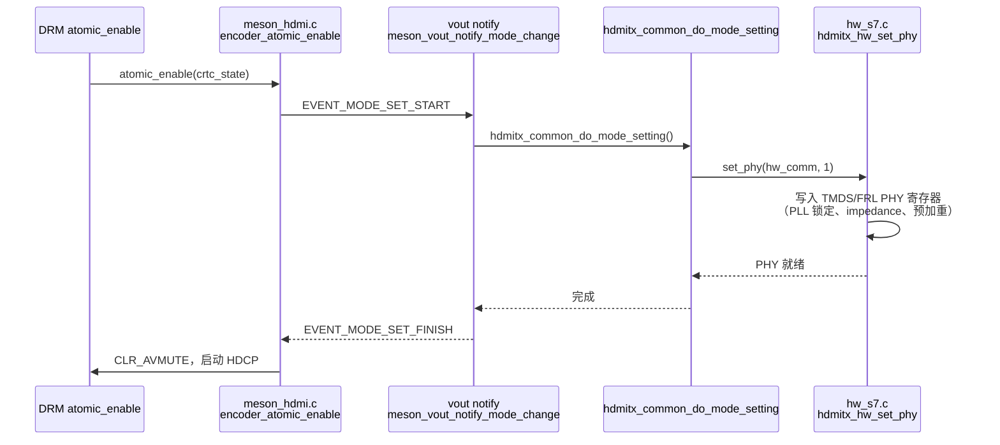

本文基于 Amlogic dn 平台内核源码（`drm-dn` + `vout-dn`），深度分析 Meson DRM 驱动的完整架构，重点覆盖：VPU-HDMITX 硬件连接方式、Overlay 实现机制、DRM Connector/Encoder 设计，以及 HDMI 2.1 高级特性（FRL、QMS-VRR、HDR、HDCP）在驱动中的落地。

<!-- more -->

- [整体架构概览](#整体架构概览)
- [模块目录结构](#模块目录结构)
- [驱动初始化与 component 框架](#驱动初始化与-component-框架)
- [VPU 硬件架构与 OSD/Video Pipeline](#vpu-硬件架构与-osdvideo-pipeline)
  - [OSD Plane 数据通路](#osd-plane-数据通路)
  - [Video Overlay：video\_wrapper](#video-overlayvideo_wrapper)
  - [PostBlend：VPP 合成输出](#postblendvpp-合成输出)
- [VPU 与 HDMITX 的硬件接口](#vpu-与-hdmitx-的硬件接口)
  - [不是 DPI，是数字并行像素总线](#不是-dpi是数字并行像素总线)
  - [VENC / ENCL 编码器时序生成](#venc--encl-编码器时序生成)
- [HDMI Connector 实现详解](#hdmi-connector-实现详解)
  - [am\_hdmi\_tx 核心结构体](#am_hdmi_tx-核心结构体)
  - [HPD 与 EDID 处理](#hpd-与-edid-处理)
  - [Connector 扩展属性](#connector-扩展属性)
- [HDMI Encoder 实现详解](#hdmi-encoder-实现详解)
  - [atomic\_mode\_set：颜色属性决策](#atomic_mode_set颜色属性决策)
  - [atomic\_enable：vout 通知链路](#atomic_enablevout-通知链路)
  - [atomic\_disable：PHY 关断时序](#atomic_disablephy-关断时序)
- [HDMI 协议与高级特性](#hdmi-协议与高级特性)
  - [HDMI 2.1 FRL 固定速率链路](#hdmi-21-frl-固定速率链路)
  - [QMS-VRR 快速媒体切换](#qms-vrr-快速媒体切换)
  - [HDR / Dolby Vision 处理流程](#hdr--dolby-vision-处理流程)
  - [HDCP 1.4 / 2.2 认证状态机](#hdcp-14--22-认证状态机)
  - [ALLM / Content Type](#allm--content-type)
- [中断与异步提交](#中断与异步提交)
- [内存与 DMA 模型](#内存与-dma-模型)
- [参考资料](#参考资料)
- [HDMI PHY 初始化流程](#hdmi-phy-初始化流程)

---

## 整体架构概览

dn 平台的显示子系统分为两个内核模块，通过 `meson_connector_dev` 接口解耦：

```
用户态 (Wayland/Android/HWC)
          │  DRM IOCTL (atomic commit)
          ▼
┌─────────────────────────────────────────────────────┐
│                  meson-drm 模块                      │
│  drm_device  ──  CRTC ── Plane(OSD/Video)           │
│                    │                                  │
│              meson_vpu_pipeline                      │
│    OSD_MIF → AFBC → Scaler → OSDBlend → PostBlend   │
│    Video_Wrapper ──────────────────────────┘         │
│                    │                                  │
│              VENC/ENCL (时序发生器)                   │
│                    │                                  │
│  Encoder ──────────┘   Connector                    │
│  (TMDS/FRL)            (HPD/EDID)                   │
└──────────┬──────────────────┬───────────────────────┘
           │ meson_connector_dev hook   │
           ▼                            ▼
┌──────────────────────────────────────────────────────┐
│              vout-dn 模块                    │
│  hdmitx_common ── hdmitx21 hw ── PHY (TMDS/FRL)     │
│  hdmitx_drm_hook (全局 tx_base / tx_hw)              │
└──────────────────────────────────────────────────────┘
```

两个模块在运行时通过 `hdmitx_bind_meson_drm()` 注册 `meson_hdmitx_dev` ops 结构体连接，DRM 层通过函数指针调用 HDMITX 的 mode setting、HPD 回调、HDCP 使能等接口，做到编译解耦。

---

## 模块目录结构

```
display-dn/
├── drm-dn/drm/          # DRM KMS 层
│   ├── meson_drm_main.c         # module_init/exit：先 vpu_init 再 drm_init
│   ├── meson_drv.c              # platform_driver probe，component master
│   ├── meson_hdmi.c             # HDMI connector + encoder (核心)
│   ├── meson_crtc.c             # CRTC + vblank + HDR 策略
│   ├── meson_plane.c            # OSD plane (ARGB/AFBC/AFRC)
│   ├── meson_vpu_pipeline.c     # VPU topology，block DAG 遍历
│   └── vpu-hw/
│       ├── meson_osd_afbc.c     # AFBC/AFRC 解压缩块
│       ├── meson_osd_scaler.c   # OSD 缩放器
│       ├── meson_vpu_osdblend.c # OSD 混合器
│       ├── meson_vpu_postblend.c# VPP postblend，OSD+Video 最终合成
│       ├── meson_vpu_video_wrapper.c # Video plane (YUV) 接口
│       └── meson_vpu_hdr_dv.c   # HDR/DV tone-mapping 控制
│
└── vout-dn/vout/
    ├── hdmitx_common/           # HDMI 协议公共层（与 SoC 无关）
    │   ├── hdmitx_common.c      # vic/edid/hpd/格式参数
    │   ├── hdmitx_edid_parse.c  # EDID Block 0/1 + CEA 扩展解析
    │   ├── hdmitx_packet.c      # AVI/SPD/VS/HDR InfoFrame 组装
    │   ├── hdmitx_drm_hook.c    # DRM ↔ HDMITX 桥接，全局 tx_base
    │   └── hdmitx_compliance.c  # CTS 测试合规检查
    └── hdmitx21/                # HDMI 2.1 硬件层
        ├── hdmi_tx_main.c       # platform_driver probe
        ├── hdmi_tx_video.c      # 视频格式参数应用
        ├── hdmi_tx_frl.c        # FRL 状态机
        ├── hdmi_tx_scdc.c       # SCDC R/W (DDC channel 2)
        └── hw/
            ├── enc_cfg_hw.c     # VENC 时序寄存器配置
            ├── hw_s7.c          # S7 SoC 专用初始化
            ├── hdmitx_frl_training.c # LTS 训练序列
            └── interrupts.c     # HDMITX 中断处理
```

---

## 驱动初始化与 component 框架

`meson_drm_main.c` 的 `module_init` 按顺序调用：

```c
am_meson_vpu_init();   // 注册 VPU platform_driver
am_meson_drm_init();   // 注册 DRM platform_driver (component master)
```

`am_meson_drv_probe()` 通过 DT `ports` 属性找到所有 CRTC 节点，再从 `of_graph` 找到 encoder 节点，构建 `component_match`，触发 `component_master_add_with_match()`。

当所有子组件（VPU、HDMITX connector）完成 probe 后，component 框架回调 `am_meson_drm_bind()`：

```c
static int am_meson_drm_bind(struct device *dev)
{
    drm_mode_config_init(drm);
    vpu_topology_init(pdev, priv);          // 解析 VPU block DAG
    drm->mode_config.funcs = &meson_mode_config_funcs;
    // atomic_commit → meson_atomic_commit (自定义)
    component_bind_all(dev, &priv->bound_data); // 绑定 HDMI connector
    am_meson_writeback_create(drm);
    meson_worker_thread_init(priv, num_crtcs); // SCHED_FIFO kthread/CRTC
    drm_vblank_init(drm, num_crtcs);
    am_meson_logo_init(drm);                // uboot logo 延续显示
    drm_dev_register(drm, 0);
}
```

HDMITX 模块通过 `hdmitx_bind_meson_drm()` → `meson_connector_dev_bind()` 钩子注册 `meson_hdmitx_dev`，供 `meson_hdmitx_dev_bind()` 创建 connector + encoder。

---

## VPU 硬件架构与 OSD/Video Pipeline

### OSD Plane 数据通路

Meson VPU 采用"block DAG"拓扑，每个硬件功能块抽象为 `meson_vpu_block`，通过有向边连接。OSD 完整通路如下：

```
GEM Buffer (dma-buf)
      │
      ▼
OSD_MIF (meson_vpu_osd_mif.c)    ← DMA 读取，pixel fetch
      │
      ▼ (若 AFBC/AFRC modifier)
AFBC 解压缩块 (meson_osd_afbc.c)  ← ARM AFBC / Amlogic AFRC
      │
      ▼
OSD Scaler (meson_osd_scaler.c)   ← 双线性/bicubic，最大缩小10x
      │
      ▼
GFCD (meson_vpu_osd_gfcd.c)       ← 去毛刺/色差补偿 (可选)
      │
      ▼
OSDBlend (meson_vpu_osdblend.c)   ← 最多 3 路 OSD alpha 混合
      │
      ▼
HDR/DV 处理 (meson_vpu_hdr_dv.c)  ← tone-mapping，DV composer
      │
      ▼
PostBlend (meson_vpu_postblend.c) ← OSD + Video 最终合成 → VPP 输出
```

AFBC 支持 ARM 标准格式（16x16/32x8 block + SPARSE + SPLIT + YTR），同时支持 Amlogic 专有 AFRC 格式（Scan-line layout，压缩 unit 16/24/32），由 `meson_plane.c` 中的 `afbc_modifier[]` 数组声明给 DRM 框架。

格式支持随 SoC 版本演进：`supported_drm_formats_v4`（S1A）新增 RGBA5551/ARGB1555/C8 调色板格式，`supported_drm_formats_v5`（S7D）增加 ABGR10101010。

### Video Overlay：video_wrapper

Video plane（YUV）走独立的 `meson_vpu_video_wrapper` 路径，不经过 OSDBlend，直接汇入 PostBlend 的 VD1/VD2 输入：

```c
// meson_vpu_video_wrapper.c
// 支持格式：NV12/NV21/UYVY/VUY888 + Amlogic FBC scatter layout
video_supported_drm_formats[] = {
    DRM_FORMAT_NV12, DRM_FORMAT_NV21,
    DRM_FORMAT_UYVY, DRM_FORMAT_VUY888,
};
video_fbc_modifier[] = {
    DRM_FORMAT_MOD_AMLOGIC_FBC(AMLOGIC_FBC_LAYOUT_BASIC, 0),
    DRM_FORMAT_MOD_AMLOGIC_FBC(AMLOGIC_FBC_LAYOUT_SCATTER, 0),
    ...
};
```

Video plane 是**真正的硬件 Overlay**：VD1/VD2 与 OSD 在 PostBlend 阶段按 Z-order 合成，不占用 GPU，适合视频解码直接输出（dma-buf zero-copy）。

### PostBlend：VPP 合成输出

PostBlend（`meson_vpu_postblend.c`）是 VPU 的最后一级，对应寄存器组 `VPP_OSD1/2_BLD_H/V_SCOPE`、`OSD1/2_BLEND_SRC_CTRL`、`VD1/2_BLEND_SRC_CTRL`。

多 VPP 配置（VPP0/1/2）支持多屏异显，每个 VPP 独立输出到各自的 VENC，最终连接到不同的物理接口（HDMITX / LCD / CVBS）。

---

## VPU 与 HDMITX 的硬件接口

### 不是 DPI，是数字并行像素总线

VPU PostBlend 输出的像素数据经过 **VENC（Video Encoder）** 加入同步信号（HSYNC/VSYNC/DE），以**内部数字并行像素总线**直连 HDMITX 控制器。这条总线是芯片内部通路，**不是 DPI（Display Parallel Interface）**——DPI 是对外引脚的并行 RGB 接口，而 Meson 的 VENC→HDMITX 路径完全在 SoC 内部。

```
VPU PostBlend
      │  像素总线（内部，TMDS 之前的数字域）
      ▼
VENC / ENCL（时序发生器）
      │  并行像素 + H/V sync + DE
      ▼
HDMITX 控制器（TMDS/FRL 编码器）
      │
      ▼  （差分对，对外引脚）
HDMI 连接器 ──── 电视/显示器
```

### VENC / ENCL 编码器时序生成

`enc_cfg_hw.c` 负责向 VENC 寄存器写入时序参数：

```c
// enc_cfg_hw.c (hdmitx21/hw/)
// 根据 VIC 计算 total_pixels_venc、active_pixels_venc 等
// 考虑 pix_repeat_factor（480i/576i 像素重复）
// 设置 VFIFO2VD_TO_HDMI_LATENCY 补偿 FIFO 延迟
static void hdmi_tvenc1080i_set(enum hdmi_vic vic) { ... }
```

VENC 有多个实例（ENCL/ENCI/ENCP），HDMITX 通常使用 ENCP（progressive）或 ENCI（interlace）。时钟由 `hw_clk.c` 中的 HPLL（HDMI PLL）驱动，支持小数分频以实现精确像素时钟（如 594MHz for 4K60）。

---

## HDMI Connector 实现详解

### am_hdmi_tx 核心结构体

```c
// meson_hdmi.h
struct am_hdmi_tx {
    struct meson_connector  base;         // 内嵌 drm_connector
    struct drm_encoder      encoder;      // 内嵌 drm_encoder
    struct meson_hdmitx_dev *hdmitx_dev; // ops 函数指针（vout 模块提供）

    // HDCP 状态
    int  hdcp_mode;           // HDCP_NULL / HDCP_MODE14 / HDCP_MODE22
    int  hdcp_state;          // DISCONNECT/START/SUCCESS/FAIL
    int  hdcp_rx_type;        // RX 支持的 HDCP 类型掩码
    bool android_path;        // Android 路径下 hdcp 由用户态管理

    // VRR
    int  min_vfreq, max_vfreq;

    // 扩展属性句柄
    struct drm_property *color_space_prop;
    struct drm_property *color_depth_prop;
    struct drm_property *hdr_cap_property;
    struct drm_property *dv_cap_property;
    struct drm_property *allm_prop;
    struct drm_property *hdmi_hdr_status_prop;
    struct drm_property *hdr_priority_prop;
    // ... HDCP/avmute/ready/contenttype_cap
};
```

Connector 与 Encoder 共享同一结构体（内嵌），通过 `container_of` 互相转换（`connector_to_am_hdmi` / `encoder_to_am_hdmi`）。

### HPD 与 EDID 处理

HPD 中断由 `vout-dn` 侧的 `hdmitx21` 处理，通过注册的回调 `meson_hdmitx_hpd_cb()` 通知 DRM：

```c
static void meson_hdmitx_hpd_cb(void *data)
{
    // 拔出时：断开 HDCP
    if (!hdmitx_get_hpd_state(tx_comm) && !am_hdmi->android_path)
        meson_hdmitx_disconnect_hdcp();

    // 插入时：立即读取 RX HDCP 能力（避免 HDCP1.4 雪花屏）
    if (hdmitx_get_hpd_state(tx_comm))
        am_hdmi_info.hdcp_rx_type = hdmitx_dev->get_rx_hdcp_cap();

    // CEC 物理地址更新
    cec_notifier_set_phys_addr_from_edid(...);

    drm_kms_helper_hotplug_event(...); // 触发 userspace uevent
}
```

`meson_hdmitx_get_modes()` 不直接解析 EDID，而是从 `hdmitx_common` 获取经过合规性检查后的 VIC 列表，再通过 `hdmitx_common_get_timing_para()` 转换为 `drm_display_mode`，支持 QMS-VRR 分组（同一分辨率多帧率打包为一个 VRR 组）。

### Connector 扩展属性

Meson HDMI connector 在标准 DRM 属性之外扩展了大量私有属性：

| 属性名 | 类型 | 说明 |
|--------|------|------|
| `color_space` | enum | RGB/444/422/420 |
| `color_depth` | range 0-16 | bit depth |
| `hdr_cap` | range 0-1023 | HDR 能力位图 |
| `dv_cap` | range 0-1023 | Dolby Vision 能力位图 |
| `allm` | range 0-3 | ALLM 模式 |
| `hdmi_hdr_status` | enum | 当前 HDR 状态 |
| `hdr_priority` | range | 0=SDR/1=HDR/2=DV 优先级 |
| `hdcp_mode` | range | 当前 HDCP 模式 |
| `hdcp_ver` | range | RX 支持的 HDCP 版本 |
| `MESON_DRM_HDMITX_PROP_AVMUTE` | bool | AV Mute |
| `ready` | bool | HDMITX 就绪状态 |

---

## HDMI Encoder 实现详解

### atomic_mode_set：颜色属性决策

`meson_hdmitx_encoder_atomic_mode_set()` 在每次 modeset 的 check 阶段（实际在 `atomic_check`）决定颜色格式：

```c
void meson_hdmitx_encoder_atomic_mode_set(...)
{
    // 1. 决定 EOTF 类型（DV/HDR10/SDR）
    meson_hdmitx_decide_eotf_type(meson_crtc_state, hdmitx_state);

    // 2. 颜色格式优先级（4K60Hz）:
    //    YUV420,10bit → YUV422,12bit → YUV420,8bit → YUV444,8bit → RGB,8bit
    // 颜色格式优先级（其他分辨率）:
    //    YUV444,10bit → YUV422,12bit → RGB,10bit → YUV444,8bit → RGB,8bit
    if (!hdmitx_state->color_force)
        meson_hdmitx_decide_color_attr(tx_comm, crtc_state, attr, seq_id);

    // 3. 构建最终格式参数
    hdmitx_common_build_format_para(tx_comm, &hcs.para, vic,
        frac_rate_policy, colorformat, colordepth, quant_range);
}
```

DV 低延迟模式（LL）强制 YUV422,12bit；DV 标准模式强制 YUV444,8bit。

### atomic_enable：vout 通知链路

```c
void meson_hdmitx_encoder_atomic_enable(...)
{
    // seamless 切换（QMS-VRR 帧率切换）：只更新 vframe_rate_hint，跳过完整 modeset
    if (meson_crtc_state->seamless) {
        hdmitx_dev->set_vframe_rate_hint(dst_vrefresh * 100, NULL);
        return;
    }

    // 正常流程：通过 vout notify 链路驱动 HDMITX 硬件
    meson_vout_notify_mode_change(vout_index, vmode, EVENT_MODE_SET_START);
    hdmitx_common_do_mode_setting(hdmitx_common, &hcs, &old_hcs);
    meson_vout_notify_mode_change(vout_index, vmode, EVENT_MODE_SET_FINISH);

    // 完成后清 AVMUTE，启动 HDCP
    hdmitx_common_avmute_locked(tx_comm, CLR_AVMUTE, AVMUTE_PATH_DRM);
    meson_hdmitx_update_hdcp();
}
```

`hdmitx_common_do_mode_setting()` 最终调用 `hw_s7.c`（或对应 SoC 的 hw_xxx.c）写入寄存器，配置 TMDS 时钟、FRL 速率、InfoFrame 等。

### atomic_disable：PHY 关断时序

```c
void meson_hdmitx_encoder_atomic_disable(...)
{
    am_hdmi_info.hdmitx_on = 0;
    hdmitx_common_avmute_locked(tx_comm, SET_AVMUTE, AVMUTE_PATH_DRM);
    msleep(100);
    hdmitx_hw_set_phy(hw_comm, 0);  // 关闭 PHY，让 TV 更快检测到断开
    meson_hdmitx_stop_hdcp();
    msleep(100);
}
```

先 AVMUTE→等待 100ms→关 PHY，遵循 HDMI 规范的时序要求，避免 TV 端因信号突变产生雪花屏。

---

## HDMI 协议与高级特性

### HDMI 2.1 FRL 固定速率链路

HDMI 2.1 用 FRL（Fixed Rate Link）取代 TMDS 以支持 48Gbps 带宽（4K120/8K60）。FRL 使用 4 条差分对（lane0-3），每条最高 12Gbps。

驱动中 FRL 状态机位于 `hdmi_tx_frl.c`，训练序列在 `hdmitx_frl_training.c`：

```c
// hdmitx_frl_training.c
void frl_tx_av_enable(bool enable)
{
    hdmitx21_set_reg_bits(H21TXSB_CTRL_1_IVCTX, !enable, 1, 1);
}

bool flt_tx_cmd_execute(u8 lt_cmd)
{
    hdmitx21_set_reg_bits(HT_DIG_CTL0_PHY_IVCTX, lt_cmd | 0x10, 0, 5);
    return hdmitx21_rd_reg(HT_LTP_ST_PHY_IVCTX) & 0x1;
}
```

LTS（Link Training Sequence）分 4 个阶段：LTS:1（初始化）→ LTS:2（速率协商，通过 SCDC）→ LTS:3（训练，TX 发 FLT_start，RX 反馈 FLT_ready）→ LTS:4（传输阶段）→ LTS:P（维持）。SCDC 通过 DDC Channel 2（I²C，地址 0x54）通信。

```
SCDC 寄存器（0x01）Update_Flags:
  bit0 = Status_Update
  bit1 = CED_Update（Character Error Detection）
  bit2 = RR_Test（Rate Reduction Test）
```

### QMS-VRR 快速媒体切换

QMS（Quick Media Switching）是 HDMI 2.1 VRR 的子集，允许在不同帧率的固定模式之间无缝切换（无黑屏）。

驱动中 QMS 实现通过 VRR 组机制：同一分辨率的多个帧率 VIC 打包为 `drm_vrr_mode_group`，并标注 BRR（Base Refresh Rate）：

```c
// meson_hdmi.c
static bool meson_encoder_vrr_change(...)
{
    if (new_state->vrr_enabled && old_state->vrr_enabled)
        meson_crtc_state->seamless = true;  // QMS→QMS 无缝
    else if (new_state->vrr_enabled && !old_state->vrr_enabled)
        // ALLM→QMS：只有当前模式是 BRR 才能无缝
        seamless = !strcmp(old_mode->name, brr_name);
}
```

seamless 路径下 `atomic_enable` 只发送 `set_vframe_rate_hint()`，HDMITX 侧通过调整 VSYNC 时序实现帧率切换，完全绕过完整 modeset，切换延迟 < 2 帧。

qms_patches 目录中有多个上游 patch，包括 QMS interlace 修复、VIC 列表合规性等，已部分合入主线。

### HDR / Dolby Vision 处理流程

EOTF 类型由 `meson_hdmitx_decide_eotf_type()` 从三个维度综合决定：

1. **用户偏好**（`hdr_priority` 属性）：0=SDR, 1=HDR10, 2=DV
2. **RX EDID 能力**：通过 VSVDB（Vendor Specific Video Data Block）解析 DV ver/interface/low_latency
3. **硬件 IP 可用性**：`crtc_dv_enable`（DV composer IP）、`crtc_hdr_enable`（HDR tone-mapping IP）

回退策略：DV → HDR10 → SDR。例如若 RX 支持 DV 但当前模式为 4K60 而 VSVDB 未标注 `sup_2160p60hz`，则自动降为 HDR10。

HDR10 InfoFrame（Dynamic Range & Mastering InfoFrame，type 0x87）由 `hdmitx_packet.c` 的 `hdmitx_common_do_mode_setting()` 在模式切换时写入。

### HDCP 1.4 / 2.2 认证状态机

```
       ┌─────────────────────────────┐
       │       HDCP 状态机            │
       │                             │
  DISCONNECT → START → (认证中)      │
       │          │                  │
       │      SUCCESS / FAIL         │
       │          │         │        │
       │      通知 DRM     降级/重试  │
       └─────────────────────────────┘
```

驱动实现双模式：
- **Android path**（`hdcp_ctl_lvl=0`）：HDCP 完全由用户态 MediaDRM 管理，驱动只透传 content_protection 属性变化
- **Linux path**（`hdcp_ctl_lvl=1/2`）：驱动直接调用 `hdmitx_dev->hdcp_enable(mode)`

ContentType0（电影）允许 HDCP 1.4 或 2.2；ContentType1（4K UHD）必须 HDCP 2.2。HDCP 2.2 失败且为 Type0 时自动降级到 1.4。

`hdcp_topo` 属性暴露中继器（Repeater）拓扑信息，供 DRM 用户态读取。

### ALLM / Content Type

ALLM（Auto Low Latency Mode）通过 VSIF（Vendor Specific InfoFrame）发送，触发 TV 自动进入游戏模式（关闭图像处理降低延迟）。驱动中 `allm_prop` 范围 0-3，通过 `hdmitx_common_set_allm_mode()` 写入。

Content Type（`CNC0-3` 对应 Graphics/Photo/Cinema/Game）通过 AVI InfoFrame byte5 bit[7:4] 发送，由 `hdmitx_common_set_contenttype()` 配置。

---

## 中断与异步提交

Meson DRM 使用专用 **kthread** 处理每个 CRTC 的 atomic commit，优先级 `SCHED_FIFO P16`：

```c
// meson_drv.c
meson_worker_thread_init(priv, num_crtcs);
// → kthread_run(kthread_worker_fn, &worker, "crtc%d_commit")
// → sched_setscheduler(thread, SCHED_FIFO, &param)
```

VBlank 中断触发时序：
1. VENC VBlank 中断 → `drm_crtc_handle_vblank()` → 唤醒等待 fence 的进程
2. Commit kthread 在 vblank 后执行 `vpu_pipeline_prepare_update()` / `vpu_osd_pipeline_update()`
3. RDMA（Register DMA）将寄存器更新列表在 VBlank 时原子写入，避免撕裂

HDMITX 中断（HPD 变化、SCDC 状态变化、HDCP 认证完成）在 `vout-dn/hdmitx21/hw/interrupts.c` 中处理，通过注册回调异步通知 DRM 层。

---

## 内存与 DMA 模型

```
用户态 mmap / DRM GEM
        │
        ▼
am_meson_gem (ION heap) 或 drm_gem_cma
        │  dma_buf fd (PRIME)
        ▼
OSD_MIF DMA 读取（streaming DMA）
  dma_map_sg() → CPU cacheline flush → GPU/DPU 读取
        │
        ▼ （视频平面）
Video Wrapper DMA
  dma-buf zero-copy from 解码器输出
  支持 Amlogic FBC scatter layout（非连续物理内存）
```

Fence 同步：
- `meson_crtc_creat_present_fence_ioctl` 创建 present fence（out-fence）
- `am_meson_dmabuf_export_sync_file_ioctl` 将 dma-buf 的 implicit fence 导出为 sync_file
- 支持 explicit sync（Android SurfaceFlinger HWC2 路径）

---

## 参考资料

- [HDMI 2.1 Specification](https://www.hdmi.org/spec21sub/overview) — FRL/QMS/ALLM/VRR 协议规范
- [Linux DRM Atomic KMS](https://www.kernel.org/doc/html/latest/gpu/drm-kms.html) — CRTC/Plane/Encoder/Connector 对象模型
- [Amlogic Meson DRM upstream](https://git.kernel.org/pub/scm/linux/kernel/git/torvalds/linux.git/tree/drivers/gpu/drm/meson) — 主线参考实现
- [ARM AFBC Specification](https://developer.arm.com/architectures/media-architectures/afbc) — AFBC block 格式
- [HDCP 2.3 Specification](https://www.digital-cp.com/) — HDCP 认证协议

## HDMI PHY 初始化流程

HDMI PHY 负责将数字信号转换为差分模拟信号输出（TMDS 或 FRL），是链路信号质量的关键环节。Meson 驱动中 PHY 初始化由 `hdmitx_hw_set_phy()` 触发，通过 `hw_s7.c`（或对应 SoC 的 hw_xxx.c）写入 PHY 寄存器组。

### PHY 初始化调用链



### PHY 初始化关键步骤

PHY 上电初始化分为以下几个阶段：

**1. HPLL 锁定**

HDMI PLL（HPLL）由 `hw_clk.c` 配置，根据目标像素时钟（如 594 MHz for 4K60）计算 HPLL 分频系数：

```c
// hw_clk.c
void hdmitx_set_clk(struct hdmitx_hw_common *tx_hw, struct hdmi_format_para *para)
{
    // 根据 tmds_clk_div 和 pixel_clk 选择 HPLL 配置
    hdmitx_hpll_set(tx_hw, para->tmds_clk);
    // 等待 PLL lock
    hd21_poll_reg(ANACTRL_HDMIPLL_CTRL0, 31, 1, 5 * HZ);
}
```

**2. TMDS PHY 模拟参数配置**

TMDS 模式下，PHY 需配置阻抗匹配（`HDMITX_PHY_CNTL1` bit[7:0]）、驱动电流和预加重（pre-emphasis）：

```c
// hw_s7.c（TMDS 3G 以下）
static void set_phy_by_mode_s7(struct hdmitx_hw_common *tx_hw,
                                enum hdmitx_phy_mode mode)
{
    hd21_write_reg(ANACTRL_HDMIPHY_CTRL0, 0x37eb65c4); // Z0=50Ω
    hd21_write_reg(ANACTRL_HDMIPHY_CTRL1, 0x0000ff00); // 预加重 = 0
    hd21_write_reg(ANACTRL_HDMIPHY_CTRL3, 0x2ab0ff3b); // 驱动电流
    hd21_write_reg(ANACTRL_HDMIPHY_CTRL5, 0x00000003); // PHY enable
}
```

**3. FRL PHY 配置（HDMI 2.1）**

FRL 模式下 PHY 需额外配置 4 lane 均衡器（EQ）参数，并通过 SCDC 协商速率后再 enable lane：

```c
// hw_s7.c（FRL 12Gbps）
static void set_phy_frl_s7(struct hdmitx_hw_common *tx_hw, u32 frl_rate)
{
    // 关闭 TMDS，切换到 FRL 模式
    hd21_write_reg(ANACTRL_HDMIPHY_CTRL0, 0x0);
    // 配置 FRL lane 参数
    hd21_write_reg(ANACTRL_HDMITX_PHY_CNTL0, frl_phy_cfg[frl_rate]);
    hd21_write_reg(ANACTRL_HDMITX_PHY_CNTL1, 0x efgh); // EQ gain
    // 等待 PLL 重新锁定（FRL 使用不同频率）
    hd21_poll_reg(ANACTRL_HDMIPLL_CTRL0, 31, 1, 2 * HZ);
}
```

**4. PHY 关断时序**

关断顺序需遵循先 AVMUTE 再关 PHY，避免 TV 端因信号突变产生雪花：

```c
// meson_hdmi.c — atomic_disable
hdmitx_common_avmute_locked(tx_comm, SET_AVMUTE, AVMUTE_PATH_DRM);
msleep(100);                          // 等待 TV 进入静音
hdmitx_hw_set_phy(hw_comm, 0);        // 关闭 PHY 差分对
msleep(100);                          // 等待 TV 检测到断开
```

---
感谢阅读！
