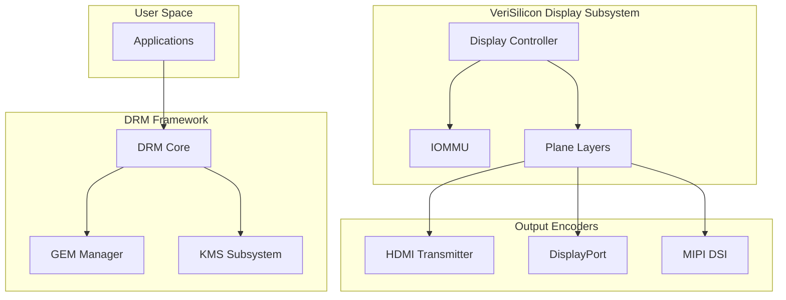

<!-- more -->

- [一、驱动概述](#一驱动概述)
- [二、系统架构](#二系统架构)
- [三、核心组件分析](#三核心组件分析)
  - [3.1 主驱动模块 (vs_drv.c)](#31-主驱动模块-vs_driv)
  - [3.2 显示控制器 (vs_dc.c)](#32-显示控制器-vs_dc)
  - [3.3 CRTC 实现 (vs_crtc.c)](#33-crtc-实现-vs_crtc)
- [四、Plane 与图层管理](#四plane-与图层管理)
- [五、输出接口支持](#五输出接口支持)
  - [5.1 HDMI 输出](#51-hdmi-输出)
  - [5.2 DP 输出](#52-dp-输出)
  - [5.3 MIPI DSI](#53-mipi-dsi)
- [六、内存管理与 IOMMU](#六内存管理与-iommu)
- [七、格式支持与转换](#七格式支持与转换)
- [八、调试与调试功能](#八调试与调试功能)
- [九、高级特性详解](#九高级特性详解)
  - [9.1 DRM Property 系统](#91-drm-property-系统)
  - [9.2 高级 Plane 功能](#92-高级-plane-功能)
  - [9.3 硬件能力定义](#93-硬件能力定义)
  - [9.4 压缩格式支持](#94-压缩格式支持)
  - [9.5 芯片信息](#95-芯片信息)
- [十、总结](#十总结)

---

## 一、驱动概述

该驱动是面向 **StarFive JH7100** SoC 的 DRM 显示子系统驱动，由 **VeriSilicon（芯动科技）** 开发。驱动基于 Linux 5.15+ 内核，支持多路显示输出、硬件图层叠加、色彩空间转换等功能。

```c
// vs_drv.c
#define DRV_NAME    "vs-drm"
#define DRV_DESC    "VeriSilicon DRM driver"
```

**主要特性**：
- DRM Atomic 模式设置
- GEM DMA 内存管理
- IOMMU 支持（可选）
- 多输出接口：HDMI、DP、MIPI DSI
- 硬件图层叠加（Overlay）

---

## 二、系统架构



**显示数据流**：
```
Framebuffer (GEM)
    ↓
Plane (Primary/Overlay/Cursor)
    ↓
Display Controller (硬件叠加与缩放)
    ↓
Output Encoder (HDMI/DP/DSI)
    ↓
Display Device
```

---

## 三、核心组件分析

### 3.1 主驱动模块 (vs_drv.c)

主驱动负责 DRM 设备初始化和组件管理：

```c
static struct drm_driver vs_drm_driver = {
    .driver_features = DRIVER_MODESET | DRIVER_ATOMIC | DRIVER_GEM,
    .prime_handle_to_fd = drm_gem_prime_handle_to_fd,
    .prime_fd_to_handle = drm_gem_prime_fd_to_handle,
    .gem_prime_import   = vs_gem_prime_import,
    .gem_prime_import_sg_table = vs_gem_prime_import_sg_table,
    .dumb_create        = vs_gem_dumb_create,
    .fops               = &fops,
};
```

**关键实现**：

```c
static int vs_drm_bind(struct device *dev)
{
    // 1. 分配 DRM 设备
    drm_dev = drm_dev_alloc(&vs_drm_driver, dev);
    
    // 2. 初始化私有数据
    priv->pitch_alignment = 64;
    priv->dma_dev->coherent_dma_mask = DMA_BIT_MASK(40);
    
    // 3. 模式配置初始化
    drm_mode_config_init(drm_dev);
    
    // 4. 绑定子组件
    component_bind_all(dev, drm_dev);
    
    // 5. 扩展模式配置
    vs_mode_config_init(drm_dev);
    
    // 6. 注册 DRM 设备
    drm_dev_register(drm_dev, 0);
    
    // 7. 初始化 fbdev
    drm_fbdev_generic_setup(drm_dev, 32);
}
```

**Component 框架**：

```c
static struct platform_driver *drm_sub_drivers[] = {
    &dc_platform_driver,           // 显示控制器
#ifdef CONFIG_STARFIVE_INNO_HDMI
    &inno_hdmi_driver,              // HDMI 连接器
#endif
#ifdef CONFIG_STARFIVE_DW_DP
    &dw_dp_driver,                  // DP 连接器
#endif
#ifdef CONFIG_VERISILICON_VIRTUAL_DISPLAY
    &virtual_display_platform_driver,
#endif
};
```

### 3.2 显示控制器 (vs_dc.c)

显示控制器是硬件的核心，负责：
- 帧缓冲读取
- 图层混合
- 色彩空间转换
- 扫描时序生成

```c
// vs_dc.c - 格式映射
static inline void update_format(u32 format, u64 mod, struct dc_hw_fb *fb)
{
    u8 f = FORMAT_A8R8G8B8;
    
    switch (format) {
    case DRM_FORMAT_XRGB8888:
    case DRM_FORMAT_RGBX8888:
        f = FORMAT_X8R8G8B8;
        break;
    case DRM_FORMAT_ARGB8888:
    case DRM_FORMAT_RGBA8888:
        f = FORMAT_A8R8G8B8;
        break;
    case DRM_FORMAT_YUYV:
    case DRM_FORMAT_YVYU:
        f = FORMAT_YUY2;
        break;
    case DRM_FORMAT_UYVY:
    case DRM_FORMAT_VYUY:
        f = FORMAT_UYVY;
        break;
    case DRM_FORMAT_YUV420:
    case DRM_FORMAT_YVU420:
        f = FORMAT_YV12;
        break;
    case DRM_FORMAT_NV12:
        if (fourcc_mod_vs_get_type(mod) == DRM_FORMAT_MOD_VS_TYPE_CUSTOM_10BIT)
            f = FORMAT_NV12_10BIT;
        else
            f = FORMAT_NV12;
        break;
    // ... 更多格式
    }
    
    fb->format = f;
}
```

**支持的颜色格式**：

| DRM Format | Hardware Format | 说明 |
|------------|------------------|------|
| XRGB8888 | FORMAT_X8R8G8B8 | 24bpp RGB |
| ARGB8888 | FORMAT_A8R8G8B8 | 32bpp ARGB |
| RGB565 | FORMAT_R5G6B5 | 16bpp |
| YUYV | FORMAT_YUY2 | YUV422 |
| NV12 | FORMAT_NV12 | YUV420 Semi-planar |
| P010 | FORMAT_P010 | 10-bit YUV420 |

### 3.3 CRTC 实现 (vs_crtc.c)

```c
static void vs_crtc_reset(struct drm_crtc *crtc)
{
    struct vs_crtc_state *state;
    
    state = kzalloc(sizeof(*state), GFP_KERNEL);
    __drm_atomic_helper_crtc_reset(crtc, &state->base);
    
    state->sync_mode = VS_SINGLE_DC;
    state->output_fmt = MEDIA_BUS_FMT_YUV8_1X24;
    state->encoder_type = DRM_MODE_ENCODER_NONE;
    
#ifdef CONFIG_VERISILICON_MMU
    state->mmu_prefetch = VS_MMU_PREFETCH_DISABLE;
#endif
}
```

**CRTC 状态跟踪**：
- `sync_mode`：同步模式（单DC/双DC级联）
- `output_fmt`：输出格式（YUV/RGB）
- `mmu_prefetch`：MMU 预取设置

---

## 四、Plane 与图层管理

```c
// vs_plane.c - Plane 辅助函数
static const struct drm_plane_helper_funcs vs_plane_helper_funcs = {
    .prepare_fb = vs_plane_prepare_fb,
    .atomic_check = vs_plane_atomic_check,
    .atomic_update = vs_plane_atomic_update,
    .atomic_disable = vs_plane_atomic_disable,
};
```

**Plane 类型**：
- Primary Plane：主图层，用于显示
- Overlay Plane：叠加图层，支持混合
- Cursor Plane：光标图层

```c
static int vs_plane_atomic_update(struct drm_plane *plane,
                                   struct drm_atomic_state *state)
{
    struct drm_plane_state *new_state = drm_atomic_get_new_plane_state(state, plane);
    struct vs_plane *vs_plane = to_vs_plane(plane);
    struct vs_plane_state *vs_state = to_vs_plane_state(new_state);
    
    // 1. 解析帧缓冲信息
    // 2. 配置硬件图层参数
    // 3. 设置缩放和裁剪
    // 4. 配置色彩混合
}
```

---

## 五、输出接口支持

### 5.1 HDMI 输出

```c
// inno_hdmi.c - HDMI 连接器实现
static const struct drm_connector_funcs inno_hdmi_connector_funcs = {
    .detect = inno_hdmi_connector_detect,
    .fill_modes = drm_helper_probe_single_connector_modes,
    .destroy = inno_hdmi_connector_destroy,
    .reset = drm_atomic_helper_connector_reset,
    .atomic_duplicate_state = drm_atomic_helper_connector_duplicate_state,
    .atomic_destroy_state = drm_atomic_helper_connector_destroy_state,
};
```

**特点**：
- 支持 EDID 读取
- 固定分辨率：1920x1080
- 支持 YUV 输出

### 5.2 DP 输出

```c
// dw-dp.c - DisplayPort 驱动
static struct platform_driver dw_dp_driver = {
    .probe = dw_dp_probe,
    .remove = dw_dp_remove,
    .driver = {
        .name = "dw-dp",
        .of_match_table = dw_dp_of_table,
    },
};
```

### 5.3 MIPI DSI

```c
// dw_mipi_dsi.c - MIPI DSI 主机控制器
struct dw_mipi_dsi {
    struct device *dev;
    void __iomem *base;
    struct clk *pclk;
    struct reset_control *rst;
    // ...
};
```

---

## 六、内存管理与 IOMMU

```c
// vs_drm_iommu_attach_device
int vs_drm_iommu_attach_device(struct drm_device *drm_dev, struct device *dev)
{
    struct vs_drm_private *priv = drm_dev->dev_private;
    
    if (!has_iommu)
        return 0;
    
    if (!priv->domain) {
        priv->domain = iommu_get_domain_for_dev(dev);
        priv->dma_dev = dev;
    }
    
    return iommu_attach_device(priv->domain, dev);
}
```

**IOMMU 配置检测**：

```c
static int vs_drm_platform_of_probe(struct device *dev)
{
    for (i = 0;; i++) {
        port = of_parse_phandle(np, "ports", i);
        iommu = of_parse_phandle(port->parent, "iommus", 0);
        
        // 如果任一 CRTC 不支持 IOMMU，则禁用全局 IOMMU
        if (!iommu || !of_device_is_available(iommu->parent))
            has_iommu = false;
    }
}
```

---

## 七、格式支持与转换

```c
// vs_dc_swizzle - Swizzle 模式配置
static inline void update_swizzle(u32 format, struct dc_hw_fb *fb)
{
    fb->swizzle = SWIZZLE_ARGB;
    fb->uv_swizzle = 0;
    
    switch (format) {
    case DRM_FORMAT_RGBX8888:
    case DRM_FORMAT_RGBA8888:
    case DRM_FORMAT_RGBA1010102:
        fb->swizzle = SWIZZLE_RGBA;
        break;
    // ...
    }
}
```

**硬件 Swizzle 模式**：
- `SWIZZLE_ARGB`：标准 ARGB 顺序
- `SWIZZLE_RGBA`：RGBA 顺序交换
- `SWIZZLE_XRGB`：XBGR 顺序

---

## 八、调试与调试功能

```c
#ifdef CONFIG_DEBUG_FS
static int vs_debugfs_planes_show(struct seq_file *s, void *data)
{
    struct drm_plane *plane;
    
    list_for_each_entry(plane, &dev->mode_config.plane_list, head) {
        struct drm_plane_state *state = plane->state;
        struct vs_plane_state *plane_state = to_vs_plane_state(state);
        
        seq_printf(s, "plane[%u]: %s\n", plane->base.id, plane->name);
        seq_printf(s, "\tcrtc = %s\n", state->crtc ? state->crtc->name : "(null)");
        seq_printf(s, "\tcrtc-pos = " DRM_RECT_FMT "\n", DRM_RECT_ARG(&plane_state->status.dest));
        seq_printf(s, "\tsrc-pos = " DRM_RECT_FP_FMT "\n", DRM_RECT_FP_ARG(&plane_state->status.src));
        seq_printf(s, "\trotation = 0x%x\n", state->rotation);
        seq_printf(s, "\ttiling = %u\n", plane_state->status.tile_mode);
    }
    
    return 0;
}
#endif
```

---

## 九、高级特性详解

### 9.1 DRM Property 系统

驱动实现了完善的 Property 状态管理系统，用于配置硬件参数：

```c
// vs_dc_property.c - Property 状态初始化
bool vs_dc_initialize_property_states(struct vs_dc_property_state_group *states)
{
    const struct vs_dc_property_proto *proto = NULL;
    struct vs_dc_property_state *item = NULL;
    
    // 支持多种属性类型
    switch (proto->type) {
    case VS_DC_PROPERTY_BLOB:    // BLOB 数据
    case VS_DC_PROPERTY_ARRAY:    // 数组
    case VS_DC_PROPERTY_ENUM:    // 枚举值
    case VS_DC_PROPERTY_RANGE:   // 范围值
    case VS_DC_PROPERTY_BITMASK: // 位掩码
    case VS_DC_PROPERTY_BOOL:    // 布尔值
        // ...
    }
}
```

**Property 类型**：
- `VS_DC_PROPERTY_BLOB`：用于 gamma/degamma LUT、3D LUT 等大数据块
- `VS_DC_PROPERTY_ENUM`：枚举类型属性
- `VS_DC_PROPERTY_RANGE`：数值范围属性
- `VS_DC_PROPERTY_BITMASK`：位掩码属性

### 9.2 高级 Plane 功能

```c
// vs_plane.c - Plane 状态重置
static void vs_plane_reset(struct drm_plane *plane)
{
    state->base.color_encoding = DRM_COLOR_YCBCR_BT2020;
    state->base.zpos = vs_plane->id;
    
    // 色彩空间转换系数
    drm_property_blob_put(state->y2r_coef);
    // 3D LUT
    drm_property_blob_put(state->lut_3d);
    // PVRIC 压缩相关
    drm_property_blob_put(state->pvric_clear);
    drm_property_blob_put(state->pvric_const);
}
```

### 9.3 硬件能力定义

```c
// vs_type.h - Plane 能力标志
struct vs_plane_info {
    u32 color_mgmt : 1;      // 色彩管理
    u32 program_csc : 1;    // 可编程色彩空间转换
    u32 roi : 1;            // 感兴趣区域
    u32 cgm_lut : 1;         // 3D LUT 色彩管理
    u32 alpha_ext : 1;      // 扩展 Alpha
    u32 demultiply : 1;      // Alpha 反预乘
    u32 hdr : 1;            // HDR 支持
    u32 tone_map : 1;       // 色调映射
    u32 watermark : 1;      // 水印
    u32 compressed : 1;     // 压缩格式支持
    u32 test_pattern : 1;   // 测试图案
};

struct vs_display_info {
    u32 bld_cgm : 1;        // 混合 EOTF/色域映射
    u32 gamma : 1;          // Gamma 校正
    u32 degamma : 1;        // Degamma 校正
    u32 ltm : 1;            // 本地色调映射
    u32 gtm : 1;            // 全局色调映射
    u32 cgm_lut : 1;        // 3D LUT
    u32 dsc : 1;            // Display Stream Compression
    u32 vrr : 1;            // 可变刷新率
    u32 decompress : 1;     // 解压支持
};
```

### 9.4 压缩格式支持

```c
// 驱动支持的压缩格式修饰符
/*
 * cap_dec ===>
 *   (1 << DRM_FORMAT_MOD_VS_TYPE_COMPRESSED) = DEC400
 *   (1 << DRM_FORMAT_MOD_VS_TYPE_PVRIC) = PVRIC
 *   (1 << DRM_FORMAT_MOD_VS_TYPE_DECNANO) = DECNANO
 *   (1 << DRM_FORMAT_MOD_VS_TYPE_ETC2) = ETC2
 */
u32 cap_dec;
```

### 9.5 芯片信息

```c
// 8x00/vs_dc_info.h
enum dc_chip_rev {
    DC_REV_0,  // HW_REV_5720, HW_REV_5721_311
    DC_REV_1,  // HW_REV_5721_30b
    DC_REV_2,  // HW_REV_5721_310
};

enum dc_hw_plane_id {
    PRIMARY_PLANE_0,
    OVERLAY_PLANE_0,
    OVERLAY_PLANE_1,
    PRIMARY_PLANE_1,
    OVERLAY_PLANE_2,
    // ... 最多 PLANE_NUM 个平面
};

#define DC_LAYER_NUM 8       // 最大图层数
#define DC_DISPLAY_NUM 2    // 显示输出数
#define DC_WB_NUM 2          // 写回通道数
#define DC_OUTPUT_NUM 4     // 输出接口数
```

---

## 十、总结

该 VeriSilicon DRM 驱动是面向 StarFive JH7100 的完整显示解决方案：

| 特性 | 实现方式 |
|------|----------|
| **平台** | StarFive JH7100 / VeriSilicon DC |
| **内核版本** | Linux 5.15+ |
| **模式设置** | Atomic Mode Setting |
| **内存管理** | GEM DMA + IOMMU（可选） |
| **输出接口** | HDMI (Inno), DP (DesignWare), DSI (DesignWare) |
| **图层支持** | Primary + Overlay + Cursor (8层) |
| **格式支持** | ARGB8888, RGB565, YUV422, YUV420, NV12, P010 |
| **调试** | DebugFS 支持 |
| **高级特性** | HDR, 3D LUT, Gamma/Degamma, DSC, VRR, 压缩格式 |

该驱动展示了商用 DRM 子系统的完整实现，包括 Component 框架管理多设备、IOMMU 支持、丰富的格式转换能力、先进的色彩管理（HDR、色调映射、3D LUT）等。

---

感谢阅读！