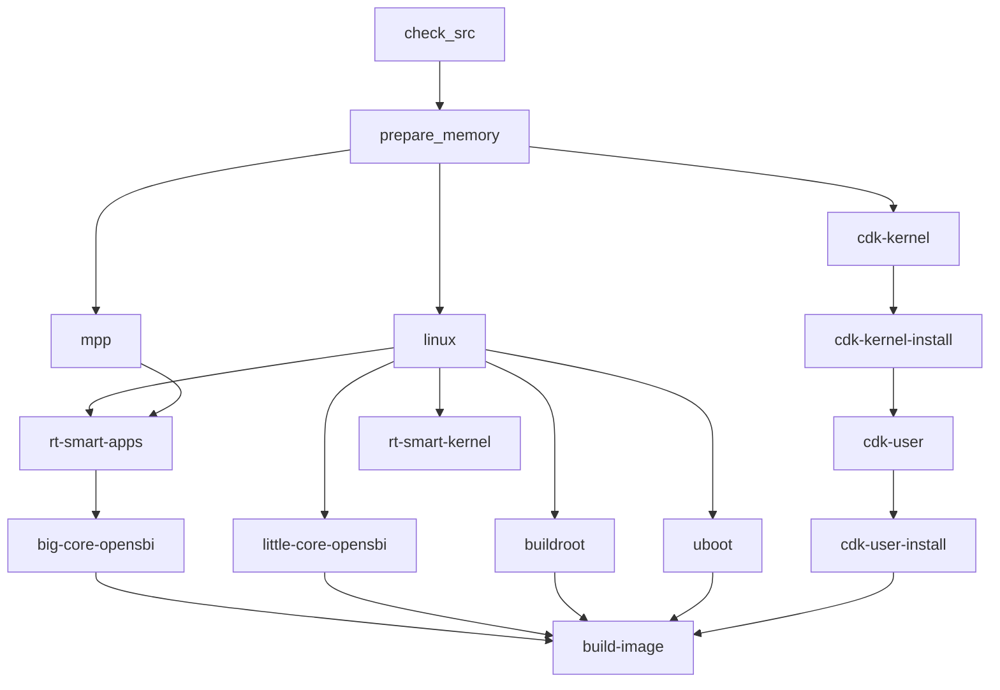

<!-- more -->
- [K230 SDK 编译流程深度分析](#k230-sdk-编译流程深度分析)
  - [1. 编译命令入口分析](#1-编译命令入口分析)
  - [2. 配置加载机制](#2-配置加载机制)
  - [3. 完整编译流程](#3-完整编译流程)
  - [4. 各组件编译详解](#4-各组件编译详解)
  - [5. 镜像生成流程](#5-镜像生成流程)
  - [6. 编译产物分析](#6-编译产物分析)
  - [7. 关键配置变量](#7-关键配置变量)
  - [8. K230 SDK 配置对比分析](#8-k230-sdk-配置对比分析)
    - [8.1 DongshanPI 配置](#81-dongshanpi-配置)
    - [8.2 各配置对比表](#82-各配置对比表)
    - [8.3 关键差异分析](#83-关键差异分析)
    - [8.4 如何选择配置](#84-如何选择配置)

# K230 SDK 编译流程深度分析

本文深入分析 `make CONF=k230_canmv_dongshanpi_defconfig` 命令的完整编译流程，揭示 K230 SDK 的构建机制。

## 1. 编译命令入口分析

### 1.1 命令解析

```makefile
# Makefile 第 29-33 行
ifeq ($(origin CONF), "command line")
    $(shell echo CONF=$(CONF)>.last_conf;cp configs/$(CONF) .config)
else
    $(shell [ -f .last_conf ] || ( echo CONF=k230_evb_defconfig>.last_conf; cp configs/k230_evb_defconfig .config ) )
endif

include .last_conf
export BUILD_DIR := $(K230_SDK_ROOT)/output/$(CONF)
```

**执行流程**：
1. 读取 `CONF` 参数 `k230_canmv_dongshanpi_defconfig`
2. 写入 `.last_conf` 文件记录配置名
3. 复制 `configs/k230_canmv_dongshanpi_defconfig` 到 `.config`
4. 设置输出目录 `output/k230_canmv_dongshanpi_defconfig/`

### 1.2 构建目标选择

```makefile
# Makefile 第 79-85 行
.PHONY: all
ifeq ($(CONFIG_SUPPORT_RTSMART)$(CONFIG_SUPPORT_LINUX),yy)
    all .DEFAULT: check_src prepare_memory linux mpp cdk-kernel cdk-kernel-install cdk-user cdk-user-install rt-smart-apps rt-smart-kernel big-core-opensbi little-core-opensbi buildroot uboot build-image
else ifeq ($(CONFIG_SUPPORT_RTSMART),y)
    all .DEFAULT: check_src prepare_memory mpp rt-smart-apps rt-smart-kernel big-core-opensbi uboot build-image
else ifeq ($(CONFIG_SUPPORT_LINUX),y)
    all .DEFAULT: check_src prepare_memory linux little-core-opensbi buildroot uboot build-image
endif
```

对于 `k230_canmv_dongshanpi_defconfig`，同时启用了 RT-Smart 和 Linux，因此执行完整构建流程。

## 2. 配置加载机制

### 2.1 配置文件解析

`parse.mak` 负责解析 `.config`：

```makefile
# parse.mak 第 1-5 行
ifeq ($(wildcard .config), .config)
    include .config
else
    include $(DEFCONFIG)
endif
```

### 2.2 工具链配置转换

```makefile
# parse.mak 第 20-26 行
export RTT_CC     := gcc
export RTT_CC_PREFIX   := $(CONFIG_TOOLCHAIN_PREFIX_RTT)
export RTT_EXEC_PATH   := $(CONFIG_TOOLCHAIN_PATH_RTT)

export LINUX_CC   := gcc
export LINUX_CC_PREFIX   := $(CONFIG_TOOLCHAIN_PREFIX_LINUX)
export LINUX_EXEC_PATH  := $(CONFIG_TOOLCHAIN_PATH_LINUX)
```

### 2.3 组件 defconfig 推导

```makefile
# parse.mak 第 51-54 行
LINUX_KERNEL_DEFCONFIG   = $(CONFIG_LINUX_DEFCONFIG)_defconfig
UBOOT_DEFCONFIG          = $(CONFIG_UBOOT_DEFCONFIG)_defconfig
BUILDROOT_DEFCONFIG      = $(CONFIG_BUILDROOT_DEFCONFIG)_defconfig
```

对于 `k230_canmv_dongshanpi_defconfig`：
- Linux kernel defconfig: `k230_canmv_dongshanpi_defconfig`
- U-Boot defconfig: `k230_canmv_dongshanpi_defconfig`
- Buildroot defconfig: `k230_canmv_dongshanpi_defconfig`

## 3. 完整编译流程

### 3.1 构建顺序图



### 3.2 依赖检查

```makefile
# Makefile 第 172-175 行
check_src:check_toolchain
    @if [ ! -f src/.src_fetched ];then \
    echo "Please run command: make prepare_sourcecode";exit 1; \
    fi;

check_toolchain:
    @if [ ! -f $(CONFIG_TOOLCHAIN_PATH_LINUX)/$(CONFIG_TOOLCHAIN_PREFIX_LINUX)gcc ] || \
         [ ! -f $(CONFIG_TOOLCHAIN_PATH_RTT)/$(CONFIG_TOOLCHAIN_PREFIX_RTT)gcc ]; then \
        echo "please run command: make prepare_toolchain"; exit 1; \
    fi;
```

编译前需要确保：
1. 工具链已准备 (`make prepare_toolchain`)
2. 源码已获取 (`make prepare_sourcecode`)

### 3.3 prepare_memory 阶段

```makefile
# Makefile 第 198-209 行
prepare_memory: defconfig .config tools/menuconfig_to_code.sh parse.mak
    @echo "prepare memory"
    @mkdir -p include/generated/ include/config/;
    @./tools/kconfig/conf --silentoldconfig --olddefconfig $(KCONFIG_CFG)
    @cp include/generated/autoconf.h src/little/uboot/board/canaan/common/sdk_autoconf.h
    @cp include/generated/autoconf.h src/big/mpp/include/comm/k_autoconf_comm.h
    @rm -rf include;
    @./tools/menuconfig_to_code.sh
```

生成内核配置头文件并分发给各组件：
- `include/generated/autoconf.h` → U-Boot 和 MPP 的 `sdk_autoconf.h`

## 4. 各组件编译详解

### 4.1 Linux 内核编译

```makefile
# Makefile 第 412-421 行
.PHONY: linux
linux: check_src defconfig prepare_memory linux-config linux-build

linux-config:
    cd $(LINUX_SRC_PATH); \
    make ARCH=riscv $(LINUX_KERNEL_DEFCONFIG) O=$(LINUX_BUILD_DIR) \
    CROSS_COMPILE=$(LINUX_EXEC_PATH)/$(LINUX_CC_PREFIX) ARCH=riscv

linux-build:
    cd $(LINUX_SRC_PATH); \
    make -j16 O=$(LINUX_BUILD_DIR) CROSS_COMPILE=$(LINUX_EXEC_PATH)/$(LINUX_CC_PREFIX) ARCH=riscv
    make modules_install INSTALL_MOD_PATH=$(LINUX_BUILD_DIR)/rootfs/ \
    CROSS_COMPILE=$(LINUX_EXEC_PATH)/$(LINUX_CC_PREFIX) ARCH=riscv
```

**编译参数**：
- ARCH: riscv
- CROSS_COMPILE: `riscv64-unknown-linux-gnu-`
- 输出目录: `output/k230_canmv_dongshanpi_defconfig/little/linux/`

### 4.2 RT-Smart 内核编译

```makefile
# Makefile 第 368-378 行
.PHONY: rt-smart-kernel
rt-smart-kernel: defconfig prepare_memory check_src
    @export RTT_CC=$(RTT_CC); \
    export RTT_CC_PREFIX=$(RTT_CC_PREFIX); \
    export RTT_EXEC_PATH=$(RTT_EXEC_PATH); \
    cd $(RT-SMART_SRC_PATH)/kernel/bsp/maix3; \
    rm -f rtthread.elf; \
    scons -j16
    mkdir -p $(RTT_SDK_BUILD_DIR); \
    cp rtthread.bin rtthread.elf $(RTT_SDK_BUILD_DIR)/;
```

**编译方式**：使用 scons 构建系统

### 4.3 MPP (多媒体处理组件) 编译

```makefile
# Makefile 第 266-267 行
.PHONY: mpp
mpp: mpp-kernel mpp-apps $(MPP_MIDDLEWARE)

mpp-kernel:
    export PATH=$(RTT_EXEC_PATH):$(PATH); \
    export RTSMART_SRC_DIR=$(K230_SDK_ROOT)/$(RT-SMART_SRC_PATH); \
    cd $(MPP_SRC_PATH); make -C kernel

mpp-apps:
    export PATH=$(RTT_EXEC_PATH):$(PATH); \
    cd $(MPP_SRC_DIR); make -C userapps/src
    make -C userapps/sample
```

### 4.4 Buildroot 编译

```makefile
# Makefile 第 475-480 行
.PHONY: buildroot
buildroot: defconfig prepare_memory check_src
    @export PATH=$(LINUX_EXEC_PATH):$(PATH); \
    cd $(BUILDROOT-EXT_SRC_PATH); \
    make CONF=$(BUILDROOT_DEFCONFIG) BRW_BUILD_DIR=$(BUILDROOT_BUILD_DIR) \
    BR2_TOOLCHAIN_EXTERNAL_PATH=$(LINUX_EXEC_PATH)/../ \
    BR2_TOOLCHAIN_EXTERNAL_CUSTOM_PREFIX=$(LINUX_CC_PREFIX)
```

### 4.5 U-Boot 编译

```makefile
# Makefile 第 510-515 行
.PHONY: uboot
uboot: defconfig prepare_memory check_src
    @export PATH=$(LINUX_EXEC_PATH):$(PATH);export CROSS_COMPILE=$(LINUX_CC_PREFIX);export ARCH=riscv; \
    cd $(UBOOT_SRC_PATH); \
    make $(UBOOT_DEFCONFIG) O=$(UBOOT_BUILD_DIR)
    make -C $(UBOOT_BUILD_DIR)
```

### 4.6 OpenSBI 编译

```makefile
# 大核 OpenSBI
.PHONY: big-core-opensbi
big-core-opensbi: rt-smart-kernel
    @mkdir -p $(BIG_OPENSBI_BUILD_DIR); \
    cp $(RT-SMART_SRC_PATH)/kernel/bsp/maix3/rtthread.bin $(OPENSBI_SRC_PATH)/; \
    cd $(OPENSBI_SRC_PATH); \
    export CROSS_COMPILE=$(LINUX_EXEC_PATH)/$(LINUX_CC_PREFIX); \
    export PLATFORM=kendryte/fpgac908; \
    make FW_FDT_PATH=hw.dtb FW_PAYLOAD_PATH=rtthread.bin \
    O=$(BIG_OPENSBI_BUILD_DIR) OPENSBI_QUIET=1

# 小核 OpenSBI
.PHONY: little-core-opensbi
little-core-opensbi: linux
    @mkdir -p $(LITTLE_OPENSBI_BUILD_DIR); \
    cd $(OPENSBI_SRC_PATH); \
    make CROSS_COMPILE=$(LINUX_EXEC_PATH)/$(LINUX_CC_PREFIX) \
    PLATFORM=generic FW_PAYLOAD_PATH=$(LINUX_BUILD_DIR)/arch/riscv/boot/Image \
    O=$(LITTLE_OPENSBI_BUILD_DIR) K230_LITTLE_CORE=1 OPENSBI_QUIET=1
```

## 5. 镜像生成流程

### 5.1 最终构建目标

```makefile
.PHONY: build-image
build-image:
    @set -e; \
    echo "build SDK images"
```

### 5.2 镜像生成脚本

镜像生成使用 `gen_image.sh` 脚本：

```bash
# board/common/gen_image_script/gen_image.sh
1. copy_file_to_images    # 复制文件到输出目录
2. gen_version             # 生成版本信息
3. add_dev_firmware        # 添加设备固件
4. gen_linux_bin           # 生成 Linux 镜像 (Image + DTB)
5. gen_final_ext2          # 生成根文件系统
6. gen_rtt_bin             # 生成 RT-Smart 镜像
7. gen_uboot_bin           # 生成 U-Boot
8. gen_env_bin             # 生成环境变量
9. copy_app                # 复制应用程序
10. gen_image              # 使用 genimage 生成最终镜像
```

### 5.3 分区配置文件

镜像分区定义在 `board/common/gen_image_cfg/genimage-sdcard.cfg`：

```
┌──────────┬─────────┬────────────────┬────────────────────┐
│ Offset   │ Size    │ Partition      │ Description        │
├──────────┼─────────┼────────────────┼────────────────────│
│ 1MB      │ 512KB   │ uboot_spl_1   │ SPL 1st copy       │
│ 1.5MB    │ 512KB   │ uboot_spl_2   │ SPL 2nd copy       │
│ 2MB      │ 1.5MB   │ uboot         │ U-Boot             │
│ 3.5MB    │ 128KB   │ uboot_env     │ U-Boot 环境变量     │
│ 10MB     │ 20MB    │ rtt           │ RT-Smart 系统       │
│ 30MB     │ 50MB    │ linux         │ Linux 内核+DTB      │
│ 80MB     │ -       │ rootfs        │ 根文件系统 (ext4)   │
│ 128MB    │ 32MB    │ fat32appfs    │ App 分区 (vfat)    │
└──────────┴─────────┴────────────────┴────────────────────┘
```

## 6. 编译产物分析

### 6.1 输出目录结构

```
output/k230_canmv_dongshanpi_defconfig/
├── big/                           # 大核组件
│   ├── mpp/                      # MPP 编译产物
│   │   ├── kernel/               # MPP 内核模块
│   │   └── userapps/             # MPP 用户应用
│   └── rt-smart/                 # RT-Smart 编译产物
│       ├── rtthread.bin
│       └── rtthread.elf
├── common/                        # 公共组件
│   ├── big-opensbi/              # 大核 OpenSBI
│   │   └── fw_payload.bin
│   ├── little-opensbi/           # 小核 OpenSBI
│   │   └── fw_payload.bin
│   └── cdk/                      # CDK 编译产物
├── little/                        # 小核组件
│   ├── linux/                    # Linux 内核
│   │   ├── vmlinux
│   │   ├── arch/riscv/boot/Image
│   │   └── modules/
│   ├── buildroot-ext/           # Buildroot 产物
│   │   └── images/
│   │       └── rootfs.ext4
│   └── uboot/                    # U-Boot 编译产物
└── images/                       # 最终镜像
    ├── big-core/                 # 大核镜像
    │   ├── rtt_system.bin
    │   └── fastboot_app.elf
    ├── little-core/              # 小核镜像
    │   ├── linux_system.bin      # Linux + DTB
    │   ├── rootfs.ext4
    │   └── uboot/
    ├── sysimage-sdcard.img       # 可烧录镜像
    └── sysimage-sdcard.img.gz    # 压缩镜像
```

### 6.2 关键产物说明

| 文件 | 说明 |
|------|------|
| `rtthread.bin` | RT-Smart 内核镜像 |
| `fw_payload.bin` | OpenSBI 固件 (含 payload) |
| `Image` | Linux 内核镜像 |
| `*.dts` | 设备树二进制 |
| `linux_system.bin` | Linux 内核 + DTB 合并镜像 |
| `rootfs.ext4` | Buildroot 根文件系统 |
| `sysimage-sdcard.img` | 最终可烧录镜像 |

## 7. 关键配置变量

### 7.1 编译目录变量

| 变量 | 路径 |
|------|------|
| `BUILD_DIR` | `output/k230_canmv_dongshanpi_defconfig/` |
| `MPP_BUILD_DIR` | `$(BUILD_DIR)/big/mpp` |
| `RTT_SDK_BUILD_DIR` | `$(BUILD_DIR)/big/rt-smart` |
| `LINUX_BUILD_DIR` | `$(BUILD_DIR)/little/linux` |
| `BUILDROOT_BUILD_DIR` | `$(BUILD_DIR)/little/buildroot-ext` |
| `UBOOT_BUILD_DIR` | `$(BUILD_DIR)/little/uboot` |

### 7.2 工具链变量

| 组件 | 工具链前缀 | 路径 |
|------|-----------|------|
| RT-Smart | `riscv64-unknown-linux-musl-` | `/opt/toolchain/riscv64-linux-musleabi_for_x86_64-pc-linux-gnu/bin` |
| Linux | `riscv64-unknown-linux-gnu-` | `/opt/toolchain/Xuantie-900-gcc-linux-5.10.4-glibc-x86_64-V2.6.0/bin` |

### 7.3 编译参数

| 参数 | 值 |
|------|-----|
| 并行编译 | `-j16` |
| 架构 | `riscv` |
| 调试级别 | `0` (Release) |

## 8. K230 SDK 配置对比分析

### 8.1 DongshanPI 配置

当前 `k230_canmv_dongshanpi_defconfig` 是**唯一**针对 DongshanPI (东山PI) 的配置：

| 配置项 | DongshanPI 值 |
|--------|--------------|
| 板级 | `CONFIG_BOARD_K230_CANMV_DONGSHANPI=y` |
| U-Boot | `k230_canmv_dongshanpi` |
| Linux | `k230_canmv_dongshanpi` |
| DTB | `k230_canmv_dongshanpi` |
| 总内存 | 1GB (0x40000000) |
| RT-Smart 内存 | 126MB (0x07E00000) |
| Linux 内存 | 128MB (0x08000000) |
| MMZ 内存 | 252MB (0x0FC00000) |
| 存储 | SD/eMMC |
| WiFi | RTL8188FU |
| 双核 | Linux + RT-Smart |

### 8.2 各配置对比表

| 配置文件 | 板级 | 总内存 | Linux | RT-Smart | 存储 | WiFi | 用途 |
|----------|------|--------|-------|----------|------|------|------|
| `k230_evb_defconfig` | EVB | 512MB | ✅ | ✅ | SD/eMMC/SPI NAND | AP6212A | EVB 开发板 |
| `k230_canmv_defconfig` | CanMV | 512MB | ✅ | ✅ | SD/eMMC | AP6212A | CanMV-K230 |
| `k230_canmv_v2_defconfig` | CanMV V2 | 512MB | ✅ | ✅ | SD/eMMC | - | CanMV-K230 V2 |
| `k230_canmv_v3_defconfig` | CanMV V3 | 512MB | ✅ | ✅ | SD/eMMC | - | CanMV-K230 V3 |
| `k230_canmv_dongshanpi_defconfig` | DongshanPI | **1GB** | ✅ | ✅ | SD/eMMC | RTL8188FU | **东山PI** |
| `k230_canmv_only_linux_defconfig` | CanMV | 512MB | ✅ | ❌ | SD/eMMC | AP6212A | 仅 Linux |
| `k230_canmv_only_rtt_defconfig` | CanMV | 256MB | ❌ | ✅ | SD/eMMC | - | 仅 RT-Smart |
| `k230d_defconfig` | K230D | 512MB | ✅ | ✅ | SPI NOR/NAND/eMMC | - | K230D 芯片 |
| `k230d_canmv_defconfig` | K230D CanMV | 128MB | ✅ | ✅ | SD/eMMC | - | K230D CanMV |
| `BPI-CanMV-K230D-Zero_defconfig` | BPI K230D | 128MB | ❌ | ✅ | SD/eMMC | - | 香蕉派 K230D Zero |

### 8.3 关键差异分析

#### 内存差异

| 配置 | 总内存 | Linux 内存 | RT-Smart 内存 | MMZ |
|------|--------|-----------|--------------|-----|
| `k230_canmv_dongshanpi_defconfig` | **1GB** | 128MB | 126MB | 252MB |
| `k230_canmv_defconfig` | 512MB | 128MB | 126MB | 252MB |
| `k230d_defconfig` | - | 72MB | 20MB | 30MB |
| `k230d_canmv_defconfig` | 128MB | 48MB | 34MB | 43MB |

**DongshanPI 配置特点**：
- 总内存翻倍 (1GB vs 512MB)
- 使用 RTL8188FU WiFi 模块 (其他多使用 AP6212A)
- 内存布局包含完整的 MMZ 区域供多媒体和 AI 使用

#### 系统配置差异

| 配置 | Linux | RT-Smart | 特性 |
|------|-------|----------|------|
| `_defconfig` (默认) | ✅ | ✅ | 双核完整 |
| `_only_linux` | ✅ | ❌ | 仅 Linux |
| `_only_rtt` | ❌ | ✅ | 仅 RT-Smart |
| `BPI-xxx` | ❌ | ✅ | 仅 RT-Smart (香蕉派) |

### 8.4 如何选择配置

- **DongshanPI (东山PI)**: `k230_canmv_dongshanpi_defconfig` ✅
- **CanMV-K230 标准版**: `k230_canmv_defconfig`
- **CanMV-K230 V2**: `k230_canmv_v2_defconfig`
- **CanMV-K230 V3**: `k230_canmv_v3_defconfig`
- **K230 EVB 开发板**: `k230_evb_defconfig`
- **K230D 芯片**: `k230d_defconfig` 或 `k230d_canmv_defconfig`
- **仅运行 Linux**: `k230_canmv_only_linux_defconfig`
- **仅运行 RT-Smart**: `k230_canmv_only_rtt_defconfig`

---

感谢阅读！