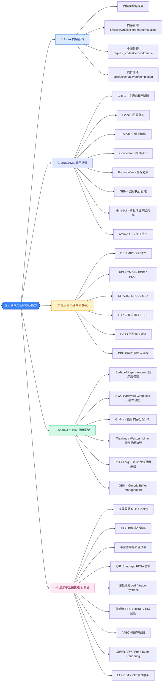
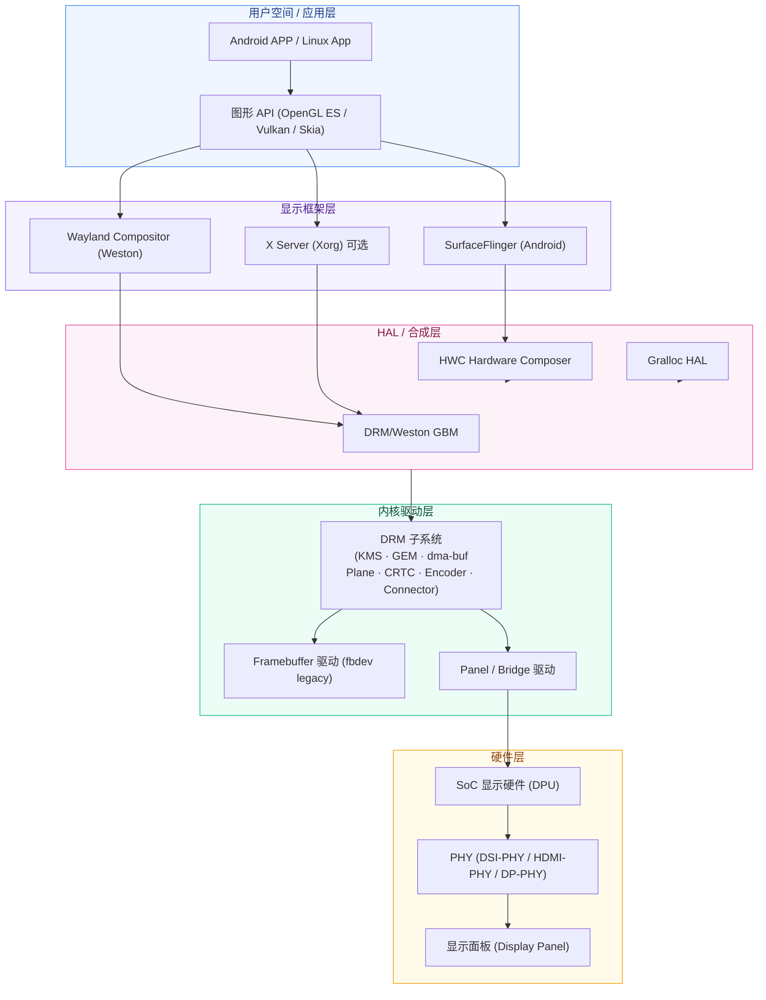
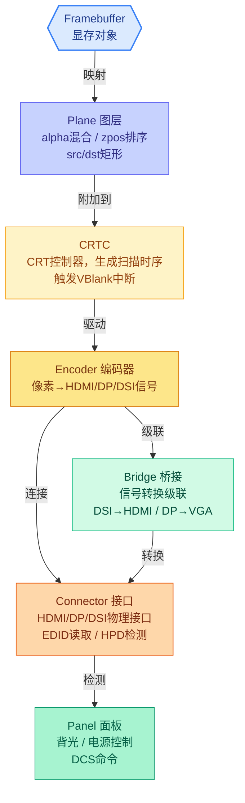
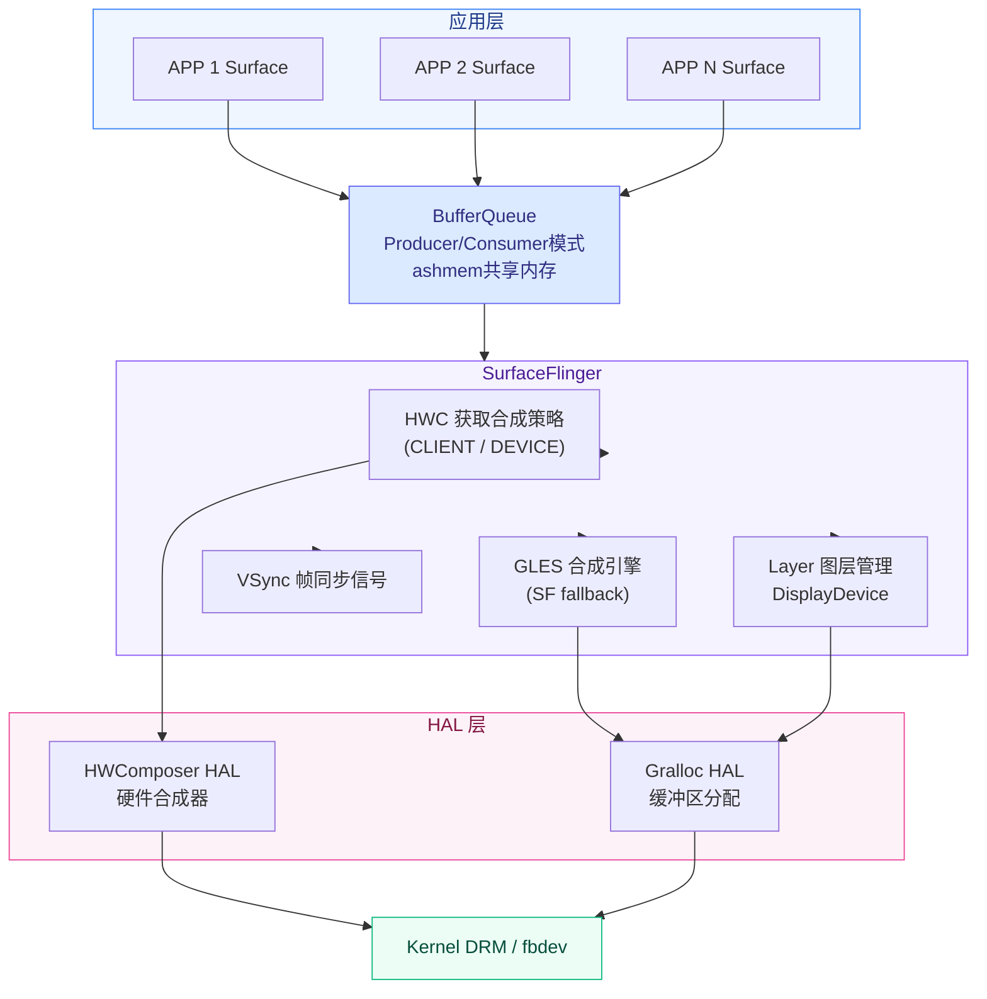
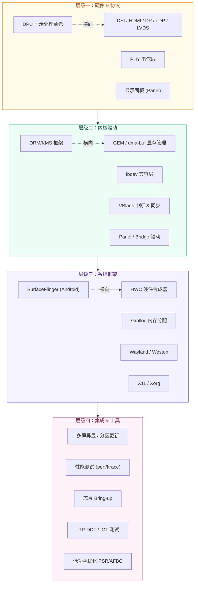

# 显示技术知识体系

> 主题：显示软件工程师核心技术图谱
> 日期：2026-03-19

---

## 目录

- [显示技术知识体系](#显示技术知识体系)
  - [目录](#目录)
  - [一、思维导图](#一思维导图)
    - [1.1 核心能力图谱](#11-核心能力图谱)
    - [1.2 Linux 显示子系统层级架构](#12-linux-显示子系统层级架构)
    - [1.3 DRM 四大核心对象关系图](#13-drm-四大核心对象关系图)
    - [1.4 Android SurfaceFlinger 架构图](#14-android-surfaceflinger-架构图)
    - [1.5 知识点关联总览](#15-知识点关联总览)
  - [二、知识点总表](#二知识点总表)
  - [三、知识点详解](#三知识点详解)
    - [1. Linux 内核架构与基础](#1-linux-内核架构与基础)
      - [涉及知识](#涉及知识)
      - [学习路径](#学习路径)
    - [2. DRM/KMS 显示驱动框架](#2-drmkms-显示驱动框架)
      - [涉及知识](#涉及知识-1)
      - [学习路径](#学习路径-1)
    - [3. fbdev 帧缓冲驱动](#3-fbdev-帧缓冲驱动)
      - [涉及知识](#涉及知识-2)
      - [学习路径](#学习路径-2)
    - [4. GEM / dma-buf 显存管理](#4-gem--dma-buf-显存管理)
      - [涉及知识](#涉及知识-3)
      - [学习路径](#学习路径-3)
    - [5. DSI / MIPI-DSI 显示接口协议](#5-dsi--mipi-dsi-显示接口协议)
      - [涉及知识](#涉及知识-4)
      - [学习路径](#学习路径-4)
    - [6. HDMI / DP / eDP / LVDS 显示接口](#6-hdmi--dp--edp--lvds-显示接口)
      - [涉及知识](#涉及知识-5)
      - [学习路径](#学习路径-5)
    - [7. VBlank 垂直同步机制](#7-vblank-垂直同步机制)
      - [涉及知识](#涉及知识-6)
      - [学习路径](#学习路径-6)
    - [8. 中断处理与同步机制](#8-中断处理与同步机制)
      - [涉及知识](#涉及知识-7)
      - [学习路径](#学习路径-7)
    - [9. Android SurfaceFlinger 框架](#9-android-surfaceflinger-框架)
      - [涉及知识](#涉及知识-8)
      - [学习路径](#学习路径-8)
    - [10. Android HWC (Hardware Composer)](#10-android-hwc-hardware-composer)
      - [涉及知识](#涉及知识-9)
      - [学习路径](#学习路径-9)
    - [11. Gralloc 内存分配机制](#11-gralloc-内存分配机制)
      - [涉及知识](#涉及知识-10)
      - [学习路径](#学习路径-10)
    - [12. Wayland / Weston 显示框架](#12-wayland--weston-显示框架)
      - [涉及知识](#涉及知识-11)
      - [学习路径](#学习路径-11)
    - [13. X11 显示框架](#13-x11-显示框架)
      - [涉及知识](#涉及知识-12)
      - [学习路径](#学习路径-12)
    - [14. GPU / 图形渲染管线](#14-gpu--图形渲染管线)
      - [涉及知识](#涉及知识-13)
      - [学习路径](#学习路径-13)
    - [15. AFBC 帧缓冲压缩](#15-afbc-帧缓冲压缩)
      - [涉及知识](#涉及知识-14)
      - [学习路径](#学习路径-14)
    - [16. XR / VR 显示技术](#16-xr--vr-显示技术)
      - [涉及知识](#涉及知识-15)
      - [学习路径](#学习路径-15)
    - [17. 芯片 Bring-up 与仿真平台](#17-芯片-bring-up-与仿真平台)
      - [涉及知识](#涉及知识-16)
      - [学习路径](#学习路径-16)
    - [18. 性能测试与优化方法](#18-性能测试与优化方法)
      - [涉及知识](#涉及知识-17)
      - [学习路径](#学习路径-17)
    - [19. 原理图与寄存器规格书](#19-原理图与寄存器规格书)
      - [涉及知识](#涉及知识-18)
      - [学习路径](#学习路径-18)
    - [20. Git 与代码规范](#20-git-与代码规范)
      - [涉及知识](#涉及知识-19)
      - [学习路径](#学习路径-19)
    - [21. 多屏异显 / 分区更新 / 低功耗](#21-多屏异显--分区更新--低功耗)
      - [涉及知识](#涉及知识-20)
      - [学习路径](#学习路径-20)
    - [22. DRM 主线社区贡献](#22-drm-主线社区贡献)
      - [涉及知识](#涉及知识-21)
      - [学习路径](#学习路径-21)
    - [23. LTP-DDT / IGT 测试框架](#23-ltp-ddt--igt-测试框架)
      - [涉及知识](#涉及知识-22)
      - [学习路径](#学习路径-22)
  - [附录：备考优先级](#附录备考优先级)
    - [必须掌握（P0）](#必须掌握p0)
    - [重要但非必须（P1）](#重要但非必须p1)
    - [加分项（P2）](#加分项p2)

---

## 一、思维导图

### 1.1 核心能力图谱



### 1.2 Linux 显示子系统层级架构



### 1.3 DRM 四大核心对象关系图



### 1.4 Android SurfaceFlinger 架构图



### 1.5 知识点关联总览



---

## 二、知识点总表

| # | 知识点 | 必须掌握 | 加分项 | 重要性 |
|---|---|---|---|---|
| 1 | Linux 内核架构与驱动基础 | ✅ | — | ⭐⭐⭐ 核心 |
| 2 | DRM/KMS 显示驱动框架 | ✅ | — | ⭐⭐⭐ 核心 |
| 3 | fbdev 帧缓冲驱动 | ✅ | — | ⭐⭐ 重要 |
| 4 | GEM / dma-buf 显存管理 | ✅ | — | ⭐⭐ 重要 |
| 5 | DSI / MIPI-DSI 接口协议 | ✅ | — | ⭐⭐ 重要 |
| 6 | HDMI / DP / eDP / LVDS 接口 | ✅ | — | ⭐⭐ 重要 |
| 7 | VBlank 垂直同步机制 | ✅ | — | ⭐⭐ 重要 |
| 8 | 中断处理与同步机制 | ✅ | — | ⭐⭐⭐ 核心 |
| 9 | Android SurfaceFlinger | ✅ | ⭐ | ⭐⭐⭐ 重要 |
| 10 | Android HWC | ✅ | ⭐ | ⭐⭐⭐ 重要 |
| 11 | Gralloc 内存分配 | ⭐ | ⭐ | ⭐⭐ 重要 |
| 12 | Wayland / Weston | ✅ | ⭐ | ⭐⭐⭐ 重要 |
| 13 | X11 显示框架 | ⭐ | — | ⭐ 了解 |
| 14 | GPU / 图形渲染管线 | ⭐ | ⭐ | ⭐⭐ 重要 |
| 15 | AFBC 帧缓冲压缩 | — | ⭐ | ⭐ 加分 |
| 16 | XR / VR 显示技术 (ATW等) | ⭐ | ⭐ | ⭐⭐ 前沿 |
| 17 | 芯片 Bring-up / FPGA 仿真 | ⭐ | ⭐ | ⭐⭐ 高级 |
| 18 | 性能测试与优化 | ✅ | — | ⭐⭐ 重要 |
| 19 | 原理图 / 寄存器规格书 | ✅ | — | ⭐⭐ 实用 |
| 20 | Git / 代码管理 | ✅ | — | ⭐ 基础 |
| 21 | 多屏异显 / 分区更新 / 低功耗 | ⭐ | ⭐ | ⭐⭐ 高级 |
| 22 | DRM 主线社区 / patch 提交 | — | ⭐ | ⭐ 加分 |
| 23 | LTP-DDT / IGT 测试框架 | ⭐ | — | ⭐ 高级 |

> 图例：✅ 任职要求中明确列出 ⭐ 加分项

---

## 三、知识点详解

---

### 1. Linux 内核架构与基础

#### 涉及知识

| 知识点 | 说明 | 深度要求 |
|---|---|---|
| 内核模块编写 | `module_init/exit`, GPL 许可, MODULE_LICENSE | 理解 |
| 设备模型 | `platform_driver`, `i2c_driver`, `pci_driver` 的注册与匹配 | 理解 |
| 内存管理 | `kmalloc/vmalloc`, `ioremap`, `dma_alloc_coherent`, `alloc_pages` | 掌握 |
| 中断处理 | `request_irq/free_irq`, `tasklet`, `workqueue`, `threaded_irq`, 顶半部/底半部 | 掌握 |
| 同步原语 | `spinlock_t`, `struct mutex`, `rw_semaphore`, `rcu`, `completion` | 掌握 |
| Proc/Sysfs/Debugfs | 驱动调试信息导出, 参数调优接口 | 理解 |
| 设备树 (Device Tree) | `of_match_table`, `platform_get_resource`, `devm_*` 系列 | 掌握 |
| 内核调试 | `dump_stack()`, `WARN_ON()`, `dev_*`, `pr_*` 日志 | 熟悉 |

#### 学习路径

**入门**：
- 《Linux Device Drivers, 3rd Edition》(LDD3) — 第 1-10 章，https://lwn.net/Articles/driver-porting/
- 《Linux Kernel Development》— Robert Love，第 4-8 章

**进阶**：
- 研读内核 `drivers/gpu/drm/` 下的 DRM 驱动实现
- 在 QEMU/virt 平台上编写简单的 platform 驱动
- 内核文档: https://www.kernel.org/doc/html/latest/

---

### 2. DRM/KMS 显示驱动框架

#### 涉及知识

DRM (Direct Rendering Manager) 是现代 Linux 显示驱动的核心框架。

**DRM 四大核心对象**：

| 组件 | 功能 |
|---|---|
| **CRTC** | 扫描输出控制器，生成时序信号，触发 VBlank 中断 |
| **Encoder** | 将像素数据编码为显示信号 (TMDS/LVDS/DP 等) |
| **Connector** | 物理接口 (HDMI/DP/DSI/LVDS)，检测 HPD、读取 EDID |
| **Plane** | 画面层，支持 alpha 混合、zpos 排序、src/dst 矩形 |
| **Framebuffer** | 显存对象描述，关联 GEM 对象 |
| **Bridge** | 级联信号转换 (如 DSI→HDMI) |
| **Panel** | 显示面板，背光、电源控制、DCS 命令 |

**DRM 驱动开发核心流程**：
```c
// 1. 分配 & 注册 DRM device
struct drm_device *drm = drm_dev_alloc(&driver, &pdev->dev);
drm_dev_register(drm, 0);

// 2. 初始化 CRTC (含 Plane)
drm_crtc_init_with_planes(drm, &priv->crtc,
    priv->primary_plane, priv->cursor_plane,
    &dpu_crtc_funcs, NULL);

// 3. 初始化 Encoder
drm_encoder_init(drm, &priv->encoder, &dpu_encoder_funcs,
    DRM_MODE_ENCODER_TMDS, NULL);

// 4. 初始化 Connector
drm_connector_init(drm, &priv->connector, &dpu_connector_funcs,
    DRM_MODE_CONNECTOR_HDMIA);
drm_connector_attach_encoder(&priv->connector, &priv->encoder);

// 5. 初始化 fbdev fallback
drm_fbdev_generic_setup(drm, 24);

// 6. 实现 Atomic API (现代标准)
drm_atomic_helper_check();
drm_atomic_commit();
```

**Legacy vs Atomic**：
- Legacy: `drmModeSetCrtc()` → `drmModePageFlip()`（简单但不支持多Plane）
- Atomic: `drm_atomic_commit()`（现代标准，支持多Plane、即时响应、电源管理）

#### 学习路径
- 内核文档: `Documentation/gpu/drm-uapi.rst`, `Documentation/gpu/drm-kms.rst`
- 《Linux DRM/Modesetting By Example》— David Herrmann，https://dvdhrm.github.io/xmore/docs/drm-howto/
- 参考驱动: `drivers/gpu/drm/vc4/`（树莓派，最完整的示例）
- 参考驱动: `drivers/gpu/drm/udl/`（USB 显示，最简单）
- DRM Wiki: https://wiki.freedesktop.org/norean/DRI/

---

### 3. fbdev 帧缓冲驱动

#### 涉及知识

fbdev (Framebuffer Device) 是 DRM 出现前的传统 Linux 显示接口，在现代系统中通过 `drm_fbdev_generic_setup()` 自动生成，作为兼容性 fallback：

| 概念 | 说明 |
|---|---|
| `/dev/fb0` | 帧缓冲设备节点 |
| `struct fb_info` | 帧缓冲核心结构，定义屏幕参数 |
| `fb_ops` | 底层硬件操作: `set_par`, `pan_display`, `blank`, `fillrect`... |
| `vm_area_struct` | mmap 显存映射 |
| IOCTL | `FBIOGET_VSCREENINFO`, `FBIOPUT_VSCREENINFO`, `FBIOBLANK` |

#### 学习路径
- 内核文档: `Documentation/fb/`
- 研读: `drivers/video/fbdev/core/fbmem.c` — fbdev 核心实现

---

### 4. GEM / dma-buf 显存管理

#### 涉及知识

**GEM (Graphics Execution Manager)** — DRM 框架中的显存管理子系统：

| 功能 | API |
|---|---|
| 分配显存对象 | `drm_gem_object_alloc()` |
| mmap 映射 | `drm_gem_mmap()` |
| Prime 共享 | `drm_gem_prime_*` |
| 同步管理 | `drm_syncobj_*` |

**dma-buf** — 跨设备/跨驱动的缓冲区共享机制，GPU 与显示控制器零拷贝共享的关键：

```c
// 导出端
struct dma_buf *dma_buf_export_dynamic(...);
int dma_buf_attach(struct dma_buf *, struct device *);

// 导入端
struct dma_buf *dma_buf_get(int fd);
void *dma_buf_vmap(struct dma_buf *);
void dma_buf_put(struct dma_buf *);
```

#### 学习路径
- 内核文档: `Documentation/driver-api/dma-buf.rst`
- 内核文档: `Documentation/gpu/drm-gem.rst`
- 源码: `drivers/dma-buf/` 和 `drivers/gpu/drm/drm_gem*.c`

---

### 5. DSI / MIPI-DSI 显示接口协议

#### 涉及知识

MIPI-DSI 是移动设备最常用的显示接口协议：

| 层级 | 说明 |
|---|---|
| **物理层 (DSI PHY)** | D-PHY / C-PHY / M-PHY 电气特性 |
| **协议层** | Short Packet / Long Packet, Data Type |
| **命令模式 (Command Mode)** | DCS (Display Command Set) 寄存器配置，低功耗 |
| **视频模式 (Video Mode)** | 实时像素流传输，必须 HS 模式 |

**关键概念**：
- **Lane**: 1/2/4 lane DSI, 带宽 = Lane数 × 时钟 × 编码率
- **D-PHY**: 时钟 Lane + 数据 Lane, HS (高速) / LP (低功耗) 模式切换
- **DCS Commands**: `set_display_on`, `set_pixel_format`, `set_address_mode` 等
- **Panel 驱动**: `drivers/gpu/drm/panel/panel-*.c`

#### 学习路径
- MIPI Alliance: https://www.mipi.org/specifications/display
- 内核文档: `Documentation/gpu/panel-recipe.rst`
- 研读: `drivers/gpu/drm/panel/panel-samsung-s6d16d0.c` 等典型面板驱动

---

### 6. HDMI / DP / eDP / LVDS 显示接口

#### 涉及知识

**HDMI**：

| 知识点 | 说明 |
|---|---|
| TMDS 编码 | 最小化传输差分信号，8b/10b 编码 |
| HDCP | 内容保护 (1.4 / 2.2 / 2.3) |
| EDID | 显示器能力读取，I2C DDC 通道 |
| CEC | 消费电子控制 |
| 版本差异 | HDMI 1.4 (10.2 Gbps) / 2.0 (18 Gbps) / 2.1 (48 Gbps) |

**DisplayPort (DP)**：

| 知识点 | 说明 |
|---|---|
| AUX 通道 | EDID/HPD/HDCP 通信 |
| Main Link | 高速数据传输 (1/2/4 lane) |
| DPCD | DisplayPort Configuration Data, 链路训练状态 |
| DSC | Display Stream Compression (可选压缩) |
| 版本差异 | DP 1.4 (32.4 Gbps) / 2.0 (80 Gbps) |

**eDP** — 笔记本内部屏幕接口，支持 Panel Self Refresh (PSR) 节能。

**LVDS** — 传统接口，低功耗、低 EMI，逐渐被 eDP / MIPI-DSI 替代。

#### 学习路径
- HDMI 规范: https://www.hdmi.org/spec/
- DisplayPort 规范: https://vesa.org/standards-developments/displayport/
- 内核驱动: `drivers/gpu/drm/bridge/synopsys/`, `drivers/gpu/drm/bridge/parade-ps8622.c`

---

### 7. VBlank 垂直同步机制

#### 涉及知识

VBlank (Vertical Blank) — 显示器的扫描机制，扫描完一帧后到下一帧开始前的空档期：

| 概念 | 说明 |
|---|---|
| **VBlank 中断** | 每帧结束后触发，用于页面翻转同步 |
| **drm_vblank_*()** | DRM VBlank API |
| **双缓冲 vs 三缓冲** | 缓冲区切换策略 |
| **Page Flip** | `drm_mode_page_flip()` / atomic commit |

#### 学习路径
- 内核文档: `Documentation/gpu/drm-kms.rst` (VBlank 部分)
- DRM 原子模式: `drivers/gpu/drm/drm_atomic.c`

---

### 8. 中断处理与同步机制

#### 涉及知识

**中断处理**：

| 机制 | 适用场景 | 上下文限制 |
|---|---|---|
| **Hard IRQ** | 硬件中断, 紧急处理 | 原子上下文, 不能睡眠 |
| **tasklet** | 软中断, 延迟处理 | 原子上下文 |
| **workqueue** | 延迟处理, 可睡眠 | 进程上下文 |
| **threaded IRQ** | 中断线程化 | 可睡眠 |
| **delayed_work** | 定时延迟处理 | 进程上下文 |

**同步原语**：

| 原语 | 类型 | 用途 |
|---|---|---|
| `spinlock_t` | 自旋锁 | 原子上下文 |
| `struct mutex` | 互斥锁 | 进程上下文, 可睡眠 |
| `rw_semaphore` | 读写信号量 | 读多写少 |
| `completion` | 完成量 | 等待事件完成 |
| `atomic_t` | 原子变量 | 计数器, 标志位 |
| `rcu` | 读拷贝更新 | 高读并发, 免锁读 |

#### 学习路径
- 《Linux Kernel Development》— 中断与异常章节
- 《Linux Device Drivers》— 第 9 章
- 内核文档: `Documentation/kernel-hacking/`

---

### 9. Android SurfaceFlinger 框架

#### 涉及知识

SurfaceFlinger 是 Android 的显示服务器，负责合成所有应用的 Surface：

```
应用 (APP) → Canvas/OpenGL ES/Vulkan → Surface
    ↓ ashmem 共享内存
SurfaceFlinger
    → HWC 获取合成策略 (CLIENT/DEVICE)
    → GLES 或 HWC 合成所有 Surface
    → 最终合成结果 → Framebuffer
    → 发送 VSync 信号同步
    ↓
HAL 层 (gralloc, hwcomposer)
    ↓
Kernel DRM / fbdev
```

**核心组件**：

| 组件 | 功能 |
|---|---|
| **BufferQueue** | 生产者(APP)/消费者(SF) 之间的缓冲区队列 |
| **Surface** | 应用的绘图表面 |
| **Layer** | SF 中的合成层 |
| **DisplayDevice** | 显示设备抽象 |
| **HWComposer** | 硬件合成器接口 |
| **RenderEngine** | GLES 合成引擎 |

#### 学习路径
- AOSP 源码: `frameworks/native/services/surfaceflinger/`
- Android HAL: `hardware/interfaces/graphics/composer/`
- 文章: Android Display System 深度系列 — 罗升阳

---

### 10. Android HWC (Hardware Composer)

#### 涉及知识

HWC HAL 将 SurfaceFlinger 的合成任务卸载到显示硬件：

| HWC 版本 | Android 版本 | 特性 |
|---|---|---|
| HWC1.0 | Android 4.x | 传统接口，已废弃 |
| HWC2.0 | Android 8+ | 标准化接口, 支持多种显示 |
| HWC3.0 | Android 14+ | AIDL 化 |

**合成类型**：

| 类型 | 说明 | 硬件负担 |
|---|---|---|
| **CLIENT** | SF 使用 GLES 合成 | GPU |
| **DEVICE** | HWC 直接合成 | 显示控制器 |
| **SOLID_COLOR** | 纯色层 | 无需缓冲区 |

**HWC vs SF 分工策略**：理想情况下 HWC 尽量多做合成（省电/省 GPU）。

**HWC2 API 核心流程**：`prepare()` → `validate()` → `set()` → `present()`

#### 学习路径
- AOSP HAL: `hardware/interfaces/graphics/composer/` (V2/V3)
- 旧版 HWC1: `frameworks/native/services/surfaceflinger/HWC2.cpp`

---

### 11. Gralloc 内存分配机制

#### 涉及知识

Gralloc HAL 是 Android 图形内存分配器，负责分配用于渲染和显示的缓冲区：

```cpp
// 旧版 HAL
int gralloc_alloc(size_t size, int usage, buffer_handle_t* handle);
int gralloc_free(buffer_handle_t handle);

// GRALLOC_USAGE_* 标志:
// - HW_FB       // 显示控制器使用
// - HW_RENDER   // GPU 渲染使用
// - HW_COMPOSER // HWC 使用
// - PROTECTED   // 受保护内容 (DRM)
// - PRIVATE_0   // 厂商私有 (AFBC 等)
```

- Gralloc 后端通常调用 `dma-buf` 或 `GEM` API
- 分配结果通过 `ANativeWindowBuffer::handle` (fd) 传递

#### 学习路径
- AOSP: `hardware/libhardware/modules/gralloc/` (旧版)
- AOSP: `hardware/interfaces/graphics/allocator/` (新版 AIDL)

---

### 12. Wayland / Weston 显示框架

#### 涉及知识

Wayland 是现代 Linux 桌面的显示协议：

```
客户端 (Client)
  EGL / Vulkan → wl_surface → Wayland Protocol
    ↓ Unix Socket
Weston (Compositor)
  接收 wl_surface → 合成 → DRM/KMS
  wl_shell / xdg-shell / IVI-shell
    ↓
DRM / KMS (Linux Kernel)
```

**Weston vs SurfaceFlinger**：

| 维度 | Weston | SurfaceFlinger |
|---|---|---|
| 平台 | Linux Desktop | Android |
| 协议 | Wayland | Binder IPC |
| 硬件加速 | GBM + EGL | EGL + HWC |
| 输入处理 | libinput | InputDispatcher |

#### 学习路径
- Weston 源码: https://gitlab.freedesktop.org/wayland/weston
- Wayland 协议: https://wayland.freedesktop.org/
- GBM: `drivers/gpu/drm/gem-display`

---

### 13. X11 显示框架

#### 涉及知识

X11 是 Linux 传统显示系统，现逐步被 Wayland 取代：

```
X11 Client (Qt/Gtk) → libX11 → X Protocol
    ↓ TCP / Unix Socket
X Server (Xorg)
  窗口管理, 合成, 输入处理
  驱动: modesetting (DRM) / fbdev / intel / nvidia
```

- Xorg modesetting 驱动使用 KMS 进行模式设置
- 使用 GBM 分配缓冲区

#### 学习路径
- X.Org Wiki: https://wiki.x.org/

---

### 14. GPU / 图形渲染管线

#### 涉及知识

**GPU 渲染管线**：`应用 → 顶点着色 → 图元装配 → 光栅化 → 片段着色 → 测试与混合 → 帧缓冲`

**DRM 中的 GPU 协同**：
- `drm/gem` — 显存对象管理 (GPU 与显示共享)
- `drm/scheduler` — GPU 命令调度
- `drm/gpu_scheduler` — 多引擎调度

**常见 DRM GPU 驱动**：`i915` (Intel), `amdgpu` (AMD), `panfrost` (ARM Mali), `vc4/v3d` (Broadcom), `msm` (Qualcomm)

#### 学习路径
- 《Real-Time Rendering》— 图形学基础
- DRM GPU 调度: `drivers/gpu/drm/scheduler/`

---

### 15. AFBC 帧缓冲压缩

#### 涉及知识

ARM Frame Buffer Compression — ARM 设计的帧缓冲压缩格式，减少显存带宽：

| 特性 | 说明 |
|---|---|
| 无损压缩 | 压缩/解压缩零误差 |
| 带宽节省 | 可达 50% 带宽降低 |
| 分块压缩 | 16x16 或 32x8 块 |
| 色彩格式 | YUV420 / RGBA / YUV422 |
| AFBC 1.2 | 支持 Tiled 模式 |

- 需要硬件支持 (如 ARM Mali-DP / DPU)
- `DRM_FORMAT_ARM_AFBC` 等格式定义在 `include/uapi/drm/drm_fourcc.h`

#### 学习路径
- ARM 官方文档: AFBC Specification
- 内核: `include/uapi/drm/drm_fourcc.h`

---

### 16. XR / VR 显示技术

#### 涉及知识

**XR 显示核心技术**：

| 技术 | 全称 | 说明 |
|---|---|---|
| **ATW** | Asynchronous TimeWarp | 头盔移动时画面翘曲补偿，保持低延迟 |
| **ASW** | Asynchronous SpaceWarp | 空间翘曲, 降低 GPU 负担 |
| **Front Buffer Rendering** | — | 直接渲染到前缓冲区, 避免撕裂 |
| **Multiview Rendering** | — | 单次渲染生成左右眼画面 (OVR_multiview) |
| **低持久性** | Low Persistence | 减少运动模糊 |

#### 学习路径
- Oculus 官方文档: https://developer.oculus.com/documentation/
- Vulkan MultiView: `VK_EXT_multiview` 扩展

---

### 17. 芯片 Bring-up 与仿真平台

#### 涉及知识

**芯片 Bring-up 流程**：`规格定义 → RTL设计 → 仿真验证 → 硅片 → Bring-up → Bootloader → 内核 → 显示驱动`

**仿真平台**：

| 平台 | 厂商 | 说明 |
|---|---|---|
| **FPGA** | Xilinx / Intel | 原型验证, 最真实 |
| **ZEBU** | Synopsys | 虚拟平台, 速度慢但灵活 |
| **Veloce** | Siemens EDA | 仿真加速器 |
| **QEMU** | 开源 | 虚拟化 ARM/RISC-V, 可运行 Linux |

**显示子系统 Bring-up 步骤**：
1. 时钟配置 — 显示时钟 PLL 配置
2. PHY 初始化 — DSI/HDMI/DP PHY 训练 (Link Training)
3. DPU 初始化 — 扫描输出配置
4. 寄存器配置 — 面板参数、时序参数
5. EDID 读取 — 显示器能力探测
6. Framebuffer 分配 — GEM 对象创建
7. 模式设置 — DRM 模式协商
8. 双缓冲 — ping-pong 机制
9. 性能验证 — 带宽、帧率测试

#### 学习路径
- U-Boot 显示: `drivers/video/drm/`
- https://u-boot.readthedocs.io/

---

### 18. 性能测试与优化方法

#### 涉及知识

**性能测试工具**：

| 工具 | 平台 | 用途 |
|---|---|---|
| **perf** | Linux | CPU profiling, `perf top`, `perf record -g` |
| **ftrace** | Linux | 内核函数追踪, 延迟分析 |
| **systrace** | Android | Android 系统追踪, Chrome 浏览器分析 |
| **Simpleperf** | Android | Android 原生 profiling |
| **igt-gpu-tools** | Linux | 显示驱动测试: `igt-runner` |

**关键性能指标**：帧率 (FPS)、帧时间、显存带宽、显示延迟、GPU 利用率、功耗。

**优化方向**：
- 带宽优化: AFBC, 压缩格式, tiling
- 延迟优化: 双缓冲 vs 三缓冲, 减少合成层数
- 功耗优化: Panel Self Refresh (PSR), 动态时钟门控 (DCRO)

#### 学习路径
- perf: https://www.brendangregg.com/perf.html
- ftrace: https://www.kernel.org/doc/html/latest/trace/ftrace.html
- systrace: https://developer.android.com/topic/performance/tracing

---

### 19. 原理图与寄存器规格书

#### 涉及知识

**原理图阅读**：显示接口信号定义 (DSI lane, HDMI differential pair)、电源/时钟连接、SoC Pin MUX 配置。

**寄存器规格书 (TRM)**：

| 寄存器类型 | 说明 |
|---|---|
| DPU registers | CRTC, Plane, Overlay, Mixer 配置寄存器 |
| DSI registers | Lane配置, Packet格式, PHY控制 |
| PHY registers | Tx/Rx 电气特性, 时钟数据恢复 (CDR) |
| Interrupt registers | 中断状态/屏蔽/清除寄存器 |

**寄存器操作**：
```c
void __iomem *base = ioremap(res->start, resource_size(res));
writel(value, base + OFFSET);
u32 val = readl(base + OFFSET);
#define FIELD_PREP(mask, val)  (((val) << __builtin_ctz(mask)) & (mask))
#define FIELD_GET(mask, val)   (((val) & (mask)) >> __builtin_ctz(mask))
```

#### 学习路径
- SoC 官方 TRM (Technical Reference Manual)
- 芯片参考原理图 (Renesas/Qualcomm/MTK/NXP/全志/瑞芯微等)

---

### 20. Git 与代码规范

#### 涉及知识

| 技能 | 说明 |
|---|---|
| Git 基础 | add, commit, push, pull, merge, rebase, stash |
| 分支管理 | feature branch, develop, master, Git Flow |
| 提交规范 | `feat:`, `fix:`, `docs:` 前缀 |
| Patch 制作 | `git format-patch`, `git send-email` (内核提交流程) |
| 内核编码风格 | `make C=1 scripts/checkpatch.pl` |

#### 学习路径
- Pro Git: https://git-scm.com/book/zh/v2
- Linux 内核提交规范: `Documentation/process/submitting-patches.rst`

---

### 21. 多屏异显 / 分区更新 / 低功耗

#### 涉及知识

**多屏异显 (Multi-Display)**：

DRM 支持多 CRTC，每个 CRTC 可独立驱动一个显示器：
- 每个显示器对应独立 CRTC/Encoder/Connector
- Plane 可以 attach 到不同的 CRTC
- 通过 `drmModeSetCrtc()` 配置各显示器

**分区更新 (Partial Update)**：
- 只更新屏幕变化的区域, 节省带宽
- DRM atomic commit 中的 damage tracking

**低功耗优化**：

| 技术 | 全称 | 说明 |
|---|---|---|
| **PSR** | Panel Self Refresh | 静止画面时面板自刷新, 关闭 DPU |
| **DRCS** | Dynamic Refresh Rate | 动态刷新率 (如 60Hz→30Hz 降频) |
| **DCRO** | — | 动态时钟资源优化, 空闲时关闭时钟 |

#### 学习路径
- DRM 多显示器: https://www.kernel.org/doc/html/latest/gpu/drm-kms.html

---

### 22. DRM 主线社区贡献

#### 涉及知识

**Linux DRM 主线开发流程**：
1. 邮件列表: dri-devel@lists.freedesktop.org
2. 代码规范: Linux 内核编码风格 (`checkpatch.pl`)
3. 测试: `igt` (Intel Graphics Tools) 测试套件
4. 提交: `git format-patch` + `git send-email`
5. Review: Patchwork (https://patchwork.freedesktop.org/)

#### 学习路径
- Linux 内核贡献指南: https://www.kernel.org/doc/html/latest/process/
- DRM 子系统指南: `Documentation/gpu/`

---

### 23. LTP-DDT / IGT 测试框架

#### 涉及知识

**IGT (Intel Graphics Tools)** — 显示驱动测试的事实标准：

| 测试类别 | 前缀 | 示例 |
|---|---|---|
| GEM 测试 | `igt@gem_@` | `igt@gem_eu_stores` |
| KMS 测试 | `igt@kms_@` | `igt@kms_pipe_crc_basic` |
| DRM 测试 | `igt@amdgpu_@` | `igt@amdgpu_cs_` |

**常用命令**：
```bash
igt-runner list                     # 列出所有测试
igt-runner run kms_pipe_crc_basic  # 运行多屏 CRC 测试
igt@kms_plane@plane-panning        # 平面平移测试
```

#### 学习路径
- IGT 源码: https://gitlab.freedesktop.org/drm/igt-gpu-tools
- LTP: https://github.com/linux-test-project/ltp

---

## 附录：备考优先级

### 必须掌握（P0）

```
① Linux 内核基础 (内存/中断/同步)          — 内核驱动开发地基
② DRM/KMS 显示驱动框架                     — 核心框架，必须精通
③ fbdev / GEM / dma-buf                    — 显存管理三件套
④ DSI / HDMI / DP 显示接口协议             — 硬件对接必备
⑤ 中断处理与同步机制                       — 内核核心技能
⑥ SurfaceFlinger + HWC (Android)           — Android 显示核心
⑦ Wayland / Weston (Linux Desktop)         — Linux 显示核心
⑧ 寄存器调试 / 硬件协同                     — 工程实用技能
```

### 重要但非必须（P1）

```
⑨  VBlank 同步机制                         — 理解显示时序
⑩  性能测试与优化 (perf/ftrace)           — 调优必备
⑪  Gralloc 内存分配                        — HAL 层关键
⑫  GPU / 图形渲染管线                      — 图形系统基础
⑬  多屏异显 / 低功耗 / 分区更新            — 进阶场景
⑭  XR / VR 显示技术 (ATW)                 — 前沿方向
```

### 加分项（P2）

```
⑮  AFBC 帧缓冲压缩                          — 带宽优化利器
⑯  芯片 Bring-up / FPGA 仿真               — SoC 开发经验
⑰  DRM 主线 patch 提交                     — 开源贡献
⑱  LTP-DDT / IGT 测试框架                  — 质量保障
```
