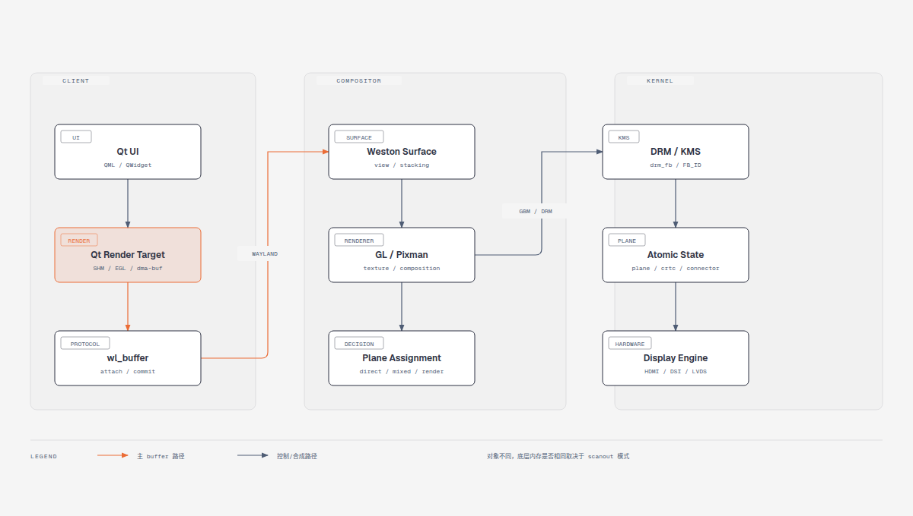
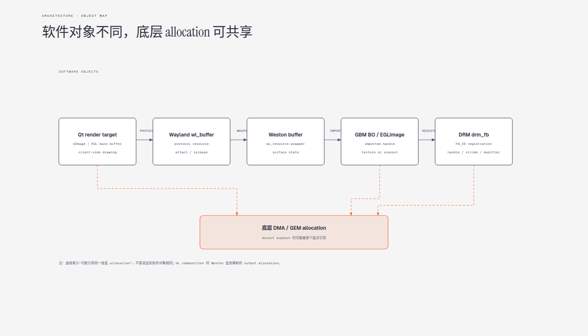
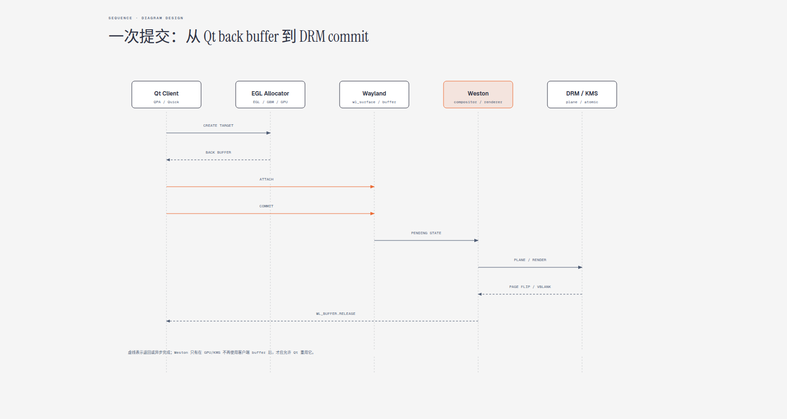
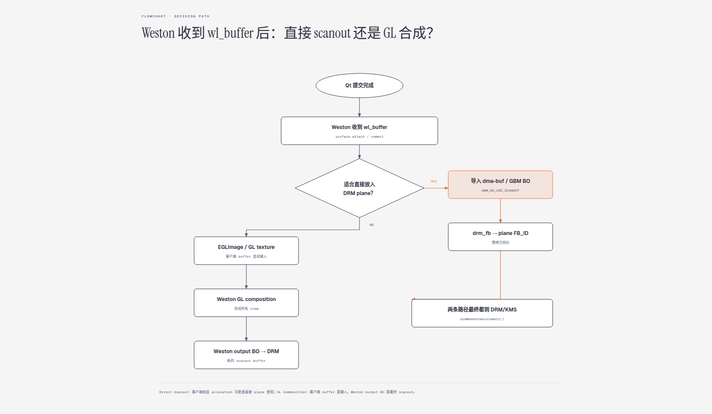

<!-- more -->

- [结论先行](#结论先行)
- [Qt、Wayland、Weston、DRM 中的 buffer 对象](#qtwaylandwestondrm-中的-buffer-对象)
- [Qt 的 surface buffer 向谁申请](#qt-的-surface-buffer-向谁申请)
  - [`wl_shm` 路径](#wl_shm-路径)
  - [EGL/Qt Quick 路径](#eglqt-quick-路径)
- [Qt 负责绘制什么，Weston 负责什么](#qt-负责绘制什么weston-负责什么)
- [从 Qt surface 到 DRM 的完整链路](#从-qt-surface-到-drm-的完整链路)
- [Qt 和 Weston 是否使用同一个 buffer](#qt-和-weston-是否使用同一个-buffer)
  - [Direct Scanout](#direct-scanout)
  - [Weston GL Composition](#weston-gl-composition)
  - [`wl_shm` 为什么通常不能直接 scanout](#wl_shm-为什么通常不能直接-scanout)
- [Weston 与 DRM/GL 的接口边界](#weston-与-drmgl-的接口边界)
- [当前 A7Z 镜像的实际路径](#当前-a7z-镜像的实际路径)
- [排查时应该观察什么](#排查时应该观察什么)
- [最终判断](#最终判断)

---

## 结论先行

在 Qt Wayland 模式下，Qt 的 UI 通常由 Qt 自己绘制，Weston 并不理解 Qt 的 Button、Text 或 QML 控件。Qt 将绘制结果封装为 Wayland `wl_buffer`，通过 `wl_surface.attach()` 和 `wl_surface.commit()` 提交给 Weston；Weston 再决定这块 buffer 是直接放到 DRM 硬件 plane 上，还是导入为纹理后与其他 surface 合成。

最容易混淆的是下面几个对象：

```text
Qt render target       —— Qt 实际绘制的目标
Wayland wl_buffer      —— Wayland 协议对象
Weston weston_buffer   —— Weston 对 wl_buffer 的内部封装
GBM gbm_bo             —— GBM 对 GPU/DRM buffer 的封装
DRM drm_fb / FB_ID     —— DRM/KMS 注册的 framebuffer 对象
DMA/GEM allocation     —— 底层真正保存像素的内存
```

因此，“是不是同一个 buffer”要分两层回答：

1. **软件对象不是同一个对象**：`wl_buffer`、`gbm_bo`、`drm_fb` 和 `FB_ID` 各自属于不同层次。
2. **底层内存可能相同，也可能不同**：Direct Scanout 时可能复用 Qt 的 dma-buf；Weston GL 合成时，Qt buffer 是输入，Weston 还会创建自己的输出 buffer。



图 1：Qt、Wayland、Weston、GBM 与 DRM/KMS 的分层关系。

## Qt、Wayland、Weston、DRM 中的 buffer 对象

下面的关系图强调“对象封装”和“底层存储”不是一回事：



图 2：不同层的对象可能引用同一块底层 allocation，但不会因此变成同一个软件对象。

| 层次 | 典型对象 | 主要职责 |
|---|---|---|
| Qt | `QImage`、Backing Store、EGL back buffer | 绘制 Qt Widgets 或 Qt Quick 场景 |
| Wayland | `wl_buffer`、`wl_surface` | 传递 buffer 和 surface 状态 |
| Weston | `weston_surface`、`weston_buffer`、`weston_view` | 管理窗口、层级、裁剪和合成状态 |
| EGL/GBM | `EGLImage`、纹理、`gbm_bo` | 在 GPU 和 DRM 之间导入或分配 buffer |
| DRM/KMS | `drm_fb`、`FB_ID`、plane state | 把 buffer 描述提交给内核显示驱动 |
| 内核/驱动 | GEM object、dma-buf、显示内存 | 保存像素并供 GPU/Display Engine 访问 |

`DRM FB_ID` 不是物理地址，也不是一份新的像素数据。Weston 会从 GBM BO 或 dma-buf 中取得 handle、stride、offset、format、modifier 等信息，再通过 `drmModeAddFB2()` 或 `drmModeAddFB2WithModifiers()` 注册一个 DRM framebuffer。

## Qt 的 surface buffer 向谁申请

Wayland 协议本身不规定“由 Weston 给客户端分配像素 buffer”。实际来源由 Qt QPA、EGL 平台、GPU 驱动和所选 buffer protocol 决定。

### `wl_shm` 路径

Qt Widgets 或某些软件渲染路径可能使用共享内存：

```text
Qt 客户端
  ↓ 创建匿名文件或 memfd
mmap 共享内存
  ↓
wl_shm_pool
  ↓
wl_buffer
  ↓
wl_surface.attach()
wl_surface.commit()
```

这种模式下，像素内存通常由客户端进程创建，Qt 通过 CPU 把内容画到共享内存中。Weston 只获得一个可以访问这块共享内存的 Wayland 资源，并在使用完成后发送 `wl_buffer.release`。

### EGL/Qt Quick 路径

Qt Quick 通常由 Scene Graph 组织绘制，并通过 OpenGL/EGL 获得后端 buffer：

```text
Qt Quick Scene Graph
  ↓
EGL / OpenGL driver
  ↓
GPU back buffer 或 dma-buf
  ↓
EGL Wayland platform
  ↓
wl_buffer
  ↓
Weston
```

这里的 buffer 通常由 Qt QPA、EGL Wayland 平台、GPU/EGL 驱动以及 GBM/dma-buf allocator 协同管理。不能简单说成“Qt 直接向 Weston 申请 buffer”，也不能简单说成“Qt 直接向 DRM 申请 buffer”。

更准确的说法是：

> Qt 通过 EGL/Wayland 图形栈取得一个可提交的渲染 buffer，再把它作为 Wayland `wl_buffer` 交给 Weston。

Qt 调用 `eglSwapBuffers()` 后，EGL Wayland 平台会完成 buffer 的轮换、提交和 Wayland 事件处理。底层具体使用 `wl_drm`、`zwp_linux_dmabuf_v1` 还是其他实现，取决于 Qt、EGL 和驱动版本。

## Qt 负责绘制什么，Weston 负责什么

可以把职责拆成两部分：

```text
Qt：设计和绘制应用 UI
  QML / QWidget
    ↓
  Scene Graph / Raster Paint Engine
    ↓
  client buffer

Weston：管理和显示多个 surface
  surface stacking
  position / transform / clip
  input dispatch
  plane assignment
  GL/Pixman composition
  DRM/KMS commit
```

Qt 应用可能只产生一个全屏 surface，也可能产生多个子 surface、弹窗、菜单或光标 surface。Weston 将这些 surface 组织为 `weston_view`，再根据硬件能力选择 overlay、cursor、primary 或 renderer 路径。

## 从 Qt surface 到 DRM 的完整链路

Qt 调用 Wayland 接口提交后，Weston 并不会在 `wl_surface.commit()` 的函数返回瞬间直接写 DRM 寄存器。它先更新 surface 的 pending/current state，然后在下一次 repaint 中构造输出状态。



图 3：Qt 生成并提交 buffer，Weston 导入/合成，最后交给 DRM/KMS。

Weston 9.0.0 的 Wayland surface 入口位于：

```text
libweston/compositor.c:3231  surface_attach()
libweston/compositor.c:3730  surface_commit()
libweston/compositor.c:2407  weston_surface_attach()
```

`surface_attach()` 先把客户端传来的 `wl_buffer` 放入 pending state：

```c
weston_surface_state_set_buffer(&surface->pending, buffer);
```

真正 commit 时，`weston_surface_attach()` 会引用这个 buffer，并调用当前 renderer 的 attach 接口：

```c
surface->compositor->renderer->attach(surface, buffer);
```

之后进入 repaint 流程：

```text
wl_surface.attach
  ↓
pending surface state
  ↓
wl_surface.commit
  ↓
weston_surface_commit_state
  ↓
weston_surface_attach
  ↓
renderer->attach
  ↓
drm_assign_planes / renderer repaint
  ↓
DRM atomic commit
```

## Qt 和 Weston 是否使用同一个 buffer

### Direct Scanout

当 Qt 的 buffer 满足硬件 plane 的要求，并且 Weston 判断它可以直接显示时，路径可能是：

```text
Qt EGL/dma-buf buffer
  ↓ wl_buffer
Weston import
  ↓
GBM BO / dma-buf
  ↓
drm_fb
  ↓
DRM plane 的 FB_ID
  ↓
Display Engine scanout
```

这种情况下，Qt 创建的 dma-buf 可能直接成为 DRM plane 扫描的底层内存，达到零拷贝效果：

```text
底层 allocation：可能相同
软件封装对象：一定不同
```

Direct Scanout 并不是无条件发生。Weston 通常还要检查：

```text
format / modifier 是否支持
尺寸和 stride 是否满足要求
缩放和 transform 是否支持
透明区域和 zpos 是否合法
surface 是否覆盖或遮挡其他内容
fence / 同步条件是否满足
atomic test 是否通过
```

### Weston GL Composition

如果 Qt 的 surface 不能直接放到 plane 上，或者当前屏幕有多个需要混合的 surface，Weston 会走 GL 合成：

```text
Qt client buffer
  ↓
EGLImage / GL texture
  ↓
Weston GL renderer
  ↓ 绘制 Qt、背景、其他窗口和 cursor
Weston 自己的 GBM output buffer
  ↓
drm_fb
  ↓
DRM primary plane scanout
```

这里有两个关键 buffer：

```text
Buffer A：Qt 提交给 Weston 的 client buffer
Buffer B：Weston 合成后交给 DRM 的 output buffer
```

两者通常不是同一块物理内存。中间也不一定发生 CPU `memcpy`，更常见的是 GPU 从 Buffer A 读取纹理，再把结果写入 Buffer B。

Weston DRM/GBM backend 的 GL 输出路径是：

```text
libweston/backend-drm/drm-gbm.c:281
drm_output_render_gl()
  ↓
renderer->repaint_output()
  ↓
gbm_surface_lock_front_buffer()
  ↓
drm_fb_get_from_bo()
```

GL renderer 最终在：

```text
libweston/renderer-gl/gl-renderer.c:1501
eglSwapBuffers()
```

所以“用了 GL renderer”并不等于“绕开 DRM plane”。正确理解是：Weston 先用 GPU 合成，再把合成结果作为一张新的 framebuffer 交给 DRM scanout plane。

### `wl_shm` 为什么通常不能直接 scanout

`wl_shm` 是客户端 CPU 共享内存，不一定具备 Display Engine 直接扫描所需的 dma-buf/GEM/stride/modifier 条件。当前 Weston 9.0.0 DRM client-buffer 路径中明确检查：

```c
if (wl_shm_buffer_get(buffer->resource))
	return NULL;
```

代码位置：

```text
libweston/backend-drm/fb.c:556
```

因此常见路径是：

```text
Qt wl_shm buffer
  ↓
Weston 读取或上传
  ↓
GL texture / 内部 output buffer
  ↓
DRM scanout
```

这也是为什么 EGL/dma-buf 路径比纯 `wl_shm` 更容易实现高性能 direct scanout。



图 4：Weston 根据 plane 能力决定复用客户端 buffer，或创建自己的合成输出 buffer。

## Weston 与 DRM/GL 的接口边界

### Weston compositor 与 renderer

Weston 的 renderer 接口定义在：

```text
include/libweston/libweston.h:885
```

重点接口包括：

```c
attach()
import_dmabuf()
repaint_output()
flush_damage()
query_dmabuf_formats()
query_dmabuf_modifiers()
```

调用关系可以概括为：

```text
weston_surface / weston_view
  ↓
weston_renderer.attach()
  ↓
GL renderer 或 Pixman renderer
```

### Weston 与 GBM

Weston DRM backend 通过 GBM 完成 output buffer 创建、客户端 buffer 导入和 front buffer 获取：

```c
gbm_surface_create()
gbm_surface_lock_front_buffer()
gbm_bo_import()
```

对于 Wayland client buffer，代码中可以看到：

```c
gbm_bo_import(b->gbm,
		     GBM_BO_IMPORT_WL_BUFFER,
		     buffer->resource,
		     GBM_BO_USE_SCANOUT);
```

代码位置：

```text
libweston/backend-drm/fb.c:564
```

这里的含义是：尝试把客户端的 Wayland buffer 导入为 GBM BO，并要求它具备 scanout 用途。

### GBM 与 DRM framebuffer

Weston 从 `gbm_bo` 读取：

```text
width
height
format
stride
handle
offset
modifier
```

然后调用：

```c
drmModeAddFB2()
drmModeAddFB2WithModifiers()
```

生成 DRM 侧的 `FB_ID`。最后由 DRM backend 组织 plane state，并通过：

```c
drmModeAtomicCommit()
```

提交给 Linux DRM/KMS。代码位置：

```text
libweston/backend-drm/fb.c:386
libweston/backend-drm/kms.c:1191
```

### 接口边界总览

```text
Qt → Wayland
  wl_surface.attach
  wl_surface.commit
  wl_buffer.release
  eglSwapBuffers

Weston compositor → renderer
  weston_renderer.attach
  weston_renderer.import_dmabuf
  weston_renderer.repaint_output

Weston DRM backend → GBM
  gbm_bo_import
  gbm_surface_create
  gbm_surface_lock_front_buffer

Weston DRM backend → Linux DRM
  drmModeAddFB2
  drmModeAddFB2WithModifiers
  drmModeAtomicCommit
```

## 当前 A7Z 镜像的实际路径

当前 SDK 的启动脚本并不是 Qt Wayland 配置。

Weston 由：

```text
out/a733/cubie_a7z/buildroot/buildroot/target/etc/init.d/S40weston:13
```

启动：

```sh
weston --backend=drm-backend.so --tty=1 --xwayland &
```

但 Qt Launcher 在：

```text
out/a733/cubie_a7z/buildroot/buildroot/target/etc/init.d/S70launcher:25
```

默认设置为：

```sh
export QT_QPA_PLATFORM=linuxfb:tty=/dev/fb0
```

如果存在 Qt 5.12.5，又会在：

```text
out/a733/cubie_a7z/buildroot/buildroot/target/etc/init.d/S70launcher:44
```

改为：

```sh
export QT_QPA_PLATFORM=eglfs
export QT_QPA_EGLFS_INTEGRATION=eglfs_mali
```

所以当前镜像实际更可能是：

```text
Weston：使用 DRM backend 管理显示
Qt linuxfb：直接写 /dev/fb0
Qt eglfs：通过 EGLFS 显示后端直接使用显示设备
```

当前脚本不能证明 Qt 是 Weston client。只有改为 Wayland QPA，并且 Qt 连接到 Weston 的 Wayland socket 后，才是：

```text
Qt Wayland client
  ↓ wl_surface / wl_buffer
Weston
  ↓ DRM backend
Linux DRM/KMS
```

也就是说，在当前 `linuxfb`/`eglfs` 配置下，不应使用“Qt buffer 交给 Weston 再 scanout”的模型解释实际运行状态。Qt 很可能绕过 Weston，直接拥有自己的显示后端。

## 排查时应该观察什么

如果需要确认设备实际走哪条路径，可以按以下顺序检查：

```sh
echo "$QT_QPA_PLATFORM"
echo "$WAYLAND_DISPLAY"
ps | grep -E 'weston|launcher|qt'
ls -l /tmp/wayland
```

确认 Qt 是否是 Wayland client：

```text
QT_QPA_PLATFORM=wayland 或 wayland-egl
存在 XDG_RUNTIME_DIR
存在 Wayland socket
Qt 进程连接 compositor socket
```

确认 Weston 是否走 direct scanout 或 GL composition，可以结合：

```text
Weston debug log
DRM atomic/plane 状态
GBM BO import 日志
GL renderer repaint 日志
drmModeAtomicCommit 路径
```

重点观察的是“最终 plane 的 FB_ID 对应谁”：

```text
如果 FB_ID 来自客户端导入的 dma-buf：倾向 Direct Scanout
如果 FB_ID 来自 Weston GBM output surface：倾向 GL Composition
```

## 最终判断

可以用下面三句话记忆整条链路：

1. **Qt 的 surface buffer 通常由 Qt/EGL/GBM/GPU allocator 或客户端 `wl_shm` 创建，不是 Weston 必然分配。**
2. **Direct Scanout 时，Qt buffer 与 DRM plane 扫描的底层内存可能相同，但各层的软件对象一定不同。**
3. **Weston GL Composition 时，Qt buffer 是输入纹理，Weston 创建另一块 output buffer 给 DRM scanout。**

因此真正的分界不是“有没有 Weston”或“有没有 GL”，而是 Weston 的 plane assignment 结果：

```text
Direct Scanout
  Qt dma-buf → Weston import → DRM plane
  尽量零拷贝

GL Composition
  Qt buffer → Weston texture → GL 合成 → Weston output BO → DRM plane
  需要新的输出 buffer
```

---
感谢阅读！
